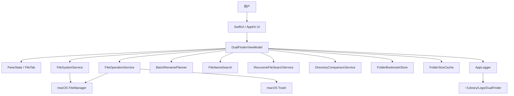

# Dual Finder 纪

Dual Finder 纪 是一个 macOS 双栏文件管理器原型，目标是把 Finder 的系统集成和 Total Commander 风格的左右目录操作结合起来。当前实现基于 SwiftUI + AppKit，核心文件系统逻辑放在 `DualFinderCore`，桌面应用交互放在 `DualFinderApp`。

## 当前状态

- 平台：macOS 14+
- Swift：Swift Package，`swift-tools-version: 6.2`
- 入口：`DualFinderApp`
- 核心模块：`DualFinderCore`
- 测试：`DualFinderCoreTests`
- 本地安装脚本：`./update_app.sh`

## 已实现功能

### 双栏浏览

- 左右双栏文件列表。
- 每栏独立 tab，支持新增、关闭、按 `Command-1...9` 切换当前栏 tab。
- 每个 tab 保留独立前进/后退历史。
- 启动时恢复上次左右 pane 和 tab 会话。
- 启动后窗口最大化，关闭最后窗口后退出进程。
- 单实例运行，避免重复启动多个应用实例。

### 导航

- 双击目录进入，双击文件用系统默认应用打开。
- 返回上级目录、回到 Home、选择任意文件夹。
- 支持后退/前进历史。
- 路径栏可点击编辑，支持绝对路径、`~` 和相对路径。
- 访问受保护目录失败时提示开启 Full Disk Access，并提供打开系统设置入口。

### 文件列表

- 显示名称、类型、大小、修改时间。
- 文件夹、包和别名按目录类项目优先展示。
- 可按名称、类型、大小、修改时间排序；排序规则按文件夹持久化。
- 可显示/隐藏隐藏文件。
- 底部显示当前列表中的文件数、文件总大小和文件夹数。
- 支持单选、`Command` 多选、`Shift` 范围选择。
- 支持当前目录内快速过滤，包含普通子串匹配、中文转拼音匹配和拼音首字母匹配。

### 搜索、对比和同步

- 支持从当前活动栏目录开始递归搜索文件名。
- 递归搜索可选搜索小型文本文件内容，并支持取消。
- 搜索结果可双击跳转到所在目录并选中目标文件。
- 支持左右目录递归对比，展示仅左侧存在、仅右侧存在、内容不同和相同项目。
- 目录对比结果支持单项向左或向右同步复制，并保留相对目录结构。

### 文件操作

- 左右栏之间复制选择项。
- 左右栏之间移动选择项。
- 文件复制、移动和移到废纸篓进入操作队列，显示最近运行/排队任务、进度和当前项目。
- 运行中或排队中的文件操作可取消。
- 通过系统剪贴板复制文件，再粘贴为复制或移动。
- 复制/移动遇到同名目标时弹出冲突对话框，支持跳过、保留两者、覆盖和应用到全部。
- 新建文件夹。
- 新建空 TXT 文件和 Markdown 文件。
- 单项重命名。
- 批量重命名，支持编号、文字替换、正则替换、扩展名修改和元数据模板。
- 移到废纸篓。
- 清空废纸篓。
- 复制所选项目的绝对路径。
- 在 Ghostty 或 Terminal 中打开所选项目所在目录。
- 计算所选文件夹大小，并缓存计算结果。
- 支持从 Finder 或另一栏拖入文件，默认移动，按住 `Option` 拖放时复制。
- 支持从列表行拖出文件或文件夹给系统或其他应用（Terminal、飞书、微信等），多选拖拽会携带全部选中项。

### 预览和系统集成

- 空格键 Quick Look 预览所选项目。
- Quick Look 中支持切换相邻选择项。
- `Command-O` 用默认应用打开选择项。
- 右键菜单包含复制绝对路径、打开终端、批量重命名、复制到另一栏、移动到另一栏、移到废纸篓。
- 可打开日志目录。
- 可打开 Full Disk Access 设置。

### 收藏和最近目录

- 自动记录最近访问目录。
- 可把当前目录加入收藏。
- 可从收藏/最近目录弹窗中搜索并跳转。
- 收藏排在最近目录之前。

### 外观

- 支持浅色、深色、跟随系统外观。
- 支持多种 accent 色。
- 工具按钮使用 SF Symbols，并带 hover tooltip。

### 日志

- 日志目录：`~/Library/Logs/DualFinder`
- 每日一个日志文件。
- 重启不清空日志。
- 默认最多保留 7 天日志。
- 记录启动、导航、选择、排序、tab、剪贴板、文件操作、Quick Look、权限提示等关键事件。

## 常用快捷键

| 快捷键 | 功能 |
| --- | --- |
| `Command-T` | 当前实现为新建左栏 tab |
| `Command-Shift-T` | 新建右栏 tab |
| `Command-1...9` | 切换当前活动栏的第 1 到第 9 个 tab |
| `Command-Left` | 聚焦左栏 |
| `Command-Right` | 聚焦右栏 |
| `Control-[` | 后退 |
| `Control-]` | 前进 |
| `Command-Up` | 返回上级目录 |
| `Command-Down` | 进入所选目录或打开所选项目 |
| `Command-Shift-G` | 编辑当前活动栏路径 |
| `Control-S` | 当前目录内快速过滤 |
| `Control-D` | 打开收藏/最近目录弹窗 |
| `Control-M` | 打开批量重命名 |
| `Command-W` | 关闭当前活动栏 tab |
| `Return` | 对单个选择项开始重命名 |
| `Command-O` | 用默认应用打开选择项 |
| `Space` | Quick Look 预览 |
| `Control-Space` | 计算所选文件夹大小 |
| `Command-C` | 复制所选文件到系统剪贴板 |
| `Command-Option-C` | 复制所选项目绝对路径 |
| `Command-V` | 从系统剪贴板复制文件到当前栏 |
| `Command-Option-V` | 从系统剪贴板移动文件到当前栏 |
| `Command-Delete` | 移到废纸篓 |
| `Command-Shift-Delete` | 清空废纸篓 |
| `Command-Option-T` | 在 Ghostty 或 Terminal 中打开所选目录 |
| `Command-Option-Right` | 移动左栏选择项到右栏 |
| `Command-Option-Left` | 移动右栏选择项到左栏 |

## 构建、测试和安装

运行单元测试：

```bash
swift test
```

构建、ad-hoc 签名、复制到 `/Applications` 并启动：

```bash
./update_app.sh
```

清理 release 目录：

```bash
./clear_release.sh
```

查看日志：

```bash
ls -la ~/Library/Logs/DualFinder
tail -n 200 ~/Library/Logs/DualFinder/$(date +%F).log
```

## 项目结构

```text
Sources/
  DualFinderCore/
    BatchRename.swift
    FileNameSearch.swift
    FileOperationService.swift
    FileSortRule.swift
    FileSystemService.swift
    FolderBookmarkStore.swift
    FolderSizeCache.swift
    FolderSortRuleStore.swift
    Logging.swift
    PaneSessionStore.swift
    PaneState.swift
  DualFinderApp/
    AppDelegate.swift
    BatchRenameDialog.swift
    ContentView.swift
    DualFinderApp.swift
    DualFinderViewModel.swift
    FilePaneView.swift
    PrivacyPermissionGuide.swift
    QuickLookPreviewService.swift
    SettingsView.swift
Tests/
  DualFinderCoreTests/
```

## 架构

- `DualFinderCore`：文件系统读取、文件操作、排序规则、批量重命名、搜索匹配、文件夹大小缓存、收藏/最近目录、pane/tab 状态、日志轮转。
- `DualFinderApp`：SwiftUI 界面、AppKit 系统交互、快捷键、Quick Look、拖放、权限提示、设置页、单实例和窗口生命周期。
- `DualFinderViewModel`：连接 UI 和 Core 的协调层，负责选择、导航、刷新、文件操作队列、目录对比、递归搜索、状态消息和日志。



## 测试覆盖

当前核心测试覆盖：

- 日志追加和 7 天轮转。
- 目录读取、URL 标准化、按大小排序。
- 文件夹大小缓存。
- pane tab、选择、导航历史和会话恢复。
- 按文件夹持久化排序规则。
- 收藏和最近目录。
- 文件复制、移动、重名复制、新建文件、重命名、清空废纸篓、移到废纸篓。
- 文件操作进度、取消和冲突策略。
- 批量重命名规则和冲突检测。
- 递归搜索文件名和可选文本内容。
- 左右目录递归对比。
- 当前目录快速过滤，包括中文拼音和首字母匹配。

## 还差哪些用户常用的重要功能

下面按“普通 macOS 用户会不会高频用到”和“对双栏文件管理器价值是否明显”排序。

| 优先级 | 功能 | 为什么重要 | 当前差距 |
| --- | --- | --- | --- |
| P0 | 常用位置侧边栏 | Finder 用户每天会用 Desktop、Downloads、Documents、Volumes、iCloud Drive、网络位置和收藏入口。只靠弹窗跳转不够顺手。 | 已有收藏/最近目录弹窗，但缺少常驻侧边栏、卷宗列表、iCloud/外接盘/网络位置入口。 |
| P0 | 更完整的操作历史和失败恢复 | 大批量复制/移动最怕失败后不知道哪些成功、哪些失败。用户常需要重试、跳过、定位失败文件。 | 已有队列、进度和取消，但完成/失败历史、错误列表、重试、失败项定位还不完整。 |
| P0 | 可配置快捷键和 Total Commander 键盘流 | 双栏工具的重度用户通常依赖 `F3/F4/F5/F6/F7/F8`、`Tab` 切栏、`Insert` 选择等键盘工作流。 | 已有一批快捷键，但还没有可配置键位、完整功能矩阵和键盘帮助页。 |
| P1 | 路径面包屑和路径补全 | 用户频繁在父级、兄弟目录和历史路径之间跳转；可编辑纯文本路径效率有限。 | 路径栏可编辑，但缺少可点击层级、自动补全、历史/收藏建议。 |
| P1 | 压缩包浏览、压缩和解压 | 下载、备份和交付文件经常遇到 zip/tar/gz。文件管理器通常需要右键解压、创建压缩包，进阶可把压缩包当目录看。 | 当前没有压缩/解压入口，也不能浏览压缩包内容。 |
| P1 | Finder 标签、颜色和元数据 | macOS 用户常用标签整理文件，也会看图片尺寸、音视频时长、PDF 页数等元数据。 | 当前只显示名称、类型、大小、修改时间；未读写 Finder 标签、注释、扩展属性和 Spotlight 元数据。 |
| P1 | 内嵌预览/信息面板 | Quick Look 很好，但整理文件时用户常希望固定右侧预览和信息面板，连续扫图、看文本、看 PDF 更快。 | 已有 Quick Look 弹窗，缺少可停靠预览面板和文件详情面板。 |
| P1 | 批量选择和过滤增强 | 常见场景是按扩展名、日期、大小、正则批量选中，再复制/删除/重命名。 | 当前有当前目录过滤和多选，但缺少“选择同扩展名”“按条件选择/反选”“保存过滤条件”。 |
| P2 | 更可信的目录同步 | 对比同步是双栏核心能力。用户同步代码、照片、备份目录时，需要预览计划、批量同步、删除多余项和 hash 校验。 | 已有递归对比和单项复制；缺少批量同步计划、双向策略、删除策略、校验和比较。 |
| P2 | 打开方式和外部工具集成 | 用户经常需要“打开方式”、复制相对路径、在编辑器/终端/脚本中打开。 | 已有默认应用打开和终端打开；缺少 Open With、编辑器选择、服务菜单、脚本/自定义命令。 |
| P2 | 多窗口和布局恢复 | 多项目、多磁盘整理时，用户会想开多个工作区，记住每组左右路径和窗口比例。 | 当前是单实例主窗口；缺少多窗口、工作区保存和 pane 比例记忆。 |
| P2 | 正式分发体验 | 非开发者用户需要可信安装、自动更新、权限解释和少踩坑的首次启动流程。 | 当前适合本地安装；公开分发还缺 Developer ID 签名、公证、更新机制和完整权限模型。 |

如果只做下一轮，建议先做这 3 件：

1. **常用位置侧边栏**：收益最大，能立刻降低跳转成本，也能承载收藏、最近、卷宗和云盘入口。
2. **操作历史和失败恢复**：在已有队列基础上补完成/失败列表、重试、定位失败文件，能显著提升大批量操作可信度。
3. **可配置快捷键矩阵**：补齐 `F3/F4/F5/F6/F7/F8`、`Tab` 切栏和快捷键帮助页，能更像真正的双栏文件管理器。

## 当前风险

- UI 自动化测试不足，真实点击、焦点、快捷键和 Quick Look 行为主要依赖手动验证。
- 操作队列已经有进度和取消，但缺少完成历史、失败项重试、错误汇总和恢复策略。
- 目录对比目前按大小和修改时间判断文件差异；需要高可信同步时应增加可选 hash 校验。
- 递归搜索的内容搜索只覆盖较小文本文件，不适合替代 Spotlight 或专业全文索引。
- 公开分发还缺 Developer ID 签名、公证和完整权限模型。
