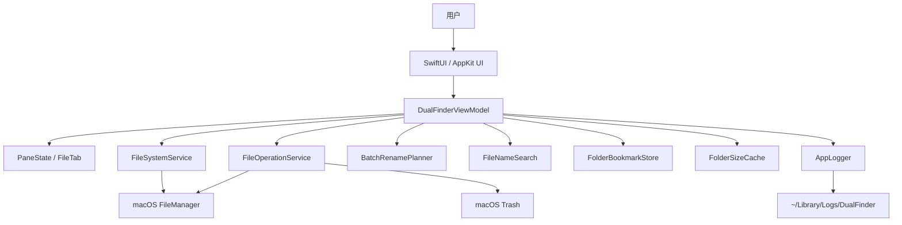

# Dual Finder 纪

Dual Finder 纪 是一个 macOS 双栏文件管理器原型，目标是把 Finder 的系统集成和 Total Commander 风格的左右目录操作结合起来。当前实现基于 SwiftUI + AppKit，核心文件系统逻辑放在 `DualFinderCore`，桌面应用交互放在 `DualFinderApp`。

## 当前状态

- 平台：macOS 14+
- Swift：Swift Package，`swift-tools-version: 6.2`
- 入口：`DualFinderApp`
- 核心模块：`DualFinderCore`
- 测试：`DualFinderCoreTests`
- 本地安装脚本：`./update_app.sh`

## 已实现功能

### 双栏浏览

- 左右双栏文件列表。
- 每栏独立 tab，支持新增、关闭、按 `Command-1...9` 切换当前栏 tab。
- 每个 tab 保留独立前进/后退历史。
- 启动时恢复上次左右 pane 和 tab 会话。
- 启动后窗口最大化，关闭最后窗口后退出进程。
- 单实例运行，避免重复启动多个应用实例。

### 导航

- 双击目录进入，双击文件用系统默认应用打开。
- 返回上级目录、回到 Home、选择任意文件夹。
- 支持后退/前进历史。
- 路径栏可点击编辑，支持绝对路径、`~` 和相对路径。
- 访问受保护目录失败时提示开启 Full Disk Access，并提供打开系统设置入口。

### 文件列表

- 显示名称、类型、大小、修改时间。
- 文件夹、包和别名按目录类项目优先展示。
- 可按名称、类型、大小、修改时间排序；排序规则按文件夹持久化。
- 可显示/隐藏隐藏文件。
- 底部显示当前列表中的文件数、文件总大小和文件夹数。
- 支持单选、`Command` 多选、`Shift` 范围选择。
- 支持当前目录内快速过滤，包含普通子串匹配、中文转拼音匹配和拼音首字母匹配。

### 文件操作

- 左右栏之间复制选择项。
- 左右栏之间移动选择项。
- 通过系统剪贴板复制文件，再粘贴为复制或移动。
- 复制/移动遇到同名目标时自动生成不覆盖的目标名称。
- 新建文件夹。
- 新建空 TXT 文件和 Markdown 文件。
- 单项重命名。
- 批量重命名，支持编号、文字替换、正则替换、扩展名修改和元数据模板。
- 移到废纸篓。
- 清空废纸篓。
- 复制所选项目的绝对路径。
- 在 Ghostty 或 Terminal 中打开所选项目所在目录。
- 计算所选文件夹大小，并缓存计算结果。

### 预览和系统集成

- 空格键 Quick Look 预览所选项目。
- Quick Look 中支持切换相邻选择项。
- `Command-O` 用默认应用打开选择项。
- 右键菜单包含复制绝对路径、打开终端、批量重命名、复制到另一栏、移动到另一栏、移到废纸篓。
- 可打开日志目录。
- 可打开 Full Disk Access 设置。

### 收藏和最近目录

- 自动记录最近访问目录。
- 可把当前目录加入收藏。
- 可从收藏/最近目录弹窗中搜索并跳转。
- 收藏排在最近目录之前。

### 外观

- 支持浅色、深色、跟随系统外观。
- 支持多种 accent 色。
- 工具按钮使用 SF Symbols，并带 hover tooltip。

### 日志

- 日志目录：`~/Library/Logs/DualFinder`
- 每日一个日志文件。
- 重启不清空日志。
- 默认最多保留 7 天日志。
- 记录启动、导航、选择、排序、tab、剪贴板、文件操作、Quick Look、权限提示等关键事件。

## 常用快捷键

| 快捷键 | 功能 |
| --- | --- |
| `Command-T` | 当前实现为新建左栏 tab |
| `Command-Shift-T` | 新建右栏 tab |
| `Command-1...9` | 切换当前活动栏的第 1 到第 9 个 tab |
| `Command-Left` | 聚焦左栏 |
| `Command-Right` | 聚焦右栏 |
| `Control-[` | 后退 |
| `Control-]` | 前进 |
| `Command-Shift-G` | 编辑当前活动栏路径 |
| `Control-S` | 当前目录内快速过滤 |
| `Control-D` | 打开收藏/最近目录弹窗 |
| `Control-M` | 打开批量重命名 |
| `Return` | 对单个选择项开始重命名 |
| `Command-O` | 用默认应用打开选择项 |
| `Space` | Quick Look 预览 |
| `Control-Space` | 计算所选文件夹大小 |
| `Command-C` | 复制所选文件到系统剪贴板 |
| `Command-Option-C` | 复制所选项目绝对路径 |
| `Command-V` | 从系统剪贴板复制文件到当前栏 |
| `Command-Option-V` | 从系统剪贴板移动文件到当前栏 |
| `Command-Delete` | 移到废纸篓 |
| `Command-Shift-Delete` | 清空废纸篓 |
| `Command-Option-T` | 在 Ghostty 或 Terminal 中打开所选目录 |
| `Command-Option-Right` | 移动左栏选择项到右栏 |
| `Command-Option-Left` | 移动右栏选择项到左栏 |

## 构建、测试和安装

运行单元测试：

```bash
swift test
```

构建、ad-hoc 签名、复制到 `/Applications` 并启动：

```bash
./update_app.sh
```

清理 release 目录：

```bash
./clear_release.sh
```

查看日志：

```bash
ls -la ~/Library/Logs/DualFinder
tail -n 200 ~/Library/Logs/DualFinder/$(date +%F).log
```

## 项目结构

```text
Sources/
  DualFinderCore/
    BatchRename.swift
    FileNameSearch.swift
    FileOperationService.swift
    FileSortRule.swift
    FileSystemService.swift
    FolderBookmarkStore.swift
    FolderSizeCache.swift
    FolderSortRuleStore.swift
    Logging.swift
    PaneSessionStore.swift
    PaneState.swift
  DualFinderApp/
    AppDelegate.swift
    BatchRenameDialog.swift
    ContentView.swift
    DualFinderApp.swift
    DualFinderViewModel.swift
    FilePaneView.swift
    PrivacyPermissionGuide.swift
    QuickLookPreviewService.swift
    SettingsView.swift
Tests/
  DualFinderCoreTests/
```

## 架构

- `DualFinderCore`：文件系统读取、文件操作、排序规则、批量重命名、搜索匹配、文件夹大小缓存、收藏/最近目录、pane/tab 状态、日志轮转。
- `DualFinderApp`：SwiftUI 界面、AppKit 系统交互、快捷键、Quick Look、权限提示、设置页、单实例和窗口生命周期。
- `DualFinderViewModel`：连接 UI 和 Core 的协调层，负责选择、导航、刷新、文件操作、状态消息和日志。



## 测试覆盖

当前核心测试覆盖：

- 日志追加和 7 天轮转。
- 目录读取、URL 标准化、按大小排序。
- 文件夹大小缓存。
- pane tab、选择、导航历史和会话恢复。
- 按文件夹持久化排序规则。
- 收藏和最近目录。
- 文件复制、移动、重名复制、新建文件、重命名、清空废纸篓、移到废纸篓。
- 批量重命名规则和冲突检测。
- 当前目录快速过滤，包括中文拼音和首字母匹配。

## 还没有实现但值得做的功能

以下建议按实际收益和当前架构适配度排序。

1. 操作队列、进度和取消

   大文件复制、移动、删除、文件夹大小计算目前缺少统一任务队列、进度条、暂停/取消和后台错误汇总。这个能力是双栏文件管理器的基础设施，应该优先做。

2. 冲突处理对话框

   现在复制/移动默认自动改名避免覆盖。后续可以提供覆盖、跳过、保留两者、仅较新文件、应用到全部等选择，更接近 Finder 和 Total Commander 的真实批量操作体验。

3. 拖拽

   支持从 Finder 拖入、拖出到 Finder、左右栏之间拖拽，以及拖拽时选择复制或移动。它对 macOS 用户很关键，也能补齐当前主要依赖按钮和快捷键的交互方式。

4. 目录树和常用位置侧边栏

   当前有收藏/最近目录弹窗，但没有 Finder 式侧边栏或 Total Commander 式目录树。建议增加可折叠侧栏，包含 Home、Desktop、Downloads、Documents、Volumes、iCloud Drive、收藏和最近目录。

5. 全局搜索

   当前搜索只是当前目录内过滤。后续可以增加递归文件名搜索、内容搜索、按扩展名/大小/日期筛选，并支持在搜索结果中直接复制、移动、删除和定位原目录。

6. 文件比较与目录同步

   Total Commander 的高价值功能之一是左右目录对比和同步。建议支持按名称、大小、修改时间、校验和比较，并提供单向/双向同步预览。

7. 压缩包浏览和压缩/解压

   支持 zip、tar、gz 等常见格式的预览、解压、创建压缩包，最好能把压缩包当作目录浏览。这对双栏文件管理器很实用。

8. 更完整的键盘操作矩阵

   可以补齐 Total Commander 风格的 `F3` 预览、`F4` 编辑、`F5` 复制、`F6` 移动、`F7` 新建文件夹、`F8` 删除，以及 Finder 风格的 `Command-Up/Down` 导航。当前已经有不少快捷键，但还没有形成可配置的完整键盘模型。

9. 标签、颜色标记和元数据

   Finder 的标签、颜色、注释、扩展属性和 Spotlight 元数据当前没有展示或编辑。加入后可以明显提升 macOS 原生感。

10. 书签式路径栏和路径面包屑

    目前路径栏可编辑但不是面包屑。建议支持点击路径层级快速跳转、路径补全、历史建议和收藏建议。

11. 文件预览面板

    当前依赖 Quick Look 弹窗。可以增加内嵌预览面板，展示图片、文本、PDF、音视频基础信息和元数据，减少频繁打开独立预览窗口。

12. 权限、沙盒和正式分发

    当前适合本地原型和自用安装。公开分发前需要补 sandbox/entitlements 策略、Developer ID 签名、公证、权限引导和受限目录访问设计。

13. 可配置设置

    当前设置只覆盖外观和 accent。后续可加入快捷键映射、默认打开目录、是否恢复会话、隐藏文件默认值、终端应用选择、复制冲突默认策略、日志保留天数等。

14. 多窗口和窗口布局

    现在是单实例单主窗口。可以增加多窗口、保存布局、按项目恢复工作区、左右栏比例记忆。

15. 更强的错误恢复

    文件操作失败时目前主要通过状态栏和日志反馈。后续可以增加失败列表、重试、跳过、展开系统错误详情、定位失败文件。

## 当前风险

- UI 自动化测试不足，真实点击、焦点、快捷键和 Quick Look 行为主要依赖手动验证。
- 大文件/大量文件操作还没有进度和取消能力。
- 文件操作冲突策略偏简单，目前自动改名，缺少用户可选策略。
- 公开分发还缺 Developer ID 签名、公证和完整权限模型。
