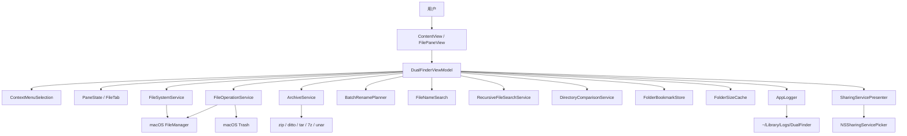

# Dual Finder 纪

Dual Finder 纪 是一个 macOS 双栏文件管理器，目标是把 Finder 的系统集成和 Total Commander 风格的左右目录操作结合起来。当前实现基于 SwiftUI + AppKit，核心文件系统逻辑放在 `DualFinderCore`，桌面应用交互放在 `DualFinderApp`。

## 当前状态

- 平台：macOS 14+
- Swift：Swift Package，`swift-tools-version: 6.2`
- 入口：`DualFinderApp`
- 核心模块：`DualFinderCore`
- 测试：`swift test` 覆盖 Core 与 App 模型（173 项全部通过）
- 本地安装脚本：`./update_app.sh`

## 已实现功能

### 双栏浏览

- 左右双栏文件列表，左侧 **Locations** 侧边栏（Pinned、Favorites、Recent）。
- 每栏独立 tab，支持新增、关闭、按 `Command-1...9` 切换当前栏 tab；Tab 右键可复制路径、打开终端、加入收藏。
- 内嵌 Terminal 支持多 tab 与分屏；Terminal 获得焦点时可按 `Option-1...9` 切换 terminal tab，按 `Command-方向键` 在 terminal 分屏间移动焦点。
- 每个 tab 保留独立前进/后退历史。
- 启动时恢复上次左右 pane 和 tab 会话。
- 启动后窗口最大化，关闭最后窗口后退出进程。
- 单实例运行，避免重复启动多个应用实例。

### 导航

- 双击目录进入，双击文件用系统默认应用打开。
- 返回上级目录、回到 Home、选择任意文件夹；侧边栏与收藏/最近弹窗（`Control-D`）均可跳转。
- 支持后退/前进历史。
- 路径栏可点击编辑，支持绝对路径、`~` 和相对路径。
- 访问受保护目录失败时提示开启 Full Disk Access，并提供打开系统设置入口。

### 文件列表

- 显示名称、类型、大小、修改时间。
- 文件夹、包和别名按目录类项目优先展示。
- 可按名称、类型、大小、修改时间排序；排序规则按文件夹持久化。
- 可显示/隐藏隐藏文件。
- 底部显示当前列表中的文件数、文件总大小和文件夹数。
- 支持单选、`Command` 多选、`Shift` 范围选择。
- 支持当前目录内快速过滤，包含普通子串匹配、中文转拼音匹配和拼音首字母匹配。

### 搜索、对比和同步

- 支持从当前活动栏目录开始递归搜索文件名。
- 递归搜索可选搜索小型文本文件内容，并支持取消。
- 搜索结果可双击跳转到所在目录并选中目标文件。
- 支持左右目录递归对比，展示仅左侧存在、仅右侧存在、内容不同和相同项目。
- 目录对比结果支持单项向左或向右同步复制，并保留相对目录结构。

### 文件操作

- 左右栏之间复制选择项。
- 左右栏之间移动选择项。
- 文件复制、移动和移到废纸篓进入操作队列，底部显示最近运行/排队任务、进度和当前项目。
- 工具栏可打开 **Operation History** 侧栏，查看已完成/失败/已取消任务，支持恢复建议、重试和清空历史。
- 运行中或排队中的文件操作可取消。
- 通过系统剪贴板复制文件，再粘贴为复制或移动。
- 复制/移动遇到同名目标时弹出冲突对话框，支持跳过、保留两者、覆盖和应用到全部。
- 新建文件夹。
- 新建空 TXT 文件和 Markdown 文件。
- 单项重命名。
- 批量重命名，支持编号、文字替换、正则替换、扩展名修改和元数据模板。
- 移到废纸篓。
- 清空废纸篓。
- 复制所选项目的绝对路径。
- 在 Ghostty 或 Terminal 中打开所选项目所在目录。
- 计算所选文件夹大小，并缓存计算结果。
- 支持从 Finder 或另一栏拖入文件，默认移动，按住 `Option` 拖放时复制。
- 支持从列表行拖出文件或文件夹给系统或其他应用（Terminal、飞书、微信等），多选拖拽会携带全部选中项。

### 压缩与解压

- 右键 **Compress to ZIP**：将同目录下所选非归档项打包为 ZIP（自动避免重名）。
- 右键 **Extract Here** / **Extract to "名称"** / **Extract to Subfolder(s)**。
- 解压支持 zip、tar/tar.gz/tgz/tar.bz2/tar.xz 等；7z、rar、iso 等依赖本机已安装的 `7z` 或 `unar`（如 Homebrew）。
- 压缩与解压在后台执行，完成后刷新列表并更新状态栏。

### 预览和系统集成

- 空格键 Quick Look 预览所选项目。
- Quick Look 中支持切换相邻选择项。
- `Command-O` 用默认应用打开选择项。
- 右键菜单包含：
  - **New Folder with Selection**：多选 ≥2 项时创建文件夹并将选中项移入（Enter 确认，Esc 取消空文件夹）。
  - **Open in New Tab(s)**：所选均为文件夹时，每个文件夹在新 Tab 打开。
  - **Share…**：调用 macOS 系统分享面板（含 AirDrop）。
  - 复制绝对路径、压缩/解压、加入收藏、打开终端、批量重命名、复制/移动到另一栏、移到废纸篓。
- 可打开日志目录。
- 可打开 Full Disk Access 设置。

### 收藏和最近目录

- 自动记录最近访问目录。
- 可把当前目录或所选文件夹加入收藏（列表右键、Tab 右键、侧边栏工具按钮）。
- 可从收藏/最近目录弹窗（`Control-D`）或左侧 **Locations** 侧边栏搜索并跳转。
- 收藏排在最近目录之前；侧边栏 Pinned 区固定 Home、Desktop、Documents、Downloads、Applications。

### 菜单栏

- **File**：新建左右 Tab、关闭 Tab、新建文件夹/TXT/Markdown、前往文件夹、收藏弹窗、选择文件夹、移到废纸篓、清空废纸篓。
- **Edit**：复制文件、粘贴、粘贴并移动、复制绝对路径、全选、重命名、删除、批量重命名；启用状态与当前栏选中、内联重命名、粘贴板内容联动（选中文件后 Copy 不再灰色）。
- **View**：显示隐藏文件、刷新、聚焦左右栏、历史后退/前进、上级目录、打开/Quick Look/计算文件夹大小、目录过滤、递归搜索、目录对比。
- **Pane**：左右栏复制/移动、终端、分享、新 Tab 打开目录、加入收藏、压缩 ZIP、解压。
- 菜单定义见 `AppMenuCommands.swift`；启用规则见 `MenuActionAvailability`（Core，可单测）。详见 [菜单栏文档](local_docs/menu_items.md)。

### 外观与快捷键

- 支持浅色、深色、跟随系统外观。
- 支持多种 accent 色。
- 工具按钮使用 SF Symbols，并带 hover tooltip。
- **Settings → Shortcuts**：可配置命令、导航、Tab、跨栏移动等快捷键，含冲突提示与恢复默认。

### 日志

- 日志目录：`~/Library/Logs/DualFinder`
- 每日一个日志文件。
- 重启不清空日志。
- 默认最多保留 7 天日志。
- 记录启动、导航、选择、排序、tab、剪贴板、文件操作、归档、分享、Quick Look、权限提示等关键事件。

## 常用快捷键

默认键位可在 **Settings → Shortcuts** 中修改。下表为出厂默认：

| 快捷键 | 功能 |
| --- | --- |
| `Command-T` | 在当前活动栏新建 tab |
| `Command-Shift-T` | 新建右栏 tab |
| `Command-Shift-/` | 打开快捷键帮助窗口 |
| `Command-1...9` | 切换当前活动栏的第 1 到第 9 个 tab |
| `Command-Left` | 聚焦左栏 |
| `Command-Right` | 聚焦右栏 |
| `Control-[` | 后退 |
| `Control-]` | 前进 |
| `Command-Up` | 返回上级目录 |
| `Command-Down` | 进入所选目录或打开所选项目 |
| `Command-Shift-G` | 编辑当前活动栏路径 |
| `Control-S` | 当前目录内快速过滤 |
| `Control-B` | 平铺显示当前文件夹、所选单个文件夹或所选单个文件父级文件夹内的递归文件，`Esc` 返回 |
| `Control-D` | 打开收藏/最近目录弹窗 |
| `Control-M` | 打开批量重命名 |
| `Command-W` | 关闭当前活动栏 tab |
| `Return` | 对单个选择项开始重命名 |
| `Command-O` | 用默认应用打开选择项 |
| `Space` | Quick Look 预览 |
| `Control-Space` | 计算所选文件夹大小 |
| `Command-C` | 复制所选文件到系统剪贴板 |
| `Command-Option-C` | 复制所选项目绝对路径 |
| `Command-V` | 从系统剪贴板复制文件到当前栏 |
| `Command-Option-V` | 从系统剪贴板移动文件到当前栏 |
| `Command-Delete` | 移到废纸篓 |
| `Command-Shift-Delete` | 清空废纸篓 |
| `Command-Option-T` | 在 Ghostty 或 Terminal 中打开所选目录 |
| `Command-Control-Right` | 复制左栏选择项到右栏 |
| `Command-Control-Left` | 复制右栏选择项到左栏 |
| `Command-Option-Right` | 移动左栏选择项到右栏 |
| `Command-Option-Left` | 移动右栏选择项到左栏 |

内嵌 Terminal 获得焦点时：

| 快捷键 | 功能 |
| --- | --- |
| `Option-1...9` | 切换当前 Terminal 面板的第 1 到第 9 个 terminal tab |
| `Command-Left/Right/Up/Down` | 在 Terminal 分屏之间移动焦点 |

## 构建、测试和安装

运行单元测试：

```bash
swift test
```

构建、ad-hoc 签名、复制到 `/Applications` 并启动：

```bash
./update_app.sh
```

清理 release 目录：

```bash
./clear_release.sh
```

查看日志：

```bash
ls -la ~/Library/Logs/DualFinder
tail -n 200 ~/Library/Logs/DualFinder/$(date +%F).log
```

## 项目结构

```text
Sources/
  DualFinderCore/
    ArchiveFormat.swift
    ArchiveService.swift
    BatchRename.swift
    CommandRunner.swift
    ContextMenuSelection.swift
    FilePasteboardReader.swift
    MenuActionAvailability.swift
    DirectoryComparisonService.swift
    FileItem.swift
    FileNameSearch.swift
    FileNameUtilities.swift
    FileOperationService.swift
    FileOperationTypes.swift
    FileSelectionResolver.swift
    FileSortRule.swift
    FileSystemService.swift
    FolderBookmarkStore.swift
    FolderSizeCache.swift
    FolderSortRuleStore.swift
    Logging.swift
    PaneSessionStore.swift
    PaneState.swift
    RecursiveFileSearchService.swift
  DualFinderApp/
    AppMenuCommands.swift
    AppDelegate.swift
    BatchRenameDialog.swift
    ContentView.swift
    DualFinderApp.swift
    DualFinderViewModel.swift
    FileOperationQueueModels.swift
    FilePaneView.swift
    IconButton.swift
    PrivacyPermissionGuide.swift
    QuickLookPreviewService.swift
    SettingsView.swift
    SharingServicePresenter.swift
    ShortcutMatrix.swift
    SingleInstanceGuard.swift
    Theme.swift
Tests/
  DualFinderCoreTests/
    ArchiveFormatDetectorTests.swift
    ArchiveServiceTests.swift
    BatchRenameTests.swift
    ContextMenuSelectionTests.swift
    DirectoryComparisonServiceTests.swift
    FileNameSearchTests.swift
    FileOperationServiceTests.swift
    FileOperationTypesTests.swift
    FileSelectionResolverTests.swift
    FileSortRuleTests.swift
    FileSystemServiceTests.swift
    FolderBookmarkStoreTests.swift
    FolderSortRuleStoreTests.swift
    PaneSessionStoreTests.swift
    PaneStateTests.swift
    RecursiveFileSearchServiceTests.swift
    RotatingLogStoreTests.swift
    TestSupport.swift
local_docs/
  update_readme.md          # README 更新与三轮审查记录
  context_menu_enchance_1.md
  support_zip_unzip.md
  ...
```

## 架构

- `DualFinderCore`：文件系统读取、文件操作、排序规则、批量重命名、搜索匹配、目录对比、归档压缩/解压、右键菜单选择规则、文件夹大小缓存、收藏/最近目录、pane/tab 状态、日志轮转。
- `DualFinderApp`：SwiftUI 界面、AppKit 系统交互（Share、Quick Look、拖放）、快捷键矩阵、侧边栏与操作历史、权限提示、设置页、单实例和窗口生命周期。
- `DualFinderViewModel`：连接 UI 和 Core 的协调层，负责选择、导航、刷新、文件操作队列、目录对比、递归搜索、归档、分享、状态消息和日志。



## 测试覆盖

当前核心测试覆盖：

- 日志追加和 7 天轮转。
- 目录读取、URL 标准化、按大小排序。
- 文件夹大小缓存。
- pane tab、选择、导航历史和会话恢复。
- 按文件夹持久化排序规则。
- 收藏和最近目录。
- 文件复制、移动、重名复制、新建文件、重命名、清空废纸篓、移到废纸篓。
- 文件操作进度、取消和冲突策略。
- 批量重命名规则和冲突检测。
- 递归搜索文件名和可选文本内容。
- 左右目录递归对比。
- 当前目录快速过滤，包括中文拼音和首字母匹配。
- 归档格式识别、ZIP 压缩、解压到命名子目录、混合父目录拒绝。
- 右键菜单选择规则：全目录判定、多选阈值、移动源防嵌套、空目录检测。
- 菜单栏启用规则：复制/粘贴/重命名/全选/收藏等（`MenuActionAvailabilityTests`）。

UI 层（Share 面板、AirDrop、SwiftUI 焦点与快捷键、归档工具缺失提示）主要依赖手工验证。

## 还差哪些用户常用的重要功能

下面按「普通 macOS 用户会不会高频用到」和「对双栏文件管理器价值是否明显」排序。已部分交付的项在「当前差距」中注明。

| 优先级 | 功能 | 为什么重要 | 当前差距 |
| --- | --- | --- | --- |
| P0 | 侧边栏扩展：卷宗、iCloud、网络位置 | 外接盘、云盘和网络共享是日常跳转目标 | 已有 Pinned + 收藏 + 最近侧边栏；仍缺 `/Volumes` 列表、iCloud Drive、SMB/AFP 入口 |
| P0 | 失败项定位与批量恢复 | 大批量操作失败后需快速找到失败文件 | 已有历史面板、Retry、恢复建议；仍缺「Reveal in List」、按失败项批量重试 |
| P0 | Total Commander 键盘流 | 重度用户依赖 `F3/F4/F5/F6/F7/F8`、`Tab` 切栏、`Insert` 选择 | 已有 Settings 内 Shortcut Matrix；仍缺 F 键默认映射、Tab 切栏、应用内快捷键帮助页 |
| P1 | 路径面包屑和路径补全 | 在父级、兄弟目录间跳转比纯文本路径更高效 | 路径栏可编辑，但缺少可点击层级、自动补全、历史/收藏建议 |
| P1 | 压缩包当目录浏览 | 部分用户希望不解压直接浏览 zip 内容 | 已支持压缩/解压；不能把压缩包挂载为虚拟目录 |
| P1 | Finder 标签、颜色和元数据 | 标签整理与图片尺寸、音视频时长等元数据 | 当前只显示名称、类型、大小、修改时间 |
| P1 | 内嵌预览/信息面板 | 连续扫图、看文本、看 PDF 比弹窗 Quick Look 更快 | 已有 Quick Look；缺少可停靠预览面板和文件详情面板 |
| P1 | 批量选择和过滤增强 | 按扩展名、日期、大小、正则批量选中 | 当前有目录过滤和多选；缺少「选择同扩展名」、条件反选、保存过滤条件 |
| P2 | 更可信的目录同步 | 批量同步、删除策略、hash 校验 | 已有递归对比和单项复制；缺少批量同步计划、双向策略、校验和 |
| P2 | 打开方式和外部工具集成 | Open With、相对路径、服务菜单、自定义命令 | 已有默认打开和终端；缺少 Open With、编辑器选择、服务菜单 |
| P2 | 多窗口和布局恢复 | 多工作区、pane 比例记忆 | 当前单实例主窗口；缺少多窗口与工作区 |
| P2 | 正式分发体验 | Developer ID、公证、自动更新 | 当前适合本地 ad-hoc 安装 |

如果只做下一轮，建议优先：

1. **侧边栏卷宗与 iCloud**：在现有 Locations 面板上扩展，跳转成本最低。
2. **失败项 Reveal + 批量重试**：在已有 Operation History 上补定位与批量恢复。
3. **F 键与 Tab 切栏默认映射 + 快捷键帮助页**：让键盘流更接近 Total Commander。

## 当前风险

- UI 自动化测试不足，真实点击、焦点、快捷键、Share 和 Quick Look 行为主要依赖手动验证。
- Share 在无 keyWindow 时静默不弹出，后续可加状态提示。
- 目录对比按大小和修改时间判断差异；高可信同步应增加可选 hash 校验。
- 7z/rar/iso 解压依赖本机第三方工具，未安装时错误信息需用户自行理解。
- 递归搜索的内容搜索只覆盖较小文本文件，不能替代 Spotlight。
- 公开分发还缺 Developer ID 签名、公证和完整权限模型。

## 相关文档

- [菜单栏与功能同步](local_docs/menu_items.md)
- [README 更新与三轮审查](local_docs/update_readme.md)
- [右键菜单增强（Share / 新 Tab / 新建收纳）](local_docs/context_menu_enchance_1.md)
- [压缩与解压](local_docs/support_zip_unzip.md)
