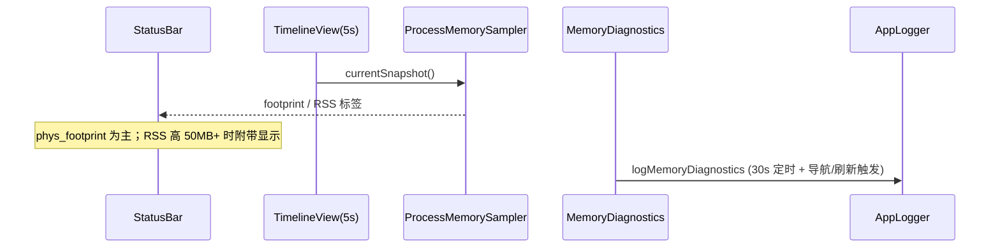
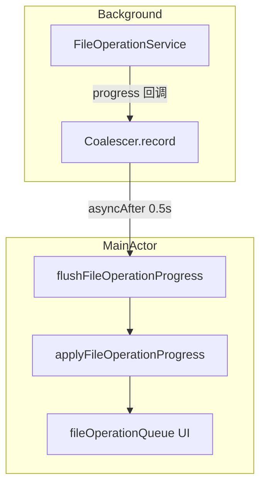

# Dual Finder 功能增强与稳定性修复

> 文档版本：对应工作区 `main` + 本地未提交改动（v0.1.24 基线，稳定性补丁未发版）
> 测试：337 项单元测试，连续 3 轮全通过

---

## 1. 问题背景

### 1.1 内存占用异常（数十 GB）

| 现象 | 影响 |
|------|------|
| Activity Monitor 显示 Dual Finder 占用极高内存 | 系统卡顿、可能被系统杀进程 |
| 长时间 Sync/Mirror 后内存不回落 | 误以为存在严重泄漏 |

**排查结论（非单一根因）：**

1. **TextEncoding 缓存**：启动时曾 eager 加载约 3.8 万条磁盘缓存 → 已改为懒加载 + LRU 上限 10,000（`TextEncodingConversionCache`）。
2. **面包屑路径**：深路径遍历在越过 `/` 后继续产生 `..` 段，数组无限膨胀 → 已限制深度 64 + 根路径停止条件 + UI 仅展示末 4 段。
3. **大目录列表分页**：`Load More` 的 `onAppear` 自动递增 `fileListRenderLimit`，滚动时持续挂载更多 SwiftUI 行 → 已移除自动加载，仅保留按钮。
4. **Mirror/Sync 热路径**：每文件 `debug` 日志 + 每文件 `Task { @MainActor }` 进度回调 → 主线程排队爆炸，表现为「应用无响应」而非典型 RSS 泄漏；日志队列与 UI 合并后 footprint 实际约 90–200 MB。

### 1.2 应用无响应（ANR）

用户在 Mirror 约 260 GB / 2.2 万文件的 `Twitter` 目录时强退。日志特征：

- `queuedOperations=1` 持续十余分钟
- `IMKCFRunLoopWakeUpReliable` 错误（主 RunLoop 阻塞）
- 内存诊断正常（footprint ~160 MB）

**因果链：**


---

## 2. 解决思路（KISS + 最小风险）

| 层级 | 策略 | 原则 |
|------|------|------|
| Core | 去掉热路径逐文件 debug；skip 进度 1000 次/2s 节流；结束时 `flushSkippedSummary` | 减少回调频率，不改业务语义 |
| Core | `AppLogger` 待写队列超 2000 时丢弃 DEBUG，并写一条 `debug.logs.dropped` | 保护磁盘与内存，保留 INFO/WARN/ERROR |
| Core | `FileOperationProgressCoalescer` 0.5s 合并进度再刷 UI | 单一职责、可单测 |
| App | 文件操作 progress 回调直接 `coalescer.record`，不再每帧 `Task { @MainActor }` | 降低 Swift 并发调度开销 |
| App | 面包屑：构建深度上限 + 根停止 + 仅显示末 4 段 | 防止路径组件数组膨胀 |
| App | 分页：移除 `onAppear` 自动 Load More | 用户显式加载 |

**刻意不做（降低风险）：**

- 未改 Mirror/Sync 核心复制逻辑
- 未发版（按当前要求）
- 未引入多窗口等大范围新功能

---

## 3. 架构与数据流

### 3.1 内存显示（状态栏，每 5 秒）



**关键文件：**

- `Sources/DualFinderCore/ProcessMemorySampler.swift`
- `Sources/DualFinderCore/MemoryDiagnostics.swift`
- `Sources/DualFinderApp/ContentView.swift` → `StatusBar`
- `Sources/DualFinderApp/DualFinderViewModel.swift` → `startMemoryDiagnosticsMonitoring()`

**日志路径：** `~/Library/Logs/DualFinder/YYYY-MM-DD.log`，关键字 `[memory] diagnostics`

### 3.2 文件操作进度合并



**关键文件：**

- `Sources/DualFinderCore/FileOperationProgressCoalescer.swift`
- `Sources/DualFinderCore/FileOperationService.swift` → `OperationContext.recordSkipped` / `flushSkippedSummary`
- `Sources/DualFinderApp/DualFinderViewModel.swift`

### 3.3 Mirror 模式


**关键文件：**

- `Sources/DualFinderCore/MirrorDeletionPlanner.swift`
- `Sources/DualFinderCore/FileOperationService.swift` → `mirror()`

---

## 4. 已交付功能清单

### 4.1 已提交（v0.1.23 / v0.1.24）

| 功能 | 状态 |
|------|------|
| 状态栏内存 footprint（5s 刷新） | 完成 |
| 内存诊断日志（30s + 事件触发） | 完成 |
| TextEncoding 懒加载 + LRU 10000 | 完成 |
| Mirror to Other Pane + 删除预览 | 完成 |
| Sync/Mirror 进度：文件数、字节、skipped/copied 统计 | 完成 |
| 可点击面包屑、Tab 切换左右栏 | 完成 |
| 大目录分页（2000 + Load More 按钮） | 完成 |
| 条件批量选中（扩展名/今日修改/>100MB） | 完成 |
| Terminal 高度持久化 | 完成 |
| 状态栏打开日志目录 | 完成 |
| Volumes 侧边栏 | 已有 |

### 4.2 工作区稳定性补丁（未发版）

| 改动 | 状态 |
|------|------|
| 移除分页 onAppear 自动加载 | 完成 |
| FileOperationProgressCoalescer | 完成 |
| skip 节流 + 去除逐文件 debug | 完成 |
| 日志 DEBUG 背压 | 完成 |
| 面包屑深度/根路径修复 | 完成（含 `..` 边界修复） |
| 单元测试 +337 | 完成 |

### 4.3 未做（Backlog）

- 多窗口
- Sync 前预估面板
- 失败项 Reveal
- 拷贝 hash 校验

---

## 5. 测试覆盖

| 套件 | 覆盖点 |
|------|--------|
| `ProcessMemorySamplerTests` | footprint 格式化、RSS 高时标签 |
| `FileOperationServiceTests` | sync skip、`sync.skip-progress`、`flushSkippedSummary` |
| `FileOperationProgressCoalescerTests` | 合并、cancel、take |
| `AppLoggerTests` | DEBUG 队列满时丢弃 |
| `PathBreadcrumbBuilderTests` | 正常路径、深度上限 64 |
| `MirrorDeletionPlannerTests` | 删除计划 |

运行：

```bash
swift test
```

---

## 6. 使用方法

### 6.1 观察内存

- 窗口底部状态栏右侧：每 5 秒更新，如 `93 MB` 或 `93 MB (RSS 144 MB)`
- 点击放大镜图标：在 Finder 中打开 `~/Library/Logs/DualFinder/`
- 排查泄漏：搜索日志 `grep memory diagnostics ~/Library/Logs/DualFinder/*.log`

### 6.2 Mirror

1. 在一侧选中文件夹
2. 右键 → **Mirror to Other Pane**
3. 确认对话框查看将删除的文件数/大小
4. 进度栏显示 `x/y files`、字节、skipped/copied

### 6.3 大目录

- 默认最多渲染 2000 项；点击 **Load More** 每次 +2000（不会自动无限加载）

### 6.4 本地验证应用

```bash
./update_app.sh
```

（当前按需求不推送 Release；脚本会编译并安装到 `/Applications`）

---

## 7. 三轮 Review 记录

### Review 1 — 现象与因果

- ANR 主因是**主线程与日志队列过载**，不是 RSS 泄漏。
- 面包屑 `..` 循环是**真实内存风险**，已修复根路径终止条件。
- 分页 onAppear 会导致**视图树持续增长**。

### Review 2 — 测试与边界

- 补充 Coalescer / Logger / Breadcrumb / flushSkippedSummary 测试。
- Coalescer 异步测试改为轮询，避免 CI 时间片抖动。
- Logger 只断言 DEBUG 被大量丢弃，允许队头 2 条 DEBUG 写入。

### Review 3 — 可维护性

- Coalescer 下沉到 `DualFinderCore`，ViewModel 仅组装 flush 回调。
- 热路径日志从 per-file DEBUG 改为聚合 INFO `sync.skip-progress`。
- 未扩大 FileOperationService 公开 API；`flushSkippedSummary` 保持 internal。

---

## 8. 关键文件索引

```
Sources/DualFinderCore/
  ProcessMemorySampler.swift
  MemoryDiagnostics.swift
  FileOperationProgressCoalescer.swift
  FileOperationService.swift
  MirrorDeletionPlanner.swift
  TextEncodingConversionService.swift
  Logging.swift

Sources/DualFinderApp/
  ContentView.swift          # StatusBar 5s 内存
  DualFinderViewModel.swift  # 诊断、Mirror、Coalescer 接线
  FilePaneView.swift         # 分页、面包屑容器
  PathBreadcrumbBar.swift    # 面包屑 UI + Builder

Tests/
  DualFinderCoreTests/FileOperationProgressCoalescerTests.swift
  DualFinderCoreTests/AppLoggerTests.swift
  DualFinderCoreTests/FileOperationServiceTests.swift
  DualFinderAppTests/PathBreadcrumbBuilderTests.swift
```

---

## 9. 平台说明

本项目为 **macOS 14+** Swift/SwiftUI 应用，无 Windows 构建。上述内存 API（`phys_footprint`）为 macOS 专用。
