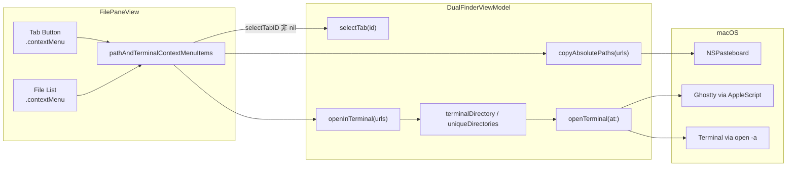
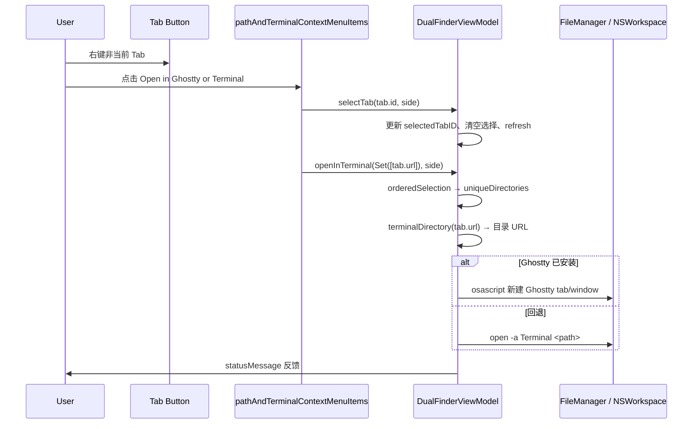
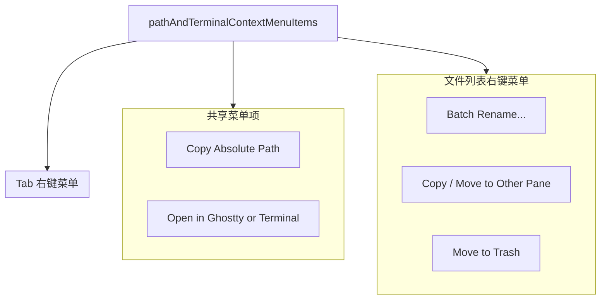
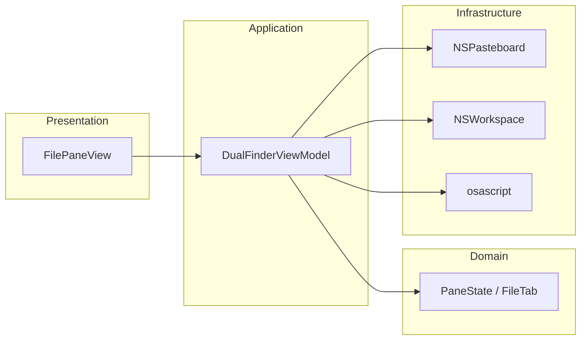

# Tab 右键菜单：Copy Path / Open Terminal

## 问题

Dual Finder 在**文件列表**右键已有「Copy Absolute Path」和「Open in Ghostty or Terminal」，但**顶部 Tab 条**右键没有任何菜单。用户需要先在列表里选中当前目录对应的条目（而当前目录本身通常不在列表中），才能复制路径或打开终端，操作路径不直观。

## 影响

| 场景 | 影响 |
|------|------|
| 在 Tab 上想复制当前目录绝对路径 | 无法直接操作，需借助路径栏或其他方式 |
| 在 Tab 上想在该目录打开终端 | 同上，体验与 Finder / VS Code 等不一致 |
| 多 Tab 并存、右键非当前 Tab | 即使未来有菜单，也必须操作**被点击 Tab** 的路径，而非当前选中 Tab |

## 解决的核心思路

1. **复用现有 ViewModel 能力**：Tab 的 `url` 即目录路径，直接调用已有的 `copyAbsolutePaths` / `openInTerminal`，不重复实现剪贴板或 Ghostty/Terminal 启动逻辑。
2. **DRY 提取共享菜单项**：将两个菜单项抽成 `pathAndTerminalContextMenuItems(for:selectTabID:)`，文件列表与 Tab 条共用，保证文案与行为一致。
3. **Tab 右键先切换 Tab**：通过可选参数 `selectTabID`，在菜单动作执行前调用 `selectTab`，与 Finder 行为一致——右键非当前 Tab 时，操作完成后该 Tab 变为活动 Tab。

## 关键文件

| 文件 | 职责 |
|------|------|
| `Sources/DualFinderApp/FilePaneView.swift` | Tab 条 `.contextMenu`、共享菜单项 ViewBuilder |
| `Sources/DualFinderApp/DualFinderViewModel.swift` | `copyAbsolutePaths`、`openInTerminal`（未改动，复用） |
| `Sources/DualFinderCore/PaneState.swift` | `FileTab.url` 数据源 |

## 设计

### 分层

```
┌─────────────────────────────────────┐
│  FilePaneView (SwiftUI 表现层)       │
│  - tabStrip.contextMenu             │
│  - pathAndTerminalContextMenuItems  │
└──────────────┬──────────────────────┘
               │ 调用
┌──────────────▼──────────────────────┐
│  DualFinderViewModel (应用逻辑层)    │
│  - selectTab                        │
│  - copyAbsolutePaths                │
│  - openInTerminal → openTerminal(at)│
└──────────────┬──────────────────────┘
               │ 系统 API
┌──────────────▼──────────────────────┐
│  NSPasteboard / NSWorkspace /       │
│  osascript (Ghostty) / open(1)      │
└─────────────────────────────────────┘
```

### 数据流



### 调用时序（Tab 右键 → Open Terminal）



### Tab 与文件列表菜单关系



## 使用方法

1. 在左/右窗格顶部的 **Tab 标签**上 **右键**。
2. 选择：
   - **Copy Absolute Path** — 将该 Tab 对应目录的绝对路径写入系统剪贴板（多 Tab 各自独立）。
   - **Open in Ghostty or Terminal** — 在该目录打开终端；优先 Ghostty，否则 macOS Terminal。
3. 若右键的是非当前 Tab，执行菜单项后会**自动切换到该 Tab**。

快捷键（与 Tab 无关，仍针对文件列表选中项）：

| 操作 | 快捷键 |
|------|--------|
| Copy Absolute Path | ⌘⇧C（菜单 Edit） |
| Open in Terminal | ⌘⌥T |

## 代码审查结论（3 轮）

### 第 1 轮：Bug 与边界场景

| 检查项 | 结论 |
|--------|------|
| Tab URL 不在文件列表中，`orderedSelection` 能否工作 | ✅ 无匹配项时回退为 `Array(selection).sorted`，单 Tab URL 正确 |
| 根目录 `/` 路径复制 | ✅ `standardizedFileURL.path` 输出 `/` |
| 右键非当前 Tab 操作错误目录 | ✅ 使用 `ForEach` 内 `tab.url`，非 `selectedURL` |
| Ghostty 未安装 | ✅ 已有回退 `open -a Terminal` |
| 目录不存在 / 无权限 | ✅ `openTerminal` 失败时 statusMessage + 日志，与列表行为一致 |
| 右键触发 Button 左键逻辑 | ✅ SwiftUI `.contextMenu` 与 `.buttonStyle(.plain)` 不冲突 |
| 引入额外问题 | ❌ 无；ViewModel 零改动 |

**遗漏评估**：未在 Tab 菜单加入 Close Tab / Duplicate Tab——用户未要求，且避免与工具栏关闭按钮职责重叠；后续可按需扩展。

### 第 2 轮：可维护性、DRY、分层

| 检查项 | 结论 |
|--------|------|
| 单一职责 | ✅ View 只负责菜单呈现；ViewModel 负责剪贴板/终端 |
| DRY | ✅ 两处菜单共用 `pathAndTerminalContextMenuItems`，消除重复 Button 定义 |
| 文件大小 | ✅ FilePaneView 增加 ~15 行，helper 内聚于 Tab/File 菜单附近 |
| 高内聚低耦合 | ✅ 未向 Core 层渗透；终端逻辑仍在 ViewModel |
| 可复用性 | ✅ `selectTabID` 可选，文件列表不传即可 |
| 竞态 | ✅ 同步 UI 操作，无 async 请求；selectTab 后立即 copy/open，无中间状态 |

**优化项（已做）**：提取共享 helper；Tab 场景传入 `selectTabID` 保证 Tab 切换。

### 第 3 轮：测试、对标、跨平台

| 检查项 | 结论 |
|--------|------|
| 单元测试 | Core 层 67 个测试全部通过；**App 层 context menu 无 UI 单测**（与拖拽等功能一致，依赖 AppKit/SwiftUI） |
| 可测试路径 | `copyAbsolutePaths` / `openInTerminal` 逻辑未变，无需新测；若将来提取 `terminalDirectory` 到 Core 可补测 |
| 测试遗漏 | Tab 右键 → selectTab 顺序、剪贴板内容——属 UI 集成，建议手动验证 |
| 对标 Finder / VS Code | ✅ Tab/面包屑右键复制路径、打开终端为常见能力 |
| REST API / Swagger | N/A（本地 macOS 桌面应用） |
| 服务端性能 | N/A |
| 跨平台 | ⚠️ Ghostty AppleScript、`open -a Terminal` 为 **macOS 专用**；Windows 需独立终端启动方案（应用当前仅 macOS 14+） |

## 测试覆盖说明

```
DualFinderCoreTests (67 tests) — 全部通过
├── FileOperationServiceTests
├── PaneStateTests              ← FileTab / tabs 状态
├── PaneSessionStoreTests       ← Tab 持久化
└── …

App 层（无 test target）
├── Tab contextMenu             ← 手动测试
├── copyAbsolutePaths           ← 复用既有实现
└── openInTerminal              ← 复用既有实现
```

### 建议手动测试清单

- [ ] 当前 Tab 右键 → Copy Absolute Path → 粘贴验证路径
- [ ] 非当前 Tab 右键 → Open Terminal → Tab 切换 + 终端 cwd 正确
- [ ] 根目录 Tab（如 `/`）复制路径
- [ ] 未安装 Ghostty 时回退 Terminal
- [ ] 文件列表右键菜单仍含完整项（Batch Rename 等）

## 架构总览



## 变更摘要

| 变更 | 说明 |
|------|------|
| `tabStrip` 每个 Tab Button 增加 `.contextMenu` | 提供 Copy Path / Open Terminal |
| 新增 `pathAndTerminalContextMenuItems` | 文件列表与 Tab 共用 |
| ViewModel | **无修改** — 完全复用 |
