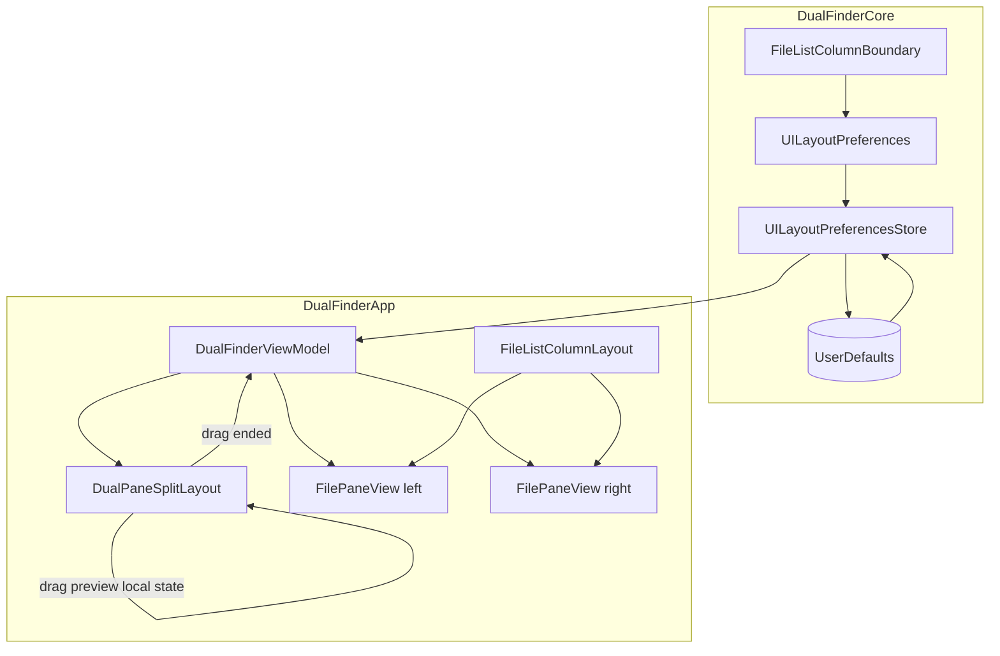
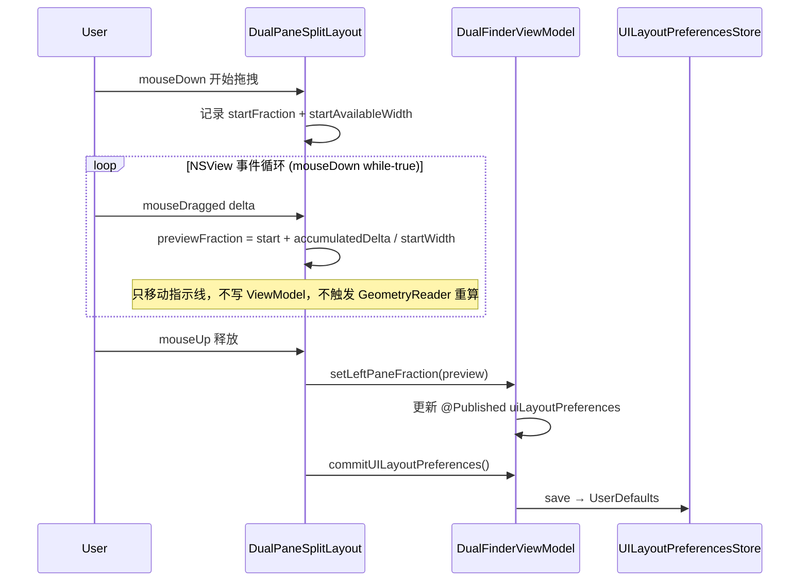
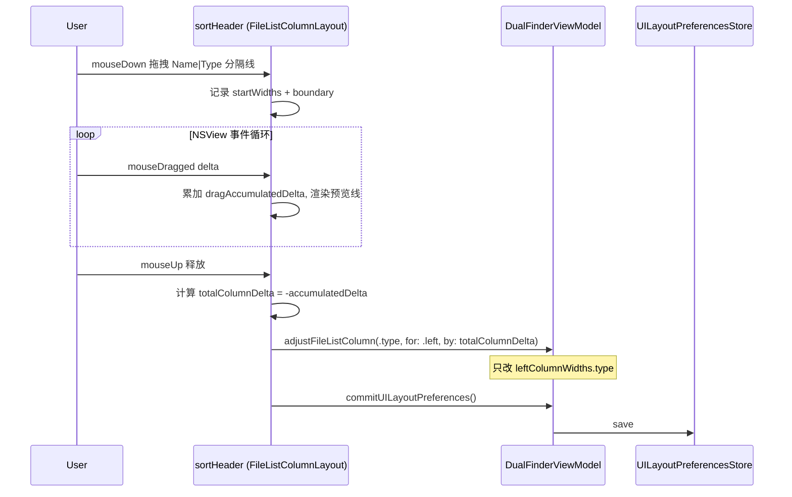
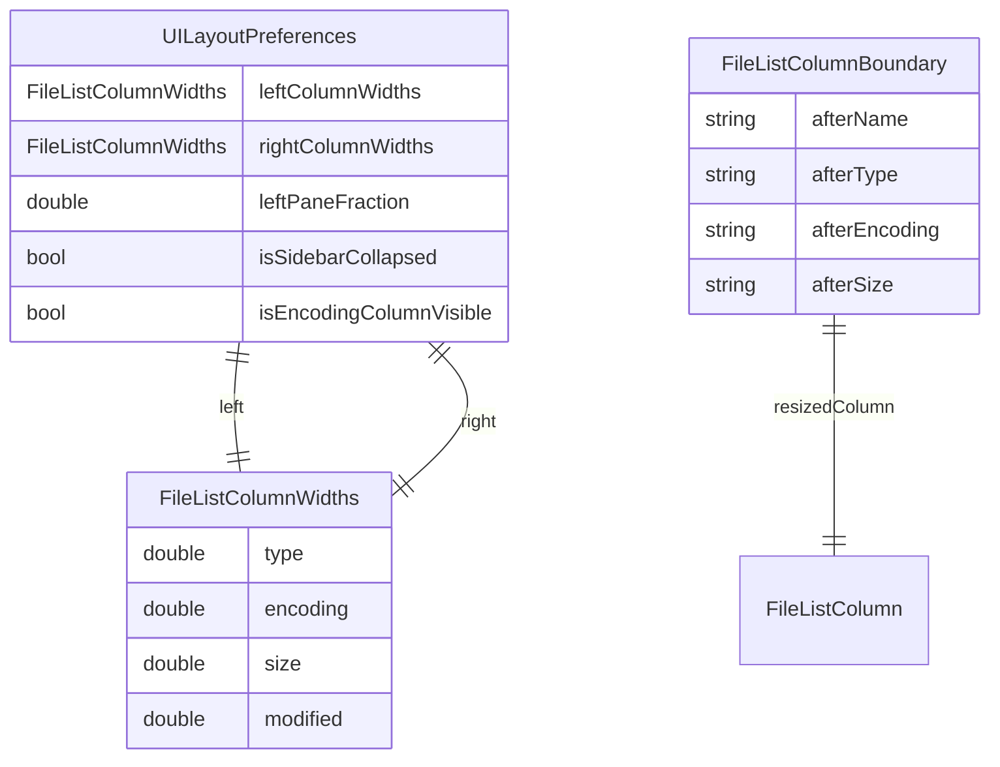

# UI 布局可调与持久化

## 问题

### 初版需求

Dual Finder 的主界面有三处布局是写死的，窗口非全屏时体验不佳：

1. **文件列表列宽固定**：Name / Type / Size / Modified 列宽写死，非全屏时常被截断。
2. **左右 pane 等宽**：无法按个人习惯调整比例。
3. **Locations 侧栏不可折叠**：固定 220pt，无法收成仅图标的窄栏。

以上状态也不会被记住，重启后恢复默认。

### 初版实现后的反馈（v0.1.5）

1. **表头过高**：列分隔拖拽条在表头里纵向撑满，行高异常。
2. **左右 pane 列宽联动**：调整左侧 pane 列宽时，右侧 pane 跟着变。
3. **pane 分隔条抖动**：拖拽中间分隔条时布局来回跳动，跟手性差。
4. **列宽拖拽方向反直觉**：向左拖时，左侧列反而变宽（因错误调整了分隔线右侧列）。

## 影响

- 表头占用过多垂直空间，文件列表可视区域变小。
- 左右 pane 无法独立优化列宽（例如左看文件名、右看 Modified）。
- pane 分隔拖拽体验差，用户难以精确调整比例。
- 列宽调整与 Finder / 常见文件管理器习惯相反，学习成本高。

## 解决核心思路

### 持久化（DualFinderCore）

`UILayoutPreferencesStore` 用 `UserDefaults` JSON 保存：

| 字段 | 说明 |
|------|------|
| `leftColumnWidths` / `rightColumnWidths` | 左右 pane **各自独立**的四列宽度（含 encoding） |
| `leftPaneFraction` | 双 pane 区域中左 pane 占比 |
| `isSidebarCollapsed` | Locations 侧栏折叠状态 |
| `isEncodingColumnVisible` | Encoding 列是否显示 |

兼容旧版 `columnWidths` 单字段：加载时复制到左右 pane。缺失 encoding 字段时用 `defaultEncodingWidth`。

### 列宽拖拽语义（Core）

`FileListColumnBoundary` 定义每条分隔线调整**右侧固定列**，并反向应用鼠标 delta（`columnDelta = -delta`）。原因是 Name 列占剩余空间，固定列从右侧锚定；这样分隔线才会按鼠标移动距离同步移动：

| 分隔线位置 | 调整的列（无 Encoding） | 调整的列（有 Encoding） |
|-----------|----------------------|----------------------|
| Name \| Type | Type | Type |
| Type \| next | Size | Encoding |
| Encoding \| Size | Size | Size |
| Size \| Modified | Modified | Modified |

### UI 层（DualFinderApp）

- **表头手柄**：固定高度 16pt，表头行高 22pt，不再纵向撑满。
- **pane 分隔拖拽**：拖拽期间只显示 1pt 目标指示线，**不**重排左右 pane、也不每帧写 ViewModel；以 drag 开始时的 fraction 与 availableWidth 为基准累加 delta；松手后一次性 `setLeftPaneFraction` + `commitUILayoutPreferences`。
- **列宽拖拽**：`adjustFileListColumn(_:for:by:)` 按 `PaneSide` 更新对应 pane；drag end 再持久化。
- **鼠标追踪**：使用 AppKit `NSView.mouseDown(with:)` + `window.nextEvent` 事件循环，而非 SwiftUI `DragGesture`，避免拖拽事件被 SwiftUI 手势系统吞掉或延迟。

## 关键文件

| 文件 | 职责 |
|------|------|
| `Sources/DualFinderCore/UILayoutPreferencesStore.swift` | 偏好模型、per-pane 列宽、legacy 迁移、`FileListColumnBoundary` |
| `Sources/DualFinderApp/ResizableLayoutViews.swift` | `LayoutResizeHandle`（NSView 事件循环）、`FileListColumnLayout`、`DualPaneSplitLayout` |
| `Sources/DualFinderApp/DualFinderViewModel.swift` | `columnWidths(for:)`、`adjustFileListColumn(for:)` |
| `Sources/DualFinderApp/FilePaneView.swift` | 表头/行内列布局，按 `side` 取列宽 |
| `Sources/DualFinderApp/ContentView.swift` | 侧栏折叠、双 pane 分割 |
| `Tests/DualFinderCoreTests/UILayoutPreferencesStoreTests.swift` | 4 个 Suite / 25 个测试 |

## 设计

### 架构

### pane 分隔拖拽时序

### 列宽调整时序

### 数据关系

## 默认值与边界

| 项 | 默认 | 范围 |
|----|------|------|
| 每 pane Type 列宽 | 112 | 64 – 280 |
| 每 pane Encoding 列宽 | 92 | 70 – 150 |
| 每 pane Size 列宽 | 86 | 56 – 160 |
| 每 pane Modified 列宽 | 126 | 88 – 240 |
| 左 pane 比例 | 0.5 | 0.2 – 0.8 |
| 表头行高 | 22pt | 固定 |
| 列分隔手柄高 | 16pt | 固定 |
| 侧栏展开 / 折叠 | 220 / 52 pt | 固定 |

- Name 列占剩余空间，不持久化。
- 旧 `columnWidths` JSON 自动迁移为左右相同列宽；旧 JSON 缺 encoding 字段用默认值。
- pane 比例相对侧栏与 Operation History 之外的双 pane 区域。
- 所有 clamp 采用多层防御：`adjust` → `setColumnWidths` → `save`，保证边界不被突破。

## 使用方法

1. **调整列宽**：在**某个 pane** 表头列分隔线上 hover（↔），拖拽。左右 pane 列宽**互不影响**。
2. **调整左右 pane 宽度**：拖拽两 pane 之间的竖向分隔条，松手后保存。
3. **折叠 Locations 侧栏**：侧栏标题栏右侧 `sidebar.left` / `sidebar.right` 按钮。

## 跨平台说明

项目仅 `macOS(.v14)`，拖拽使用 AppKit `NSView` 事件循环 + `NSCursor`。暂无 Windows 构建；移植时需抽象鼠标追踪与光标管理。

## 测试覆盖

共 **4 个 Suite / 25 个测试**，分布在 `UILayoutPreferencesStoreTests.swift`：

| Suite | 测试数 | 覆盖内容 |
|-------|--------|---------|
| `UILayoutPreferencesStore` | 7 | 持久化 round-trip、legacy 迁移、encoding 迁移/round-trip、clamp、默认值回退、sidebar width |
| `FileListColumnWidths` | 7 | `adjust` 四列（type/encoding/size/modified）、边界 min/max、`width(for:)` 四列、`clamped()` 含 encoding、默认 encoding 宽 |
| `UILayoutPreferences` | 5 | `columnWidths(for:)` 读、`setColumnWidths` 独立写入、`setColumnWidths` clamp、`clampedFraction` 边界值（0.0/0.2/0.5/0.8/0.9/1.0/-1.0）、`clamp()` 全字段、默认值 |
| `FileListColumnBoundary` | 6 | `resizedColumn` 无 encoding、有 encoding、`afterEncoding` 回退、`columnDelta` 全 boundary × 正负零、`allCases` 覆盖 |

SwiftUI 拖拽手感未做 UI 自动化；Core 层覆盖持久化、边界语义与数据完整性。

## 性能分析

| 操作 | 频率 | 开销 | 结论 |
|------|------|------|------|
| 拖拽中 delta 累加 | 每像素 | `@State` 更新 + 指示线偏移 | 无性能问题；不触发 ViewModel 更新 |
| drag end 列宽/fraction 应用 | 每次松手 | `@Published` → 所有 FileRow body 重算 | FileRow.Equatable 短路大部分 diff；只在 columnWidths 实际变化时重渲染 |
| UserDefaults 写入 | 每次松手 | JSON encode ~0.1ms | 无性能问题 |
| 多层 clamp | 每次 adjust/save | 4 个 min/max 比较 | 纳秒级，防御性设计，保留 |
| `LayoutResizeTrackingNSView` 事件循环 | 拖拽期间 | 阻塞 main thread 但仅处理鼠标事件 | macOS 标准模式，不影响 UI 响应 |

## Review 记录

### 第 1 轮（v0.1.5 修复）

- 表头手柄 `length: 16`，表头 `frame(height: 22)`，消除纵向撑满。
- `leftColumnWidths` / `rightColumnWidths` 解耦左右 pane。
- `FileListColumnBoundary` 调整分隔线**右侧**固定列，并反向应用 delta，修正右锚定列导致的错列拖动。
- pane 分隔：拖拽只更新目标指示线（`@State dragPreviewFraction`），避免 GeometryReader 反馈抖动。

### 第 2 轮（性能与竞态）

- 以 drag 开始时的 `availableWidth` 为分母，避免窗口缩放时 delta 换算漂移。
- 列宽 / pane 比例均在 drag end 写 UserDefaults；侧栏折叠仍即时保存。
- 鼠标追踪从 SwiftUI `DragGesture` 改为 AppKit `NSView.mouseDown` 事件循环，消除手势识别延迟。

### 第 3 轮（测试覆盖补齐）

- 从 7 个测试扩展到 25 个，覆盖所有公开 API：
  - `adjust(.modified)` 与 encoding 列 clamp
  - `setColumnWidths` 独立写入 + 越界 clamp
  - `clampedFraction` 全部边界值
  - `FileListColumnBoundary` encoding 开启/关闭切换
  - `clamp()` 全字段极端值
  - `width(for:)` 四列 CGFloat 返回
  - encoding round-trip 持久化
- 确认多层 clamp（adjust → setColumnWidths → save）为防御性设计，不引入性能问题。
- 确认 `FileRow.Equatable` 包含 `columnWidths` 不构成性能瓶颈：列宽仅在 drag end 变化。
