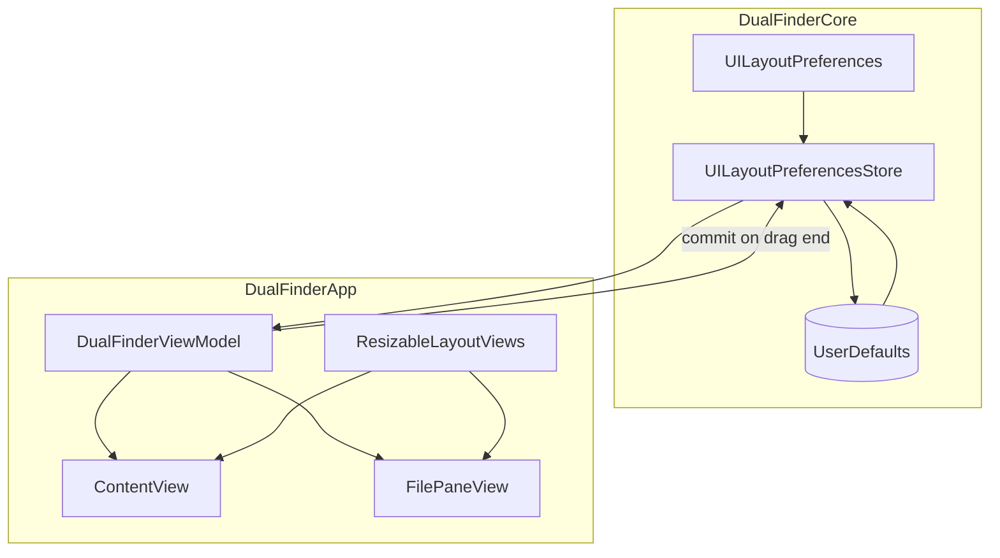
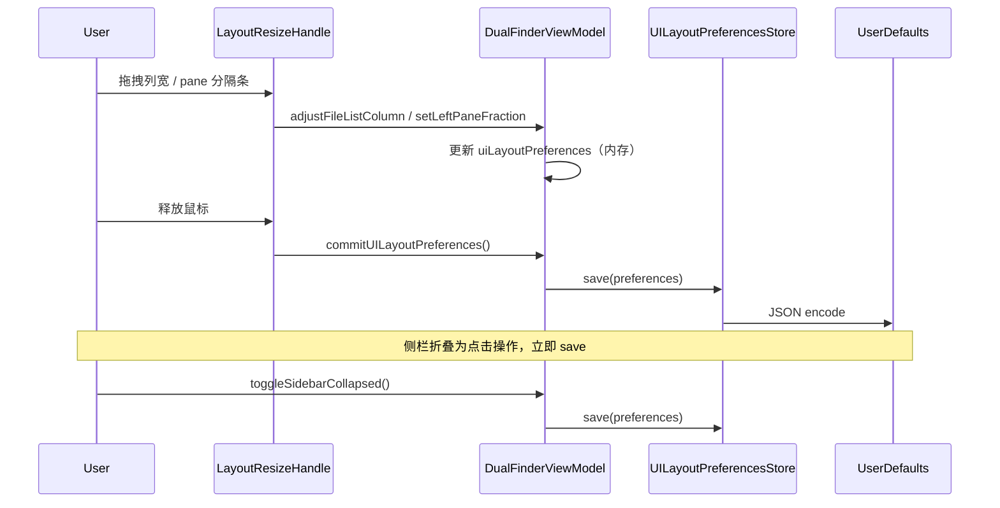

# UI 布局可调与持久化

## 问题

Dual Finder 的主界面有三处布局是写死的，窗口非全屏时体验不佳：

1. **文件列表列宽固定**：Name / Type / Size / Modified 列宽写死在 `FilePaneView`，Type、Size、Modified 在非全屏窗口里经常太窄，内容被截断。
2. **左右 pane 等宽**：`ContentView` 用 `HStack` 均分左右文件面板，无法按个人习惯调整比例。
3. **Locations 侧栏不可折叠**：侧栏固定 220pt，占用横向空间；无法收成仅图标的窄栏。

以上状态也不会被记住，重启后恢复默认。

## 影响

- 小窗口或分屏时，Modified 日期、Size 等列经常看不全。
- 左右 pane 无法按任务调整（例如左侧浏览、右侧预览）。
- 侧栏长期占宽，压缩双 pane 可用空间。
- 每次重启都要重新适应默认布局。

## 解决核心思路

在 `DualFinderCore` 增加 `UILayoutPreferencesStore`，用 `UserDefaults` JSON 持久化：

- 三列固定宽度（Type / Size / Modified）
- 左右 pane 比例（`leftPaneFraction`）
- 侧栏折叠状态（`isSidebarCollapsed`）

App 层提供可复用 SwiftUI 组件：

- `FileListColumnLayout`：表头带拖拽手柄，数据行复用同一列宽
- `DualPaneSplitLayout`：左右 pane 之间的可拖拽分隔条
- `CommonLocationsSidebar`：折叠/展开切换，折叠时仅显示图标

拖拽过程中只更新内存中的 `@Published` 状态；**拖拽结束**或**点击折叠按钮**时再写入 `UserDefaults`，减少频繁 IO。

## 关键文件

| 文件 | 职责 |
|------|------|
| `Sources/DualFinderCore/UILayoutPreferencesStore.swift` | 布局偏好模型、列宽 clamp、UserDefaults 读写 |
| `Sources/DualFinderApp/ResizableLayoutViews.swift` | `LayoutResizeHandle`、`FileListColumnLayout`、`DualPaneSplitLayout` |
| `Sources/DualFinderApp/DualFinderViewModel.swift` | 暴露 `uiLayoutPreferences` 与调整/提交 API |
| `Sources/DualFinderApp/ContentView.swift` | 侧栏折叠 UI、双 pane 分割布局 |
| `Sources/DualFinderApp/FilePaneView.swift` | 表头列宽拖拽、行内列对齐 |
| `Tests/DualFinderCoreTests/UILayoutPreferencesStoreTests.swift` | 持久化、clamp、默认值测试 |

## 设计

### 架构



### 数据流



### 数据关系

```mermaid
erDiagram
    UILayoutPreferences {
        FileListColumnWidths columnWidths
        double leftPaneFraction
        bool isSidebarCollapsed
    }
    FileListColumnWidths {
        double type
        double size
        double modified
    }
    UILayoutPreferences ||--|| FileListColumnWidths : contains
    UILayoutPreferencesStore ||--o| UILayoutPreferences : load/save
```

## 默认值与边界

| 项 | 默认 | 范围 |
|----|------|------|
| Type 列宽 | 112 | 64 – 280 |
| Size 列宽 | 86 | 56 – 160 |
| Modified 列宽 | 126 | 88 – 240 |
| 左 pane 比例 | 0.5 | 0.2 – 0.8 |
| 侧栏展开宽 | 220 | 固定 |
| 侧栏折叠宽 | 52 | 固定 |

- Name 列始终占据剩余空间，不参与固定宽度存储。
- 损坏或越界的持久化数据在 `load()` / `save()` 时会被 clamp。
- 无已存数据时回退到 `.default`。
- 左右 pane 比例相对「侧栏与可选 Operation History 之外的双 pane 区域」计算。

## 使用方法

1. **调整列宽**：在任意 pane 表头 Type / Size / Modified 列之间的分隔线 hover（光标变为左右箭头），拖拽即可。左右 pane 共享同一套列宽。
2. **调整左右 pane 宽度**：拖拽左右 pane 之间的竖向分隔条。
3. **折叠 Locations 侧栏**：点击侧栏标题栏右侧的 `sidebar.left` 按钮；折叠后仅显示文件夹/收藏图标，hover 可看完整路径；再点 `sidebar.right` 展开。

所有调整在拖拽结束或点击折叠后自动保存，重启后恢复。

## 跨平台说明

当前项目 `Package.swift` 仅声明 `macOS(.v14)`，UI 实现依赖 AppKit（`NSCursor`、现有 SwiftUI-macOS 栈）。**暂无 Windows 构建目标**；若未来移植，需将 `ResizableLayoutViews` 中的 AppKit 依赖抽象为平台适配层。

## 测试覆盖

`UILayoutPreferencesStoreTests` 覆盖：

- 列宽、pane 比例、侧栏折叠状态的 round-trip 持久化
- 非法值的 clamp
- 无数据时的默认值回退
- `FileListColumnWidths.adjust` 与 `sidebarWidth` 计算

SwiftUI 拖拽交互未做 UI 自动化测试（与项目其他 UI 一致）；持久化与 clamp 逻辑在 Core 层单测覆盖。

## Review 记录（3 轮）

### 第 1 轮：功能与 bug

- 确认表头才有 resize handle，数据行用等宽 spacer，避免每行出现拖拽条。
- 表头增加 20pt 图标占位，与 `FileRow` 对齐。
- `DualPaneSplitLayout` 用 fraction × availableWidth，避免硬编码 min width 导致比例失真。

### 第 2 轮：性能与边界

- 拖拽中只改内存，drag end 再 `commitUILayoutPreferences()`，避免逐像素写 UserDefaults。
- 侧栏折叠为离散操作，点击即持久化。
- clamp 防止极端列宽或 pane 比例破坏布局。

### 第 3 轮：可维护性

- 持久化放 Core（`UILayoutPreferencesStore`），与 `PaneSessionStore`、`FolderSortRuleStore` 一致。
- 可复用布局组件集中在 `ResizableLayoutViews.swift`，`FilePaneView` / `ContentView` 只负责组装。
- 无 REST API / TypeScript；服务端性能不适用。
