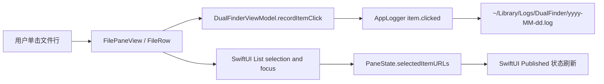
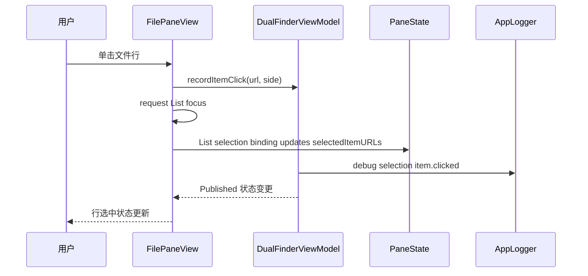
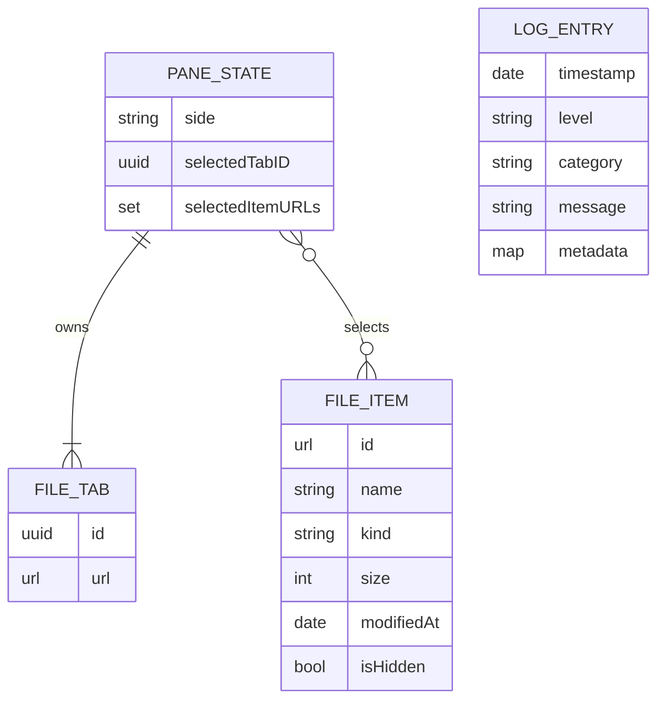
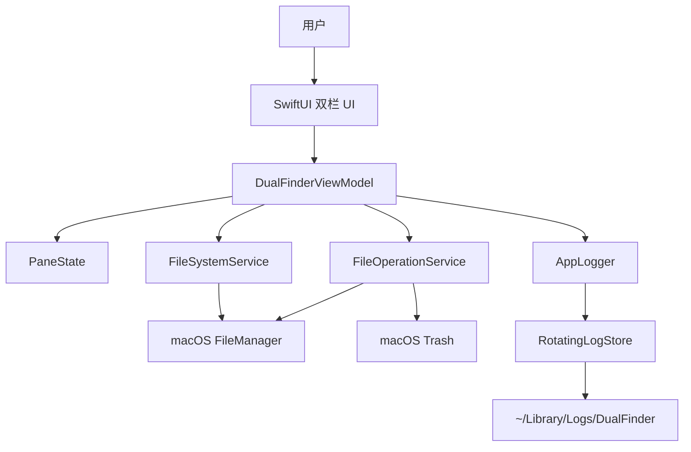

# Dual Finder 纪 基础功能设计复审

## 问题是什么

本轮复审围绕基础文件管理能力做了 3 次循环检查：文件区单击响应、日志可排查性、文件操作边界、测试覆盖、分层职责和后续跨平台风险。

用户反馈的直接问题是：文件列表区域单击多次时，看起来只有一次响应。排查日志发现当前日志只记录 `selection.changed`，也就是选中集合真正变化时才记录；反复点击同一个已选中的文件不会产生新日志。同时，列表行的可点击区域依赖 SwiftUI `List` 的默认行布局，空白区域命中范围不够明确，影响排查和交互稳定性。

## 影响是什么

- 用户会误以为文件区点击丢失，因为重复点击同一项没有新的状态变化和日志证据。
- 问题排查时只能看到少量 `selection.changed`，无法区分“点击没有触发”和“点击触发但选择未变化”。
- `trash(_:)` 的非 macOS fallback 曾经会直接永久删除文件；虽然当前 package 声明为 macOS app，但这个核心服务如果未来被跨平台复用，会引入高风险误删行为。
- `closeSelectedTab` 曾经在只剩一个 tab、实际没有关闭时仍写 `tab.closed` 日志，会误导后续诊断。

## 解决的核心思路

本轮优化遵循行为锁定优先、小步修改、每轮验证：

1. 先运行 `swift test` 锁定现有行为。
2. 第一轮：修复文件区点击可观测性和命中范围。
3. 第二轮：修复跨平台文件删除语义风险。
4. 第三轮：修复 tab 关闭日志和状态不一致。
5. 最后补充设计复审文档，记录问题、影响、设计、数据流、测试覆盖和剩余风险。

## 三轮复审结论

### 第一轮：文件区单击和日志

发现：

- 日志目录存在：`~/Library/Logs/DualFinder`。
- 今天的日志文件示例：`~/Library/Logs/DualFinder/2026-05-26.log`。
- 日志已有 `selection.changed`，但只有选择集合变化时才写入。
- 多次点击同一已选中文件不会触发新的选择变化日志。

修改：

- `FilePaneView` 给每行增加非拦截式单击记录，调用 `model.recordItemClick(...)`。
- `DualFinderViewModel.recordItemClick` 每次单击都写 `selection item.clicked` 日志。
- `FileRow` 增加 `frame(maxWidth: .infinity, alignment: .leading)`，配合 `contentShape(Rectangle())` 扩大整行命中范围。
- 单击记录使用 `simultaneousGesture`，选择和焦点仍交给原生 `List(selection:)` 处理，避免程序化 selection 导致非焦点灰色选中态。

### 第二轮：文件操作边界

发现：

- `FileOperationService.trash(_:)` 在非 AppKit 环境会调用 `removeItem`，这不是“移到废纸篓”，而是永久删除。
- 当前 app 是 macOS app，但核心层代码如果未来抽给 Windows/Linux，会产生危险语义偏差。

修改：

- 新增 `FileOperationError.trashUnsupported`。
- `trash(_:)` 在 macOS 使用 `FileManager.trashItem`。
- 非 macOS 平台明确抛出不支持错误，不再永久删除。
- 补充 macOS 废纸篓单元测试。

### 第三轮：状态和日志一致性

发现：

- `PaneState.closeTab(id:)` 在只剩一个 tab 时会忽略关闭，这是正确行为。
- `DualFinderViewModel.closeSelectedTab` 无论是否真的关闭都记录 `tab.closed`，日志语义不准确。

修改：

- `PaneState.closeTab(id:)` 返回 `Bool`，表示是否真的关闭。
- ViewModel 只在真实关闭时写 `tab.closed`。
- 忽略最后一个 tab 关闭时写 `tab.close.ignored` debug 日志。
- 补充测试覆盖关闭成功和关闭最后一个 tab 被拒绝的路径。

## 关键文件

- `Sources/DualFinderApp/FilePaneView.swift`：文件列表 UI、单击/双击交互、行命中范围。
- `Sources/DualFinderApp/DualFinderViewModel.swift`：UI 操作协调层，负责选择、导航、刷新、文件操作和日志。
- `Sources/DualFinderCore/PaneState.swift`：pane/tab/selection 的纯状态模型。
- `Sources/DualFinderCore/FileOperationService.swift`：复制、移动、新建文件夹、移到废纸篓。
- `Sources/DualFinderCore/FileSystemService.swift`：目录读取、隐藏文件过滤、排序。
- `Sources/DualFinderCore/Logging.swift`：每日日志、追加写入、7 天轮转。
- `Tests/DualFinderCoreTests/PaneStateTests.swift`：tab 和 selection 状态测试。
- `Tests/DualFinderCoreTests/FileOperationServiceTests.swift`：复制、移动、重名复制、macOS Trash 测试。
- `local_docs/basic_functions_design_review.md`：本复审文档。

## 设计

### 分层

- Core 层只保留可测试的文件系统、文件操作、日志和状态模型。
- App 层负责 SwiftUI/AppKit 交互、系统面板、`NSWorkspace` 打开文件和日志目录。
- ViewModel 是边界协调层，把 UI 事件转成 Core 操作，并写可排查日志。

### 单一职责

- `PaneState` 只管理 pane 状态，不读文件、不写日志。
- `FileOperationService` 只做文件操作，不持有 UI 状态。
- `FileSystemService` 只做目录读取和 `FileItem` 映射。
- `RotatingLogStore` 只做日志格式化、追加和轮转。
- `FilePaneView` 只描述单个面板 UI 和事件入口。

### DRY

- ViewModel 新增 `setSelection(_:for:)`，避免左右 pane selection 赋值重复。
- `mutatePane` 和 `pane(for:)` 继续作为左右 pane 访问的统一入口。
- 选择逻辑由 SwiftUI `List(selection:)` 和 ViewModel selection binding 统一处理，点击日志不再直接改 selection，避免重复职责。

## 数据流动图



## 调用时序图



## 数据关系图



## 架构图



## 使用方法

### 查看日志

```bash
ls -la ~/Library/Logs/DualFinder
tail -n 200 ~/Library/Logs/DualFinder/$(date +%F).log
```

单击文件行后，应能看到类似：

```text
DEBUG [selection] item.clicked path=/Users/hunter/Documents side=right
```

选择集合变化时，应能看到：

```text
DEBUG [selection] selection.changed count=1 side=right
```

### 运行测试

```bash
swift test
```

### 构建、签名、安装并启动

```bash
./update_app.sh
```

## 单元测试覆盖

当前核心测试覆盖：

- 日志追加不截断。
- 日志最多保留最近 7 个日文件。
- 目录读取按目录优先和名称排序。
- tab 新增/关闭，并且保留至少一个 tab。
- 单选文件状态，并在导航时清空选择。
- 复制文件。
- 移动文件。
- 复制同名文件不会覆盖目标文件。
- macOS 下移到废纸篓。

本轮新增或加强：

- `PaneState` 导航清空已有 selection 的不变量。
- `PaneState.closeTab(id:) -> Bool` 成功/失败返回值。
- `FileOperationService.trash(_:)` macOS 废纸篓路径。

## 测试遗漏和剩余风险

- 还没有 UI 自动化测试验证 SwiftUI `List` 的真实点击命中区域。
- 还没有双击导航与单击选择手势组合的 UI 自动化回归测试。
- `selectTab(_:)` 对无效 tab id 仍缺少显式拒绝返回值和测试。
- 复制/移动目录到自身或子目录的错误提示还可以更友好，目前依赖系统错误。
- Windows/Linux 不是当前 package 目标平台；非 macOS Trash 已避免误删，但还没有跨平台文件管理实现。

## 必要性判断

- 文件区单击日志是必要修改：直接解决“点击很多次只响应一次”时缺少诊断证据的问题。
- 整行命中范围是必要修改：降低 SwiftUI 列表空白区域点击不稳定的概率。
- 非 macOS Trash 不再永久删除是必要修改：避免未来跨平台复用时引入破坏性行为。
- tab 关闭返回值是必要修改：让状态变化和日志语义一致。
- 新增测试是必要修改：覆盖本轮引入的核心状态和文件操作边界。
