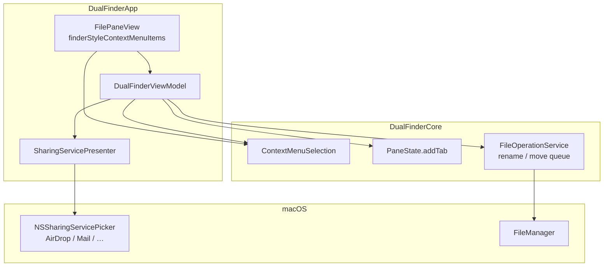
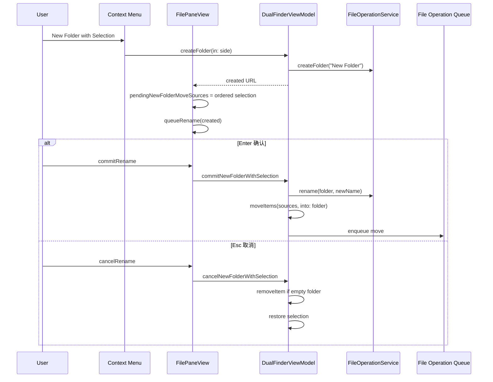
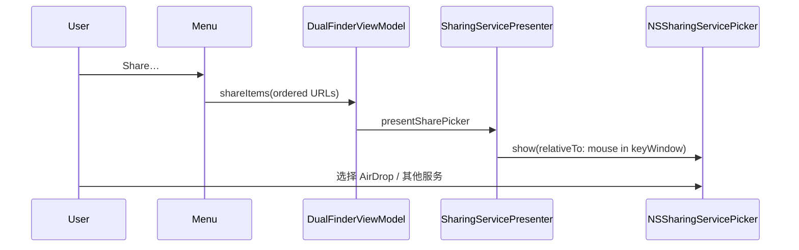

# 文件列表右键菜单增强：Share / 新 Tab 打开 / 新建文件夹收纳多选

## 问题

Dual Finder 文件列表右键菜单缺少 Finder 中常用的三项能力：

| 能力 | 用户期望 |
|------|----------|
| **Share…** | 调用 macOS 系统分享面板（含 AirDrop、邮件、信息等） |
| **Open in New Tab(s)** | 多选且均为文件夹时，每个文件夹在新 Tab 打开 |
| **New Folder with Selection** | 多选 ≥2 项时，创建新文件夹并进入重命名；Enter 确认后将选中项移入该文件夹，Esc 取消并删除空文件夹 |

## 影响

- 无法从应用内直接 AirDrop，需先切到 Finder。
- 多文件夹对比要在当前 Tab 反复进入/返回，或手动新建多个 Tab。
- 整理多文件只能「移到对面板」或拖放，无法像 Finder 一步「新建文件夹并收纳」。

## 解决的核心思路

1. **Share**：用 `NSSharingServicePicker` 展示系统分享服务（含 AirDrop），不自行实现传输协议。
2. **新 Tab**：复用 `PaneState.addTab(url:)`，按列表顺序为每个目录追加 Tab，最终停留在最后一个新 Tab（与 Finder 一致）。
3. **新建文件夹收纳多选**：`createFolder` → 行内重命名；Enter 时 `rename` + 复用已有 `enqueueFileOperation(.move)`；Esc 时若文件夹仍为空则删除并恢复原先选区。
4. **可测逻辑下沉 Core**：`ContextMenuSelection` 负责目录判定、多选阈值、移动源过滤、空目录检测；App 层只做菜单与 UI 状态。

## 关键文件

| 文件 | 职责 |
|------|------|
| `Sources/DualFinderCore/ContextMenuSelection.swift` | 目录判定、≥2 项阈值、`moveSources` 过滤、空目录检测 |
| `Sources/DualFinderApp/SharingServicePresenter.swift` | 弹出 `NSSharingServicePicker` |
| `Sources/DualFinderApp/DualFinderViewModel.swift` | `shareItems`、`openSelectionInNewTabs`、`moveItems`、`commit/cancelNewFolderWithSelection` |
| `Sources/DualFinderApp/FilePaneView.swift` | `finderStyleContextMenuItems`、行内重命名与 `pendingNewFolderMoveSources` 联动 |
| `Tests/DualFinderCoreTests/ContextMenuSelectionTests.swift` | Core 规则单元测试 |

## 设计

### 分层

### 菜单可见性规则

| 菜单项 | 条件 |
|--------|------|
| New Folder with Selection (N Items) | `selection.count >= 2` |
| Open in New Tab(s) | 选中项全部为目录（含 `.package`） |
| Share… | 选中项非空 |

### 数据流（New Folder with Selection）

### 调用时序（Share）

### 移动源过滤（边界）

`ContextMenuSelection.moveSources` 会排除：

- 目标文件夹自身；
- 若目标路径位于某选中项内部（防止把父目录移入子目录中的新文件夹）。

移动冲突、同名处理仍走既有 `FileOperationService` + 冲突对话框队列。

## 使用方法

1. 在左/右 pane 文件列表中选中一项或多项。
2. **右键**打开菜单：
   - **Share…**：打开系统分享面板，可选 AirDrop 等设备/服务。
   - **Open in New Tab / Open in New Tabs**：仅当所选全是文件夹时出现；每个文件夹各占一个新 Tab。
   - **New Folder with Selection (N Items)**：至少选中 2 项时出现；自动创建 `New Folder`（若重名则自动 `New Folder 2` 等）并进入重命名。
     - **Enter**：按输入名称重命名文件夹，并将原多选项目 **move** 进该文件夹。
     - **Esc**：若新文件夹仍为空则删除，并恢复原来的多选状态。
3. 其余菜单项（复制路径、压缩、收藏等）位置与行为不变。

## 测试

| 范围 | 内容 |
|------|------|
| `ContextMenuSelectionTests` | 全目录判定、≥2 阈值、`moveSources` 过滤、空目录检测 |
| 已有 `FileOperationServiceTests` | `createFolder`、`move`、`rename` 行为 |
| 已有 `PaneStateTests` | `addTab` |

**未覆盖（需手工）**：`NSSharingServicePicker` UI、AirDrop 真机传输、行内重命名与右键菜单并发的视觉回归。

## 审查结论（3 轮）

### 第 1 轮：正确性与边界

- Share 使用系统 API，无自研网络栈，AirDrop 能力随系统更新。
- 新 Tab 循环 `addTab` 会依次激活，最终落在最后一个新 Tab，与 Finder 一致。
- 重命名失败时不清理 `pendingNewFolderMoveSources`，用户可改名称或 Esc。
- Esc 仅删除**空**的新文件夹，避免误删已有内容。

### 第 2 轮：必要性与风险

- 未引入 REST/Swagger（非服务端项目）。
- 无额外网络请求与缓存竞态；文件操作仍串行队列处理。
- macOS 专用：`NSSharingServicePicker` / Trash / Tab 模型；`Package.swift` 仅声明 `macOS(.v14)`，无 Windows 实现需求。
- Share 锚点使用 `mouseLocationOutsideOfEventStream`，贴近右键位置。

### 第 3 轮：可维护性与 DRY

- 菜单条件与移动过滤集中在 `ContextMenuSelection`，ViewModel 编排，View 只保留 `pendingNewFolderMoveSources` 这一 UI 状态。
- `moveItems` 复用 `enqueueFileOperation(.move)`，与拖放、对面板移动一致。
- `selectedDirectoryURLs` 改为调用 Core，避免重复过滤逻辑。

### 可选后续（未做）

- Tab 条右键也提供 Share（当前仅文件列表）。
- Share 在无 keyWindow 时的降级提示。
- ViewModel 层针对 `commitNewFolderWithSelection` 的集成测试（需注入 mock `FileOperationService`）。

## 平台说明

本功能仅面向 **macOS 14+** 原生应用，依赖 AppKit 分享与 Finder 式 Tab 模型，**不**考虑 Windows 兼容实现。
