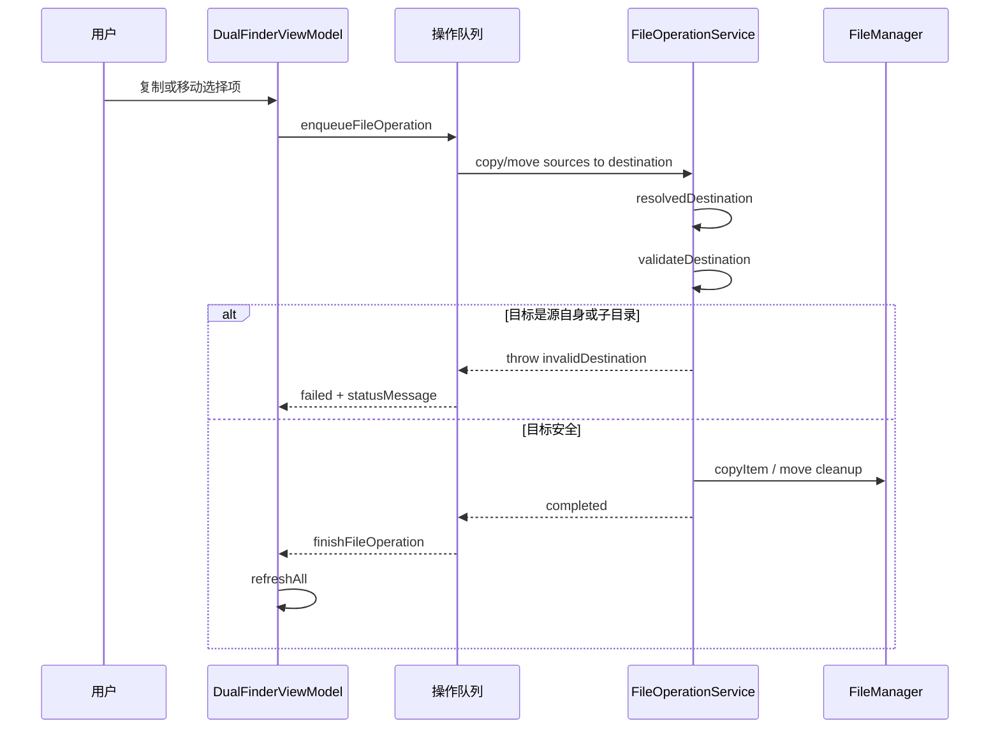
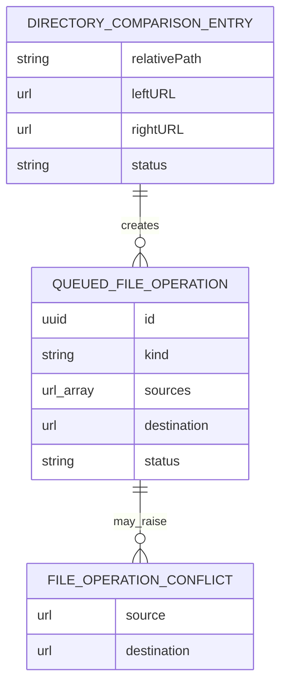
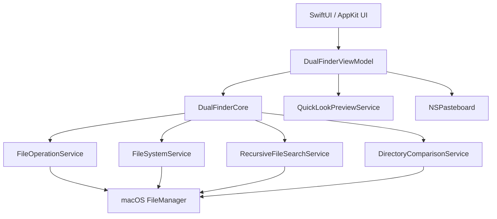

# Dual Finder 纪 功能设计与代码复审

## 问题是什么

本轮复审覆盖全部 Swift 源码、核心单元测试、构建脚本和既有本地文档，重点检查：

- 文件复制、移动、删除、批量重命名是否存在误删、覆盖、递归和回滚风险。
- 双栏同步、全局搜索、操作队列等前端状态是否存在竞态或过期任务覆盖新状态的问题。
- 单元测试是否覆盖关键边界路径。
- Core/App 分层是否清晰，是否遵循单一职责和 DRY。
- 当前 macOS App 的实现是否把平台相关能力限制在 AppKit/macOS 边界内。

发现的主要问题有 3 个：

1. `FileOperationService` 允许把文件夹复制或移动到自身子目录，可能触发递归复制；移动场景还可能在清理源目录时删除刚复制出的目标。
2. 同路径 overwrite 冲突处理会先删除目标；当源和目标是同一个文件时，存在删除源文件再复制失败的风险。
3. 目录比较的单项同步没有保留 `relativePath` 的父目录，嵌套文件会被复制到对侧根目录。

额外发现一个前端状态竞态：

- 全局搜索结果写入已经用 cancellation token 防止旧任务覆盖新任务，但进度回调缺少同样校验，旧搜索可能短暂覆盖状态栏文案。

## 影响是什么

- 文件夹复制/移动到自身子目录是高风险边界：轻则生成深层重复目录，重则移动后目标被源目录删除。
- 同路径 overwrite 是误删风险，尤其是未来如果 UI 暴露“覆盖全部”或外部调用 Core API 时。
- 目录比较同步如果不保留相对目录，会破坏目标目录结构，也会让用户难以判断同步结果。
- 旧搜索进度覆盖新搜索状态属于 UI 竞态，结果数据不会错，但状态提示会误导用户。

## 解决的核心思路

- 在 Core 层阻断危险文件操作，而不是只依赖 UI 过滤。
- 对真实风险先补回归测试，再做最小实现修复。
- 保留现有队列、冲突对话框和服务接口，不引入新依赖。
- App 层同步目录比较结果时，只补齐目标父目录并沿用现有操作队列。
- 异步搜索的结果和进度都使用同一个 cancellation token 校验。

## 关键文件

- `Sources/DualFinderCore/FileOperationService.swift`：复制/移动/冲突处理，新增危险目标校验。
- `Tests/DualFinderCoreTests/FileOperationServiceTests.swift`：新增同路径 overwrite、自身子目录复制/移动回归测试。
- `Sources/DualFinderApp/DualFinderViewModel.swift`：目录比较同步路径修复、全局搜索进度竞态修复。
- `Sources/DualFinderCore/DirectoryComparisonService.swift`：提供 `relativePath`，供 App 层保留目录结构。
- `Sources/DualFinderCore/RecursiveFileSearchService.swift`：全局搜索核心，配合 ViewModel cancellation。

## 设计

### 分层

- `DualFinderCore` 负责可测试的文件系统能力：读取目录、复制/移动、批量重命名、递归搜索、目录比较、缓存和状态模型。
- `DualFinderApp` 负责 SwiftUI/AppKit 交互：操作队列、冲突弹窗、Quick Look、剪贴板、系统设置和窗口生命周期。
- `DualFinderViewModel` 是协调层，负责把 UI 事件转成 Core 服务调用，并维护异步任务 token、状态消息和刷新。

### 单一职责

- `FileOperationService` 不关心 UI，只负责文件操作和进度。
- `DirectoryComparisonService` 只生成差异和相对路径，不直接修改文件。
- `DualFinderViewModel.syncComparisonEntry` 只负责把某个差异项映射为一次复制任务。
- `RecursiveFileSearchService` 只返回结果；过期任务仲裁留在 ViewModel。

### DRY 和复用

- 危险目标校验集中在 `FileOperationService.resolvedDestination`，复制和移动共用同一逻辑。
- 目录比较同步使用 `enqueueDirectoryComparisonCopy` 统一左右方向路径准备逻辑。
- 全局搜索复用现有 `FileOperationCancellation`，没有新增第二套任务标识机制。

## 数据流动图


## 调用时序图



## 数据关系图



## 架构图



## 使用方法

### 运行测试

```bash
swift test
```

本轮验证结果：

- `swift test`：54 个 Swift Testing 测试全部通过。
- `git diff --check`：通过，没有空白错误。

### 构建应用

```bash
swift build
swift build -c release
```

本项目的应用 target 依赖 AppKit/SwiftUI，当前 package 平台声明为 macOS 14+。Core 层已对非 macOS Trash 语义做保护，但完整桌面 App 不是 Windows/Linux 跨平台实现。

### 本地安装

```bash
./update_app.sh
```

## 单元测试覆盖

已有覆盖：

- 文件复制、移动、冲突 keepBoth/skip/overwrite。
- 文件操作进度。
- 新建文件/文件夹、重命名、批量重命名、Trash、清空 Trash。
- 目录读取、排序、文件夹大小缓存。
- pane/tab/历史/选择恢复。
- 收藏/最近目录。
- 递归搜索、目录比较、中文拼音搜索、日志轮转。

本轮新增覆盖：

- 同路径 overwrite 被拒绝，源文件内容保持不变。
- 复制文件夹到自身子目录被拒绝。
- 移动文件夹到自身子目录被拒绝，源目录不丢失。

仍未覆盖：

- `DualFinderApp` 目前没有 UI 自动化测试；SwiftUI/AppKit 层主要通过编译和 Core 单测兜底。
- 目录比较同步的父目录保留逻辑位于 App target，当前没有单独 App 测试 target。
- 全局搜索进度竞态修复依赖 ViewModel cancellation token，尚未有并发 UI 单测。

## 维护性结论

- Core/App 分层整体清晰，Core 可测试性较好。
- `DualFinderViewModel` 已经承担较多协调职责，是后续最值得拆分的文件；可按“操作队列”“搜索/比较”“剪贴板/拖拽”拆出协作者。
- 当前没有新依赖，改动保持在已有服务和 ViewModel 边界内。
- 复制/移动安全校验属于必要修改；目录同步相对路径和搜索进度 token 校验也是必要修复，不是风格性调整。

## 剩余风险和后续建议

- 大目录复制/移动仍是自定义递归实现，建议后续增加更完整的取消回滚、权限失败局部跳过、错误汇总和恢复策略。
- `DirectoryComparisonService` 以大小和修改时间判断文件相同，速度快但不是强一致；需要高可信同步时应增加可选 hash 校验。
- 递归搜索遇到某些受保护路径时可能整体抛错；可以考虑跳过不可读项并汇总警告。
- App 层缺少 UI 自动化测试，建议后续用 Xcode UI Test 或可控 ViewModel 测试覆盖队列、冲突弹窗、搜索取消和目录同步。
