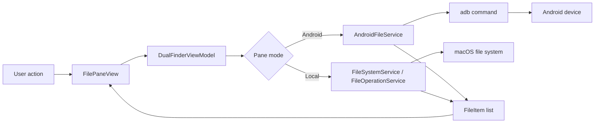
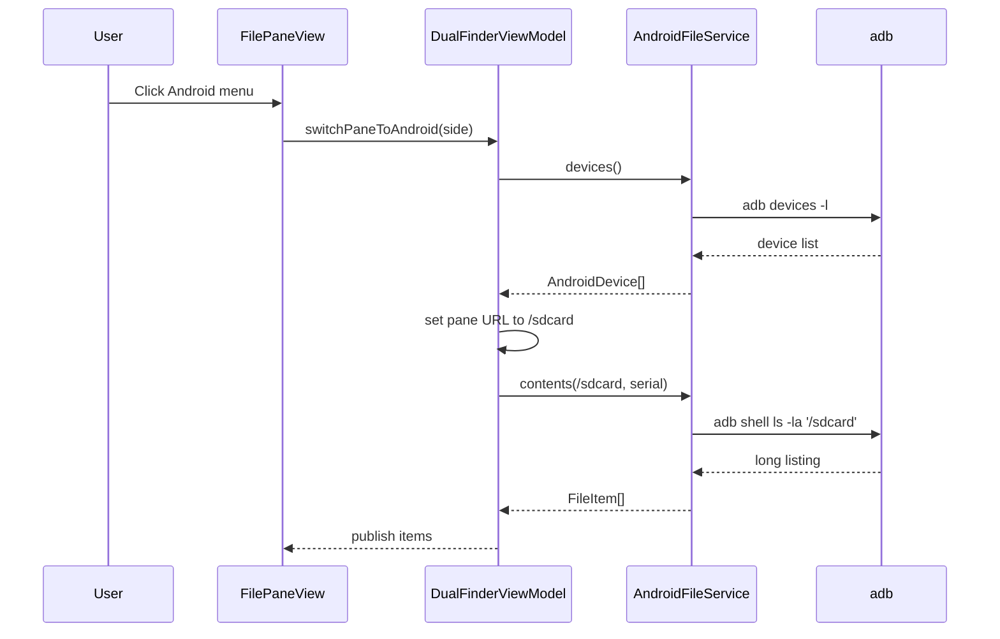
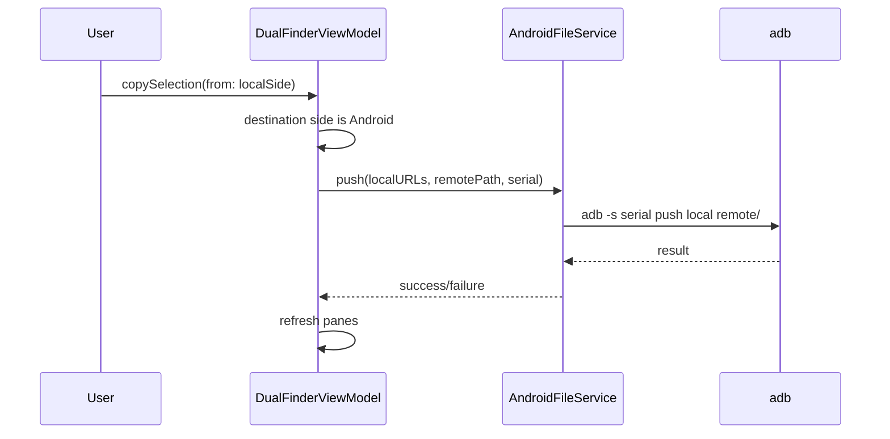
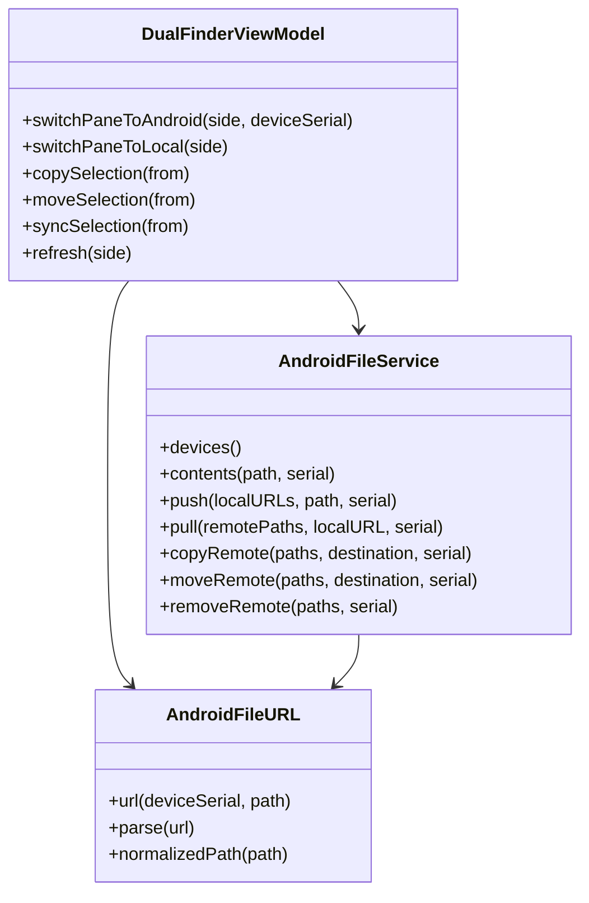

# Encoding and Android File Ability

## 问题

DualFinder 原本只管理 macOS 本地文件系统。用户需要在左右任一 pane 中切换到 Android 设备视图，并在本地文件夹与 Android 远端目录之间执行浏览、复制、移动、同步、新建、重命名、删除等常见文件管理动作。

同时，现有文件浏览能力正在扩展文本编码列，Android 能力不能破坏本地文件浏览、编码扫描、列宽和现有复制/移动队列行为。

## 影响

- 本地和 Android 文件会同时出现在同一个双栏文件管理模型中。
- Android 文件不是本地 `file://` URL，不能直接交给 Finder、Quick Look、Terminal 或 macOS 文件剪贴板。
- ADB 操作可能较慢，并且设备可能处于 `unauthorized` / `offline` 状态。
- Android shell 环境差异较大，不能依赖 GNU-only 命令能力。

## 核心思路

Android 底层使用 `adb` 命令实现，封装在 `AndroidFileService` 中：

- `adb devices -l`：列出已连接 Android 设备。
- `adb -s <serial> shell ls -la <path>`：列出 Android 远端目录。
- `adb -s <serial> push <local> <remote>/`：本地复制/移动到 Android。
- `adb -s <serial> pull <remote> <local>/`：Android 复制/移动到本地。
- `adb -s <serial> shell cp -R/mv/rm/mkdir/touch`：Android 远端内部操作。

ViewModel 通过每个 pane 的模式判断路由：

- 本地 pane 继续走原来的 `FileSystemService` / `FileOperationService`。
- Android pane 走 `AndroidFileService`。
- 本地和 Android 跨 pane 复制/移动通过 push/pull 实现。
- “同步”当前是单向同步入口，语义等同于向另一个 pane 执行 copy/push/pull；不是双向增量同步。

## 关键文件

- `Sources/DualFinderCore/AndroidFileService.swift`
  - ADB 设备发现、远端 URL、目录列表、远端文件操作。
- `Sources/DualFinderApp/DualFinderViewModel.swift`
  - pane 模式切换、Android 导航、跨本地/远端操作路由。
- `Sources/DualFinderApp/FilePaneView.swift`
  - pane header Android 菜单、Android 路径显示、Android 上下文菜单。
- `Sources/DualFinderApp/AppMenuCommands.swift`
  - View 菜单切换 Android/Local，Pane 菜单 copy/move/sync。
- `Tests/DualFinderCoreTests/AndroidFileServiceTests.swift`
  - ADB 命令构造、输出解析、错误处理、远端文件名校验。
- `Tests/DualFinderAppTests/FilePaneInteractionTests.swift`
  - Android pane 切换、远端导航、本地/远端复制、历史返回、重命名、删除。

## 数据模型

Android 远端路径使用自定义 URL：

```text
android://file/<deviceSerial>/<remotePath>
```

示例：

```text
android://file/emulator-5554/sdcard/Download/photo.jpg
```

解析后得到：

```text
deviceSerial = emulator-5554
remotePath = /sdcard/Download/photo.jpg
```

## 数据流



## 调用时序

### 切换到 Android pane



### 本地复制到 Android



## 架构关系



## 使用方法

1. 在 Android 设备上启用开发者选项和 USB 调试。
2. 用 USB 连接设备，确认手机弹出授权窗口并允许当前 Mac。
3. 在 pane header 点击手机图标。
4. 选择 “Use First Connected Android Device”，或先 “Refresh Android Devices” 再选择具体设备。
5. 左右 pane 可分别保持本地或 Android：
   - 本地 -> Android：Copy/Move/Sync to Other Pane 使用 `adb push`。
   - Android -> 本地：Copy/Move/Sync to Other Pane 使用 `adb pull`。
   - Android -> Android 同设备：使用远端 `cp -R` / `mv`。
6. Android pane 内可双击文件夹进入目录，使用底部按钮新建文件夹/文件、删除、刷新。

## 测试覆盖

已覆盖：

- ADB 设备列表解析，包含 `device` 和 `unauthorized` 状态。
- ADB 非零退出码会转成错误。
- Android `ls -la` 输出解析，包含目录、文件、隐藏项和链接。
- 远端 `mkdir` / `touch` / `cp -R` / `mv` / `rm -rf` / `push` / `pull` 命令构造。
- 远端空名字和路径型名字拒绝。
- pane 切换到 Android 后列出 `/sdcard`。
- Android pane 双击/激活目录时不走本地文件存在性判断。
- 本地 -> Android copy。
- Android -> 本地 copy。
- Android 重命名和删除。
- Android 历史 back 回到本地 URL 时恢复本地模式。

最新验证：

```text
swift test --filter AndroidFileServiceTests --filter FilePaneInteractionTests
swift test
```

## 真实设备验证

本地执行过：

```text
adb devices -l
```

结果能启动 adb daemon 并识别到设备，但当前设备状态是 `unauthorized`：

```text
b929f566 unauthorized usb:34603008X transport_id:1
```

这说明本机 adb 链路可用，但该设备需要在手机端确认 USB 调试授权后才能进行文件浏览和操作。

## 性能与优化

当前优化：

- 目录列表使用一次 `adb shell ls -la <path>` 获取当前目录，不为每个条目启动 adb。
- 远端多文件 `cp` / `mv` / `rm` 合并为单次 adb shell 命令。
- 本地和 Android 跨端传输直接使用 `adb push` / `adb pull`，避免先落中间临时目录。

仍可优化：

- 大文件传输和批量操作当前由 ViewModel 同步触发，后续应纳入现有 file operation queue，提供进度、取消和失败重试。
- 目录列表没有缓存；如果用户频繁来回进入同一目录，可增加短 TTL 缓存并在写操作后失效。
- Android `ls -la` 输出跨 ROM 仍可能有格式差异；如遇兼容问题，可增加 `stat` fallback。
- “同步”当前是单向复制语义；完整同步可后续基于文件大小、修改时间或 hash 做差异同步。

## 兼容性

这是 macOS SwiftUI 应用，当前实现依赖 macOS UI API 和本机 `adb` 可执行文件。Windows 兼容性不是当前 target 的运行目标；如果后续迁移到跨平台 UI，需要抽出：

- ADB 可执行文件查找策略。
- 本地文件操作实现。
- 剪贴板、Quick Look、Terminal、Finder 等 macOS 专属行为。

## Review 结论

三轮 review 后保留的修改都是必要的：

- ADB 服务独立在 Core，避免 UI 层拼 shell。
- Android URL 独立封装，避免把远端路径伪装成本地路径。
- ViewModel 只做 pane 模式和操作路由。
- UI 只暴露切换入口和上下文动作。
- 测试覆盖核心命令构造、解析、错误和主要用户流。

主要剩余风险是异步队列化和完整同步语义，这两项属于后续增强，不影响当前 Android 文件浏览和基础管理能力。
