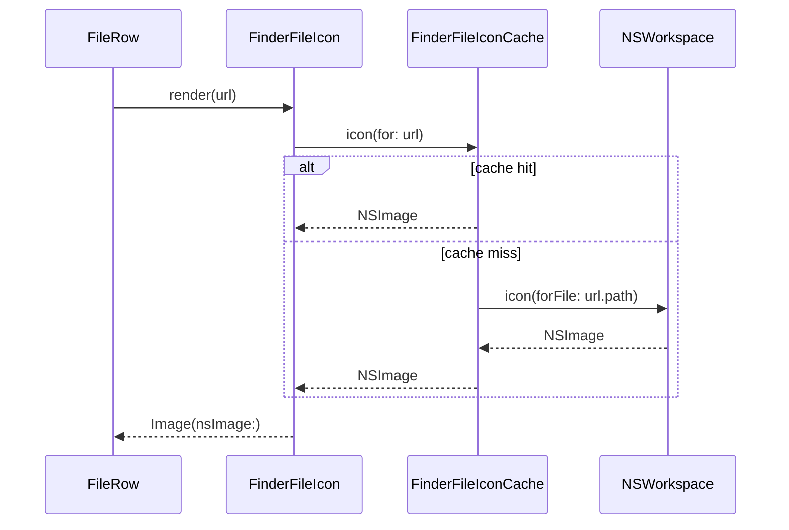
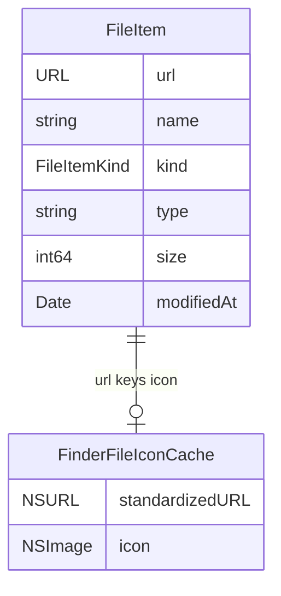

# Finder 系统图标

## 问题

文件列表原来用 SF Symbols 按 `FileItemKind` 显示图标：文件统一是 `doc`，文件夹是 `folder`，包是 `shippingbox`，别名是箭头图标。这样能表达粗粒度类型，但无法像 Finder 一样根据 `.txt`、`.pdf`、`.mp4`、`.zip`、`.exe`、`.glb`、`.png` 等文件类型显示系统图标。

## 影响

- 不同类型文件在列表中视觉区分度不足。
- 与 Finder 的识别习惯不一致，尤其是压缩包、PDF、图片、视频和跨平台文件。
- 继续手写扩展名到 SF Symbols 的映射会维护成本高，也无法覆盖系统自带和第三方 App 注册的文件类型图标。

## 解决核心思路

在 App 层使用 macOS 原生 `NSWorkspace.shared.icon(forFile:)` 获取文件或目录的系统图标，再用 SwiftUI `Image(nsImage:)` 渲染。系统负责解析扩展名、包、目录、别名、默认打开应用和自定义图标，应用只负责展示和缓存。

没有把图标逻辑放进 `DualFinderCore`，因为 Core 负责文件系统数据和业务规则，应该保持不依赖 AppKit UI。图标是 macOS UI 表现层能力，放在 `DualFinderApp` 更清晰。

## 关键文件

- `Sources/DualFinderApp/FinderFileIcon.swift`
  - `FinderFileIcon`：SwiftUI 视图，负责把 `NSImage` 缩放到列表行图标尺寸。
  - `FinderFileIconCache`：按标准化文件 URL 缓存系统图标，避免列表滚动或刷新时重复调用 `NSWorkspace`。
- `Sources/DualFinderApp/FilePaneView.swift`
  - `FileRow` 从原来的 `Image(systemName:)` 改成 `FinderFileIcon(url:)`。
- `Tests/DualFinderAppTests/FinderFileIconCacheTests.swift`
  - 覆盖相同标准化 URL 只加载一次、清空缓存后会重新加载。

## 设计

```mermaid
flowchart LR
    FS[FileSystemService] -->|FileItem url/type/kind| VM[DualFinderViewModel]
    VM -->|items(for pane)| Pane[FilePaneView]
    Pane --> Row[FileRow]
    Row --> IconView[FinderFileIcon]
    IconView --> Cache[FinderFileIconCache]
    Cache -->|miss| Workspace[NSWorkspace.shared.icon(forFile:)]
    Cache -->|hit| IconView
    Workspace --> Cache
    IconView -->|Image(nsImage:)| UI[SwiftUI List Row]
```

## 调用时序



## 数据关系



## 使用方法

打开应用后，文件列表会自动显示与 Finder 一致的系统图标。无需配置。macOS 上已注册的文件类型、目录、包和别名会由系统返回对应图标。

## 边界和风险

- 缓存 key 是标准化文件 URL；同一路径文件的自定义图标如果在应用运行期间被外部修改，可能要刷新缓存或重启应用后才能立刻体现。
- 该能力依赖 AppKit 和 `NSWorkspace`，属于 macOS 专有实现；当前项目平台就是 macOS 14+，不影响 Windows，因为本应用不是跨平台 SwiftUI 文件管理器。
- 未手写扩展名映射，因此不会遗漏新文件类型，但最终显示取决于系统和已安装应用注册的文件类型图标。

## 验证

- 新增 App 层单元测试覆盖缓存复用和清空逻辑。
- 运行 `swift test` 验证 Core 和 App 测试均通过。
