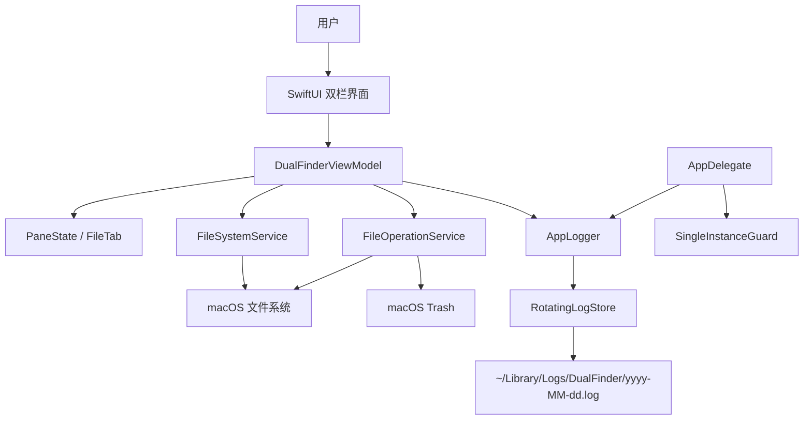
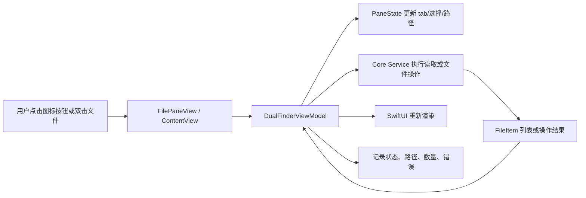
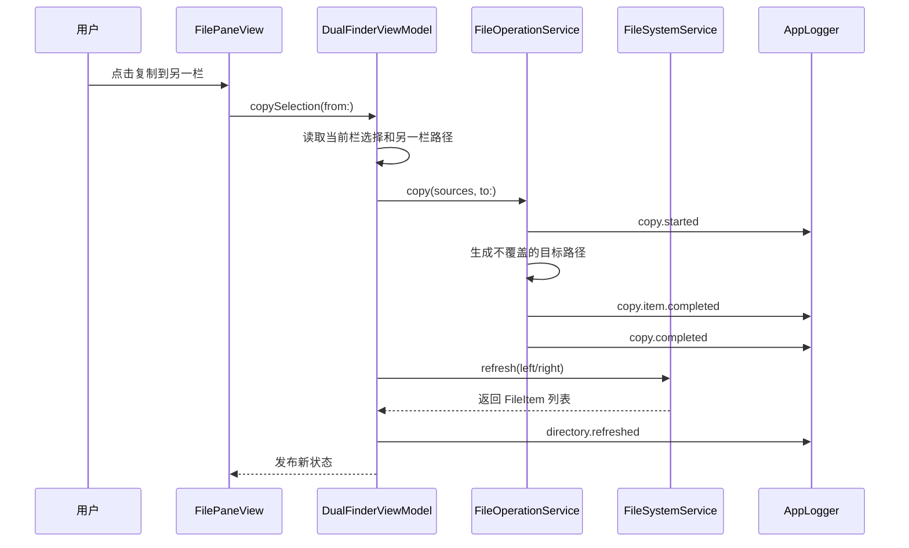
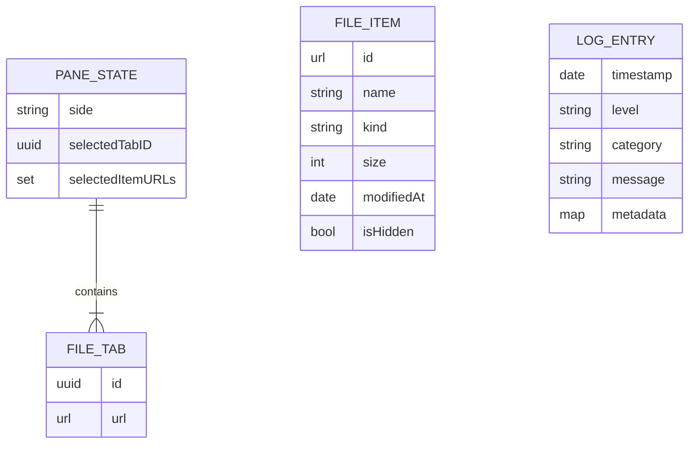

# Dual Finder 初始应用说明

## 问题是什么

macOS Finder 对双目录对照、跨目录批量复制/移动、多 tab 文件管理的效率不够接近 Total Commander 风格。这个项目初始化了一个 Swift macOS 桌面应用，提供左右双栏文件管理窗口，每个窗口有独立 tab、目录浏览、复制、移动、删除到废纸篓、新建文件夹和持久运行日志。

## 影响是什么

- 用户可以在两个目录之间快速对照和执行文件操作。
- 开发者可以通过 `~/Library/Logs/DualFinder` 中的日志理解启动、导航、选择、刷新和文件操作状态。
- 日志按天追加，重启不会清空，最多保留 7 个日文件，避免日志无限增长。
- `update_app.sh` 固化了 mac App 的本地交付流程：测试、编译、图标、签名、安装到 `/Applications`、重启。

## 解决核心思路

项目采用分层设计：

- `DualFinderCore`：可测试核心层，负责日志轮转、文件系统读取、pane/tab 状态和文件操作。
- `DualFinderApp`：SwiftUI + AppKit 应用层，负责双栏 UI、主题、窗口生命周期、单实例和系统交互。
- `tools`：生成 macOS `.icns` 图标。
- 根目录脚本：负责 release 清理、构建、签名、安装和启动。

核心逻辑不依赖 UI，因此可以用 Swift Testing 先写测试，再实现代码。

## 关键文件

- `Package.swift`：Swift Package 定义，包含 `DualFinderCore`、`DualFinderApp` 和测试 target。
- `Sources/DualFinderCore/Logging.swift`：每日日志、7 天轮转、追加写入。
- `Sources/DualFinderCore/FileSystemService.swift`：目录读取、元数据整理、目录优先排序。
- `Sources/DualFinderCore/PaneState.swift`：左右 pane 和 tab 状态。
- `Sources/DualFinderCore/FileOperationService.swift`：复制、移动、新建文件夹、删除到废纸篓。
- `Sources/DualFinderApp/DualFinderViewModel.swift`：UI 状态与核心服务之间的协调层。
- `Sources/DualFinderApp/FilePaneView.swift`：单个文件面板、tab、文件列表和操作按钮。
- `Sources/DualFinderApp/AppDelegate.swift`：单实例、启动最大化、关闭退出、生命周期日志。
- `tools/generate_icon.swift`：透明背景、圆角 mac App 图标生成。
- `update_app.sh`：完整构建、签名、安装和重启流程。
- `clear_release.sh`：清空 `release` 目录。
- `CLAUDE.md`：记录后续编码测试后的 mac App 更新和 GitHub 发布偏好。

## 架构图



## 数据流动图



## 调用时序图



## 数据关系图



## 使用方法

### 运行测试

```bash
swift test
```

### 构建、签名、安装并启动

```bash
./update_app.sh
```

这个脚本会执行：

1. `swift test`
2. `swift build -c release`
3. 创建 `release/Dual Finder.app`
4. 生成透明背景圆角图标并写入 `.icns`
5. `codesign --force --deep --sign -`
6. 杀掉已有 `Dual Finder` 进程
7. 复制到 `/Applications`
8. 从 `/Applications/Dual Finder.app` 启动

### 清理 release

```bash
./clear_release.sh
```

### 查看日志

```bash
ls -l ~/Library/Logs/DualFinder
tail -n 100 ~/Library/Logs/DualFinder/$(date +%F).log
```

日志示例：

```text
2026-05-26 15:03:29.608 INFO [navigation] directory.refreshed count=42 path=/Users/hunter showHidden=false side=left
```

## 核心代码说明

### 日志轮转

`RotatingLogStore` 用 `yyyy-MM-dd.log` 作为日文件名。每次写入时创建日志目录、追加当前日文件，然后按文件名排序删除旧日志，只保留最新 7 个日文件。写入过程受 `NSLock` 保护，避免同进程并发写日志交错。

### 文件系统读取

`FileSystemService.contents(of:)` 读取目录下 URL resource values，生成 `FileItem`。排序规则是目录/包优先，然后按 `localizedStandardCompare` 排序，适合 Finder 风格的自然排序。

### 文件操作

`FileOperationService` 负责复制、移动、新建文件夹和删除到废纸篓。复制/移动前会计算不覆盖目标的唯一路径，例如目标已有 `source.txt` 时，新文件会写入 `source 2.txt`。

### 状态管理

`PaneState` 是纯数据结构，保存 pane 方向、tab 列表、当前 tab 和选中文件 URL。`DualFinderViewModel` 持有左右两个 `PaneState`，负责把 UI 操作转换成核心服务调用，并在每个关键步骤写日志。

## 已实现能力

- 左右双栏文件浏览。
- 每栏多个 tab。
- 双击目录进入，双击文件用系统默认应用打开。
- 返回上级目录、回到 home、选择目录。
- 复制到另一栏、移动到另一栏、删除到废纸篓、新建文件夹。
- 显示/隐藏隐藏文件。
- 浅色、深色、跟随系统外观。
- 多个 accent 色系。
- 图标按钮和 hover tooltip。
- 每日日志、7 天轮转、重启不清空。
- 单实例启动、启动最大化、关闭窗口退出。
- release 打包、ad-hoc 签名、安装到 `/Applications`。

## 测试覆盖

当前核心单测覆盖：

- 日志追加不截断。
- 日志最多保留最近 7 个日文件。
- 目录读取按目录优先和名称排序。
- tab 新增/关闭并保留至少一个 tab。
- 复制文件并写操作日志。
- 移动文件并写操作日志。
- 复制同名文件不会覆盖目标文件。

## 仍然存在的风险和后续优化

- UI 目前没有自动化截图测试，主要通过构建和手动运行验证。
- 初版没有启用 sandbox；这更适合本地文件管理器原型，但未来如果发布给普通用户，需要补 entitlements、权限说明和受限目录访问设计。
- 当前文件操作没有进度条和取消能力；大文件复制时后续应加入异步任务、进度日志和失败重试/恢复策略。
- 当前不实现拖拽、搜索、文件预览和快捷键矩阵；这些适合后续迭代。
- ad-hoc 签名可以本地运行，但不会通过 Gatekeeper 分发校验；公开发布需要 Developer ID 签名和 notarization。
