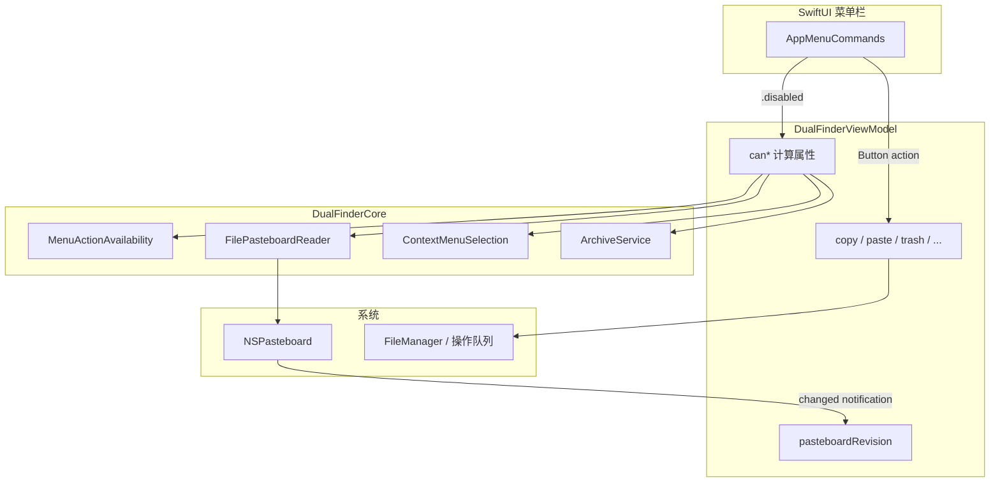
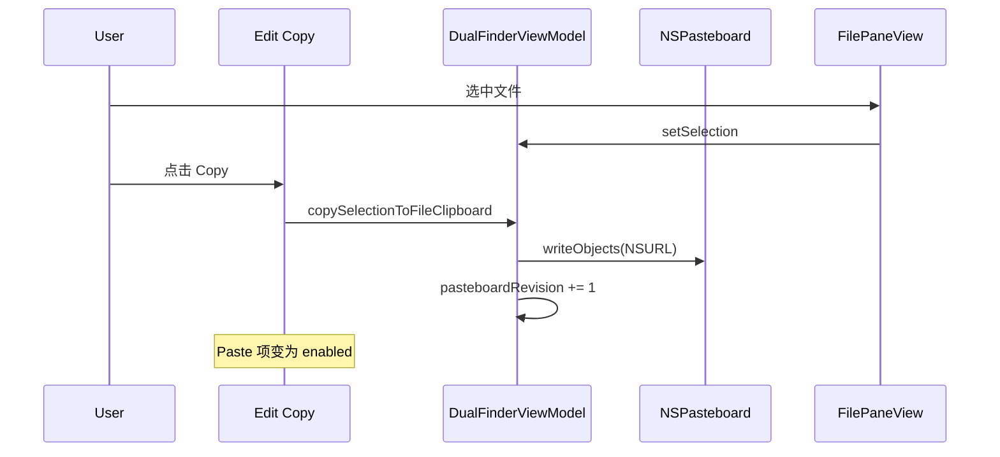

# 菜单栏与功能同步

## 问题

菜单栏原先只有少量自定义项（新建 Tab、废纸篓、跨栏移动、复制路径），而 **Edit 菜单中的 Copy / Paste / Delete 仍走系统默认逻辑**，未绑定 Dual Finder 的文件剪贴板与选择状态。用户在列表中已选中文件时，Edit 菜单仍显示为灰色（见截图）。

此外，大量能力只存在于右键菜单、工具栏或 `FilePaneView.onKeyPress`，**菜单栏没有分组、也没有与选择/面板状态联动**。

## 影响

- 从菜单操作文件时体验与 Finder 不一致，易误以为应用无响应。
- 快捷键矩阵、菜单、`onKeyPress` 三套入口长期可能漂移。
- 新功能难以发现，文档也无法以菜单为索引。

## 解决思路

1. **集中定义菜单**：`AppMenuCommands` 按 File / Edit / View / Pane 分组，全部调用 `DualFinderViewModel` 已有能力。
2. **可测试的启用规则**：`MenuActionAvailability`（Core）+ `FilePasteboardReader`；ViewModel 暴露 `can*` 计算属性供 SwiftUI `.disabled`。
3. **粘贴板刷新**：监听 `NSPasteboardChangedNotification`，`pasteboardRevision` 驱动 Paste 菜单项启用状态。
4. **内联重命名**：菜单「新建 / 重命名」通过 `InlineRenameRequest` 通知对应 `FilePaneView` 进入重命名（与工具栏 `queueRename` 行为一致）。

## 关键文件

| 文件 | 职责 |
| --- | --- |
| `Sources/DualFinderApp/AppMenuCommands.swift` | 菜单结构与快捷键（默认键位） |
| `Sources/DualFinderCore/MenuActionAvailability.swift` | 菜单项启用规则（纯函数） |
| `Sources/DualFinderCore/FilePasteboardReader.swift` | 从系统粘贴板读取文件 URL |
| `Sources/DualFinderApp/DualFinderViewModel.swift` | `can*` 状态、`selectAllItems`、粘贴板观察 |
| `Sources/DualFinderApp/FilePaneView.swift` | 消费 `inlineRenameRequest`；键盘快捷键仍在此处理 |
| `Tests/DualFinderCoreTests/MenuActionAvailabilityTests.swift` | 启用规则单元测试 |

## 菜单结构

### File（替换系统 New 组）

| 菜单项 | 快捷键 | 启用条件 |
| --- | --- | --- |
| New Left Tab | ⌘T | 始终 |
| New Right Tab | ⌘⇧T | 始终 |
| Close Active Tab | ⌘W | 始终 |
| New Folder / TXT / MD | — | 非重命名、非归档进行中 |
| Go to Folder… | ⌘⇧G | 非重命名 |
| Open Locations… | ⌃D | 非重命名 |
| Choose Folder… | — | 非重命名 |
| Move Selection to Trash | ⌘⌫ | 有选中、非重命名 |
| Empty Trash | ⌘⇧⌫ | 非重命名、非归档进行中 |

### Edit（替换 Pasteboard 组）

| 菜单项 | 快捷键 | 启用条件 |
| --- | --- | --- |
| Copy | ⌘C | 有选中、非重命名 |
| Paste | ⌘V | 粘贴板含文件 URL、非重命名、非归档 |
| Paste and Move | ⌘⌥V | 同上 |
| Copy Absolute Path | ⌘⌥C | 有选中、非重命名 |
| Select All | ⌘A | 列表非空、非重命名 |
| Rename | — | 单选、非重命名（Return 仍在列表内触发） |
| Delete | ⌘⌫ | 同移到废纸篓 |
| Batch Rename… | ⌃M | 有选中、非重命名 |

说明：macOS Finder 对文件不使用 Cut；本应用未提供 Cut，避免与文本 Cut 混淆。

### View

| 菜单项 | 快捷键 | 启用条件 |
| --- | --- | --- |
| Show Hidden Files | 切换 | 非重命名 |
| Refresh | ⌘R | 非重命名 |
| Focus Left / Right Pane | ⌘← / ⌘→ | 始终 |
| History Back / Forward | ⌃[ / ⌃] | 当前 Tab 有历史、非重命名 |
| Go to Parent | ⌘↑ | 始终 |
| Open Selection | ⌘O | 有选中 |
| Quick Look | Space | 有选中 |
| Calculate Folder Size | ⌃Space | 有选中 |
| Filter Current Folder | ⌃S | 非重命名 |
| Recursive Search… | — | 非重命名 |
| Compare Directories… | — | 非重命名 |

### Pane

| 菜单项 | 快捷键 | 启用条件 |
| --- | --- | --- |
| Copy L→R / R→L | ⌘⌃→ / ⌘⌃← | 对应栏有选中 |
| Move L→R / R→L | ⌘⌥→ / ⌘⌥← | 同上 |
| Open in Terminal | ⌘⌥T | 活动栏有选中 |
| Share… | — | 有选中 |
| Open in New Tab(s) | — | 所选均为目录 |
| Add Selection to Favorites | — | 所选含未收藏目录 |
| Compress to ZIP | — | `ArchiveService.canCompress` |
| Extract Here / Subfolder(s) | — | 所选含可解压归档 |

## 架构与数据流



## 菜单操作调用时序（以 Copy 为例）



## 与右键 / 快捷键的关系

| 入口 | 实现位置 | 说明 |
| --- | --- | --- |
| 菜单栏 | `AppMenuCommands` | 默认快捷键；启用状态与 `can*` 同步 |
| 列表快捷键 | `FilePaneView.onKeyPress` | 与菜单默认键位一致，焦点在列表时生效 |
| 可配置快捷键 | `AppShortcutMatrix` + `AppShortcutHandler` | 导航/Tab/跨栏移动等；与菜单部分重叠 |
| 右键菜单 | `FilePaneView` contextMenu | 条件显示（`if`）；规则与 `ContextMenuSelection` / `ArchiveService` 共用 |

**未纳入菜单栏**（仍通过工具栏/右键/快捷键）：New Folder with Selection、Swap panes、Operation History 侧栏、排序列头、拖放等。

## 使用方法

1. 在列表中选中一项或多项后，**Edit → Copy** 应可用；未选中时为灰色。
2. 从 Finder 或其它处复制文件后，**Edit → Paste** 应在非重命名状态下可用。
3. 跨栏：**Pane** 菜单或 ⌘⌥←/→ 移动；**Pane → Copy** 在对应侧有选中时可用。
4. 新建文件/文件夹后自动进入内联重命名（与底部工具栏一致）。

本地验证：

```bash
swift test
./update_app.sh
```

## 测试覆盖

- `MenuActionAvailabilityTests`：复制/粘贴/重命名/全选/收藏等启用规则。
- 既有 `ContextMenuSelectionTests`、`ArchiveServiceTests` 覆盖与 Pane 菜单相关的目录/归档规则。
- **未覆盖**：SwiftUI 菜单栏 UI 自动化、菜单快捷键与 `ShortcutMatrix` 自定义后的冲突（需手工验证）。

## 已知限制与后续

- 工具栏按钮仍未统一 `.disabled`（与菜单独立迭代）。
- Settings 内自定义快捷键不会自动改写菜单显示键位。
- Cut 未实现（与 macOS Finder 文件语义一致）。
- Windows 移植时需用各平台菜单 API 复用 `MenuActionAvailability` 规则。

## 三轮审查记录

| 轮次 | 发现 | 处理 |
| --- | --- | --- |
| 1 | Edit 未接文件剪贴板；粘贴板变化不刷新菜单 | `replacing: .pasteboard` + `pasteboardRevision` |
| 2 | `inlineRenameRequest` 重复触发；MainActor 警告 | 消费后置 nil；`Task { @MainActor }` |
| 3 | Rename 菜单绑定 Return 易与列表冲突 | 菜单仅保留项，Return 仍由 `FilePaneView` 处理 |
