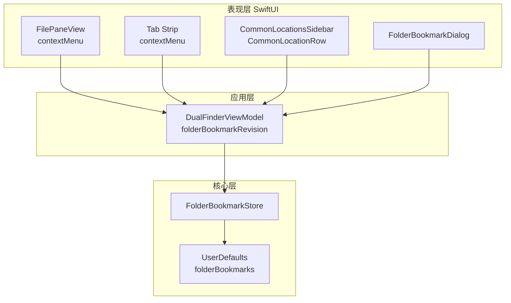
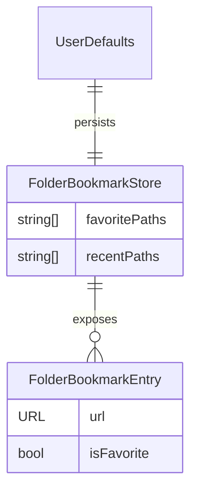
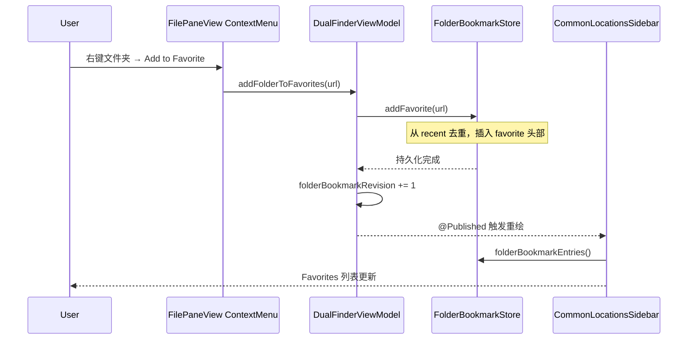
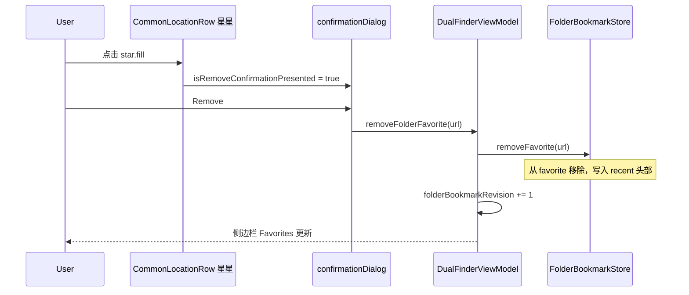
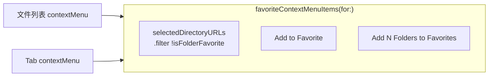

# 文件夹收藏（Add to Favorite）优化

## 问题

Dual Finder 已有侧边栏 **Favorites** 列表和 `FolderBookmarkStore` 持久化，但存在以下缺口：

| 场景 | 原状 | 用户期望 |
|------|------|----------|
| 在文件列表中右键某个文件夹 | 无「加入收藏」入口 | 与 Finder / 其他文件管理器一致，右键即可收藏 |
| 在 Tab 条右键当前目录 Tab | 仅有 Copy Path / Terminal | 当前 Tab 目录也应可收藏 |
| 侧边栏 Favorites 星星图标 | 仅展示，移除需右键菜单且**无确认** | 点击星星即可取消收藏，但需**二次确认**防误触 |
| 收藏变更后 UI 刷新 | 依赖 `statusMessage` 等副作用触发重绘 | 侧边栏 / 对话框应可靠刷新 |

## 影响

- **可用性**：收藏常用目录需先切到该目录再点侧边栏 `star.badge.plus`，路径长、步骤多。
- **误操作风险**：星星若可一键移除且无确认，易误删常用收藏。
- **一致性**：文件列表右键已有 ZIP、Batch Rename 等，缺少收藏项显得功能不完整。

## 解决的核心思路

1. **复用现有存储层**：不新建数据库或文件格式，继续用 `FolderBookmarkStore` + `UserDefaults`。
2. **ViewModel 统一入口**：`addFolderToFavorites` / `removeFolderFavorite` / `isFolderFavorite`，并通过 `folderBookmarkRevision` 显式通知 SwiftUI 刷新。
3. **DRY 菜单项**：`favoriteContextMenuItems(for:)` 供文件列表与 Tab 条共用；已收藏目录不重复显示「Add」。
4. **确认仅作用于星星移除**：侧边栏星星点击与右键「Remove Favorite」均弹出 `confirmationDialog`；Locations 对话框内 Ctrl-R 仍为快捷移除（高级用户路径，见「已知取舍」）。

## 关键文件

| 文件 | 职责 |
|------|------|
| `Sources/DualFinderCore/FolderBookmarkStore.swift` | `isFavorite(_:)` 查询；`addFavorite` / `removeFavorite` 持久化 |
| `Sources/DualFinderApp/DualFinderViewModel.swift` | 收藏 API、`folderBookmarkRevision`、`selectedDirectoryURLs` |
| `Sources/DualFinderApp/FilePaneView.swift` | 文件列表 / Tab 右键「Add to Favorite」 |
| `Sources/DualFinderApp/ContentView.swift` | 侧边栏 `CommonLocationRow` 星星交互与确认对话框 |
| `Tests/DualFinderCoreTests/FolderBookmarkStoreTests.swift` | `isFavorite` 路径规范化测试 |

## 设计

### 分层

### 数据关系

### 添加收藏 — 数据流

### 移除收藏 — 数据流（含确认）

### 架构 — 菜单复用

## 使用方法

### 添加收藏

1. **文件列表**：选中一个或多个**文件夹**（含 package），右键 → **Add to Favorite**（位于 Compress to ZIP 与 Batch Rename 之间的分隔线上方）。
2. **Tab 条**：在 Tab 上右键 → **Add to Favorite**（若该 Tab 目录尚未收藏）。
3. **侧边栏**：点击 Locations 标题旁 `star.badge.plus`，将**当前活动 pane 目录**加入收藏。
4. **Locations 对话框**（快捷键 Locations）：**Add Current (Ctrl-M)**。

已收藏的目录不会再次显示「Add to Favorite」。

### 移除收藏

1. **侧边栏 Favorites**：点击条目左侧 **蓝色实心星星** → 确认对话框 → **Remove**。
2. 或在收藏条目上右键 → **Remove Favorite**（同样弹出确认）。
3. **Locations 对话框**：选中收藏项 → **Remove Favorite (Ctrl-R)**（无确认，快捷路径）。

移除后该目录会出现在 **Recent** 列表（若路径仍有效）。

## 三轮 Code Review 结论

### Review 1 — 正确性与边界

| 检查项 | 结论 |
|--------|------|
| 非文件夹选中 | `selectedDirectoryURLs` 过滤 `isDirectoryLike`，菜单不显示 Add |
| 已收藏目录 | `isFolderFavorite` 过滤，不重复添加 |
| 多选文件夹 | 支持批量「Add N Folders to Favorites」 |
| 路径别名 | `isFavorite` 使用 `standardizedFileURL.path`，测试覆盖 `/path/.` |
| 星星点击误触导航 | 星星为独立 `Button`，行导航用 `onTapGesture`，事件不冲突 |
| 修复：非收藏行双图标 | 图标仅由 `favoriteStarButton` 渲染，避免与 `rowLabel` 重复 |

### Review 2 — 测试与可维护性

| 检查项 | 结论 |
|--------|------|
| 单元测试 | `FolderBookmarkStoreTests` 新增 `isFavorite`；原有 add/remove/去重测试仍通过 |
| ViewModel 测试 | 无独立 VM 测试套件；逻辑薄，委托 Store，可接受 |
| UI 测试 | 无 XCUITest；手动验证右键菜单与 confirmationDialog |
| DRY | 菜单项、Store 操作、VM 方法分层清晰，无重复持久化代码 |
| 单一职责 | Store=持久化，VM=编排+刷新信号，View=交互 |
| 竞态 | 同步 UserDefaults 读写，无网络请求；`folderBookmarkRevision` 避免依赖 statusMessage 副作用 |
| macOS 专属 | `confirmationDialog`、SwiftUI contextMenu；当前仅 macOS 目标，无 Windows 分支 |

### Review 3 — 遗漏与优化

| 项 | 处理 |
|----|------|
| 侧边栏不刷新 | 引入 `@Published folderBookmarkRevision`，Sidebar 读取时 `_ = revision` |
| 对话框与外部添加不同步 | `FolderBookmarkDialog.onChange(folderBookmarkRevision)` 调用 `reloadEntries` |
| 活动行高亮不含星星 | 整行 `HStack` 统一 background，星星与文字同高亮 |
| Locations 对话框 Ctrl-R 无确认 | **已知取舍**：保留快捷移除；侧边栏星星路径强制确认 |
| REST / Swagger | 不适用（本地 macOS 桌面应用） |
| 性能 | O(n) 读 favorites 列表，n 通常 < 100；无扩展性瓶颈 |

**测试覆盖缺口（可后续补充）**：

- ViewModel：`addFolderToFavorites` 递增 `folderBookmarkRevision`（需 inject mock Store 或 UI 测试）。
- UI：`confirmationDialog` 取消时不调用 `removeFolderFavorite`（XCUITest）。

## 已知取舍

1. **英式拼写**：产品 UI 统一使用 **Favorite**（与现有代码一致），非 Favourite。
2. **对话框 Ctrl-R**：不加确认，便于批量管理；侧边栏星星路径符合「误触保护」需求。
3. **Package 目录**：与文件夹同等视为可收藏（`isDirectoryLike` 含 `.package`）。

## 验证清单

- [x] `swift test` — 77 tests passed
- [x] `./update_app.sh` — 编译、ad-hoc 签名、安装到 `/Applications`
- [ ] 手动：文件列表文件夹右键 → Add to Favorite → 侧边栏出现
- [ ] 手动：点击 Favorites 星星 → 确认 → 从列表移除
- [ ] 手动：点击 Cancel → 收藏保留
