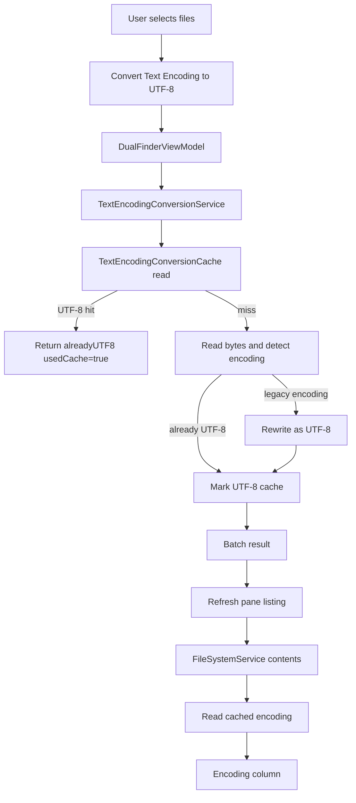
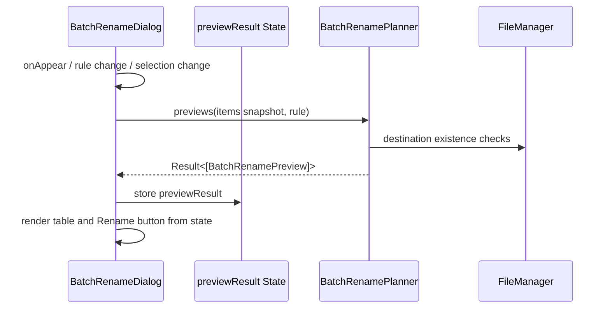
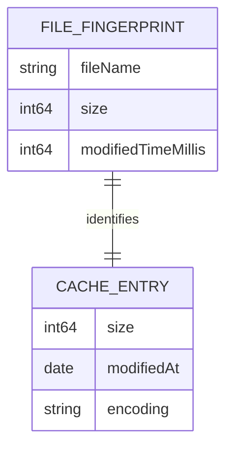
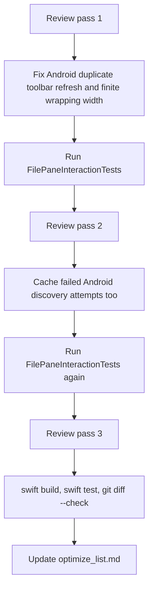

# Optimization Notes

## Scope

This note records the focused fixes made around three user-visible problems:

1. Batch Rename preview could drive very high CPU while thousands of files were selected.
2. Text encoding conversion needed a reliable UTF-8 success cache so repeated conversion and the Encoding column can skip redundant detection.
3. Inline rename was hard to read when the selected row background and text field selection colors overlapped.
4. Toolbar Android device discovery could be requested by both panes during the same UI appearance cycle.
5. Batch Rename history chips used a custom wrapping layout that needed a finite-size guard for unconstrained proposals.

## Problems And Impact

### Batch Rename Preview CPU

`BatchRenameDialog` previously exposed the preview as a computed property. SwiftUI can evaluate view bodies and dependent properties many times during layout, scrolling, focus changes, and control updates. With thousands of selected files, each evaluation rebuilt every rename preview and reran collision checks.

Impact:

- High CPU when the Batch Rename dialog is open.
- Repeated filesystem checks while the UI is only re-rendering.
- Poor responsiveness for large selections.

### Text Encoding Rework

The encoding conversion service already had a cache, but the cache identity was path-based. After files were converted to UTF-8, repeated conversion of the same selected file should be able to fast-skip, and the Encoding column should be able to display known UTF-8 without probing the bytes again.

The requested identity is:

```text
fileName + size + lastModifiedTime
```

Impact:

- Successful UTF-8 conversions can be reused by conversion and listing flows.
- Moved files with the same name and unchanged fingerprint can still hit the cache.
- Existing path-key cache entries remain readable for compatibility.

### Inline Rename Visibility

Inline rename used a borderless transparent `NSTextField` inside a selected blue row. On active selection, white row text and native text selection/insert colors could make the selected range and caret difficult to see.

Impact:

- Users could not reliably tell which filename text was selected.
- Caret position was unclear before typing.
- Rename felt risky for long names.

### Duplicate Android Device Discovery

Both file panes can appear at the same time. The toolbar now refreshes Android devices on appearance so the Android menu is useful before the user opens it, but doing that independently per pane could run duplicate `adb devices -l` requests.

Impact:

- Unnecessary process launches.
- Repeated failures when `adb` is unavailable.
- Extra UI churn with no new information.

### Wrapping Layout Edge Case

Batch Rename search/replace history chips are laid out by a small custom `Layout`. SwiftUI layouts must return finite sizes. If an unconstrained parent passes an infinite width proposal, returning that infinite width is invalid and can destabilize layout.

Impact:

- Possible dialog layout warnings or clipping under future host/container changes.
- Hard-to-debug UI behavior because the issue only appears in some proposal chains.

## Core Design

### Batch Rename

Preview generation is now state-backed instead of body-backed:

- `previewResult` is stored in `@State`.
- The preview refreshes only when the dialog appears, the rename rule changes, or the selected file snapshot changes.
- `canApply` and the table render from the cached result.

This keeps `BatchRenamePlanner` as the pure Core planner while avoiding redundant SwiftUI render-time work.

### Encoding Cache

`TextEncodingConversionCache` now uses a fingerprint key:

```text
lastPathComponent + unit-separator + size + unit-separator + modifiedTimeMillis
```

Reads try:

1. The new fingerprint key.
2. The legacy standardized path key.

Writes use only the new fingerprint key. Conversion cache hits that go through `convertFileToUTF8` mark the final URL again, which naturally migrates successful UTF-8 entries to the new key.

Important behavior:

- `convertFileToUTF8` checks `cachedUTF8Encoding` before reading file data.
- Empty UTF-8 files, already UTF-8 files, and converted files all mark UTF-8 in the cache.
- `FileSystemService.contents(... includeTextEncoding: true)` reads cached encoding without probing.

### Inline Rename

The row and field now enter a clear editing visual state:

- Renaming rows use normal label colors instead of selected-row white text.
- The row background switches to the system text background color.
- The row gets an accent border.
- The `NSTextField` draws its own background and border.

### Android Toolbar Refresh Cache

Toolbar-triggered Android discovery now uses a short in-memory TTL:

- `refreshAndroidDevicesForToolbar(now:staleAfter:)` skips work if a recent attempt exists.
- Successful and failed attempts both update the timestamp, preventing duplicate failure storms.
- Explicit user actions still call `refreshAndroidDevices()` directly and are not throttled by the toolbar cache.

### Batch Rename History Layout

`WrappingHStack.sizeThatFits` now converts infinite width proposals into the measured row width before returning. This keeps the layout finite while preserving normal behavior for constrained dialog widths.

## Key Files

| File | Role |
| --- | --- |
| `Sources/DualFinderApp/BatchRenameDialog.swift` | State-backed rename preview and dialog-level preview refresh ownership |
| `Sources/DualFinderCore/TextEncodingConversionService.swift` | UTF-8 conversion, detection, and fingerprint-based encoding cache |
| `Sources/DualFinderCore/FileSystemService.swift` | Encoding column uses cached encoding during listing |
| `Sources/DualFinderApp/DualFinderViewModel.swift` | Conversion orchestration and selection refresh after conversion |
| `Sources/DualFinderApp/FilePaneView.swift` | Inline rename row and text field rendering |
| `Sources/DualFinderApp/TextEditingCommandRouter.swift` | Routes menu edit commands to focused AppKit text fields before file operations |
| `Sources/DualFinderApp/BatchRenameHistoryStore.swift` | Persists find/replace history for Batch Rename |
| `Sources/DualFinderApp/BatchRenameWindowPresenter.swift` | Presents Batch Rename as an independent resizable utility window |
| `Sources/DualFinderApp/MountedVolumeLocations.swift` | Lists mounted local volumes for sidebar/toolbar shortcuts |
| `Tests/DualFinderCoreTests/TextEncodingConversionServiceTests.swift` | Cache hit, conversion, legacy compatibility, and fingerprint-key coverage |
| `Tests/DualFinderAppTests/FilePaneInteractionTests.swift` | Rename identity, Android toolbar refresh cache, encoding scan, and pane interaction coverage |

## Data Flow



## Batch Rename Preview Sequence



## Encoding Cache Relationship



## Android Toolbar Refresh Sequence

```mermaid
sequenceDiagram
    participant PaneA as Left Pane Toolbar
    participant PaneB as Right Pane Toolbar
    participant VM as DualFinderViewModel
    participant ADB as AndroidFileService / adb

    PaneA->>VM: refreshAndroidDevicesForToolbar(now=t0)
    VM->>ADB: adb devices -l
    ADB-->>VM: devices or error
    VM->>VM: record last attempt at t0
    PaneB->>VM: refreshAndroidDevicesForToolbar(now=t0+1s)
    VM-->>PaneB: skip; cached attempt still fresh
    PaneB->>VM: refreshAndroidDevicesForToolbar(now=t0+6s)
    VM->>ADB: adb devices -l
```

## Review Loop Summary



## Usage

### Convert Encoding

1. Select text files.
2. Run **Convert Text Encoding to UTF-8**.
3. Files already known as UTF-8 by cache are skipped quickly.
4. Converted files are rewritten as UTF-8 and cached.
5. Unknown encodings are moved to `unknown_encode` as before.

### Show Encoding Column

1. Enable **Show Encoding Column**.
2. File listing first displays cached values when available.
3. Uncached files are scanned asynchronously.
4. Successful scan results are written to the same cache.

### Inline Rename

1. Select one file.
2. Press Enter.
3. The editable filename appears with a distinct input background, border, and readable selection/caret.

## Review Notes

### Necessity

- The Batch Rename state cache is necessary because the previous computed property was directly on a SwiftUI render path.
- The encoding fingerprint key is necessary to satisfy the repeat-conversion and Encoding-column fast path.
- The legacy fallback is necessary to avoid invalidating existing path-key cache files.
- The inline rename styling is necessary because selection state and editing state need different visual treatment.

### Remaining Risks

- The fingerprint key intentionally does not hash file contents. Two different files with the same name, size, and modification time can share an encoding cache entry. This follows the requested key shape, but it is a known trade-off.
- Batch Rename preview still recomputes synchronously when the rule changes. It no longer recomputes on every render, but a future improvement could debounce typing or move preview planning off the main actor for very large selections.
- Inline rename styling is covered by build verification, not automated visual snapshot testing.
- `WrappingHStack` is covered by compile/build verification, not a direct unit test, because it is a private SwiftUI `Layout` type. The fix is intentionally narrow and defensive.
- Android toolbar discovery cache is in-memory only. That is intentional: it avoids duplicate pane appearance requests without hiding device changes for long.
- This is a local macOS desktop application, not a REST service. Swagger/OpenAPI documentation is therefore not applicable.
- Cross-platform App concerns are not applicable to this package as implemented; `Package.swift` targets macOS 14 and the UI uses AppKit/SwiftUI macOS APIs.

## Verification

- `swift build --product DualFinderApp`
- `swift test --filter TextEncodingConversionServiceTests`
- `swift test --filter FilePaneInteractionTests`
- `swift test`
- `git diff --check`

Latest verification after the three review/fix passes:

- `swift build --product DualFinderApp`: passed
- `swift test --filter FilePaneInteractionTests`: passed, 31 tests
- `swift test`: passed, 265 tests in 39 suites
- `git diff --check`: passed
