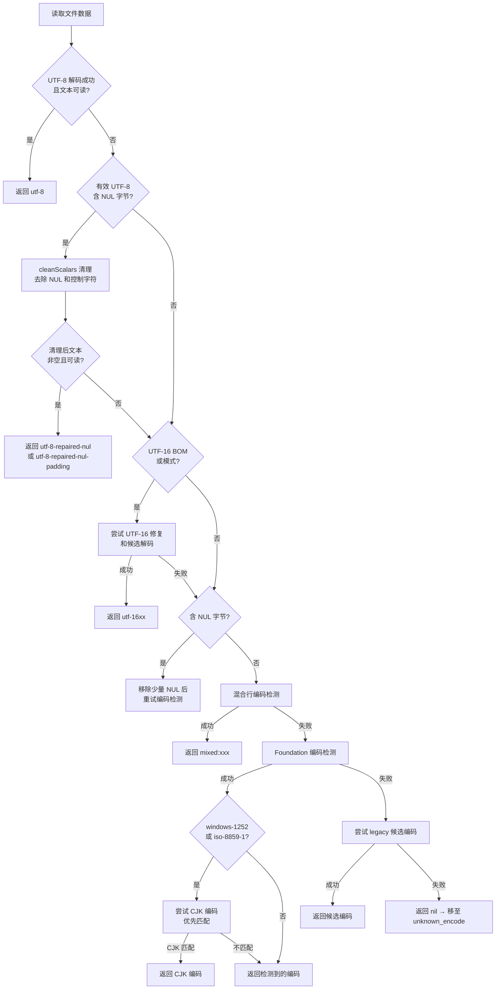
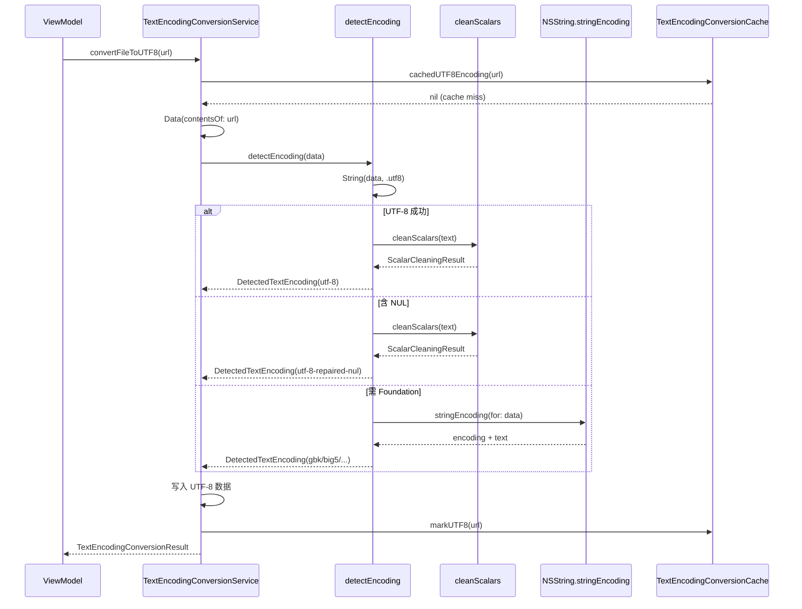
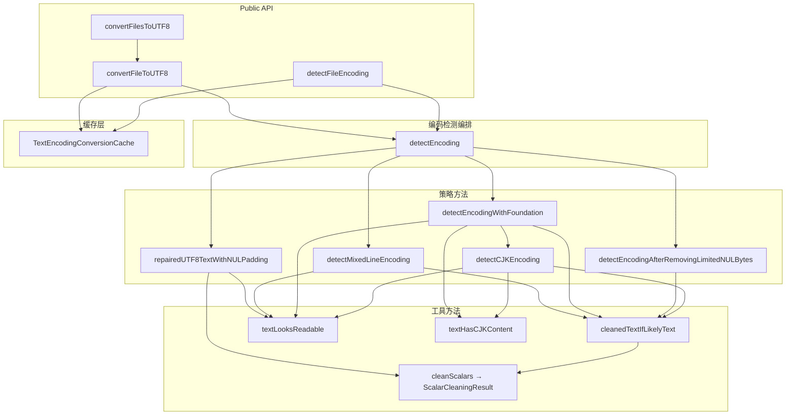

# TextEncodingConversionService 优化 (Round 2)

## 问题总览

针对 `TextEncodingConversionService` 的编码检测与转换逻辑进行设计审查，发现 5 个需要优化的问题：

| # | 问题 | 类型 | 影响 | 状态 |
|---|------|------|------|------|
| 1 | `lossyLimit` 在 for 循环内重复计算 | 性能 | 每次 lossy fallback 都重新计算常量表达式 | 已修复 |
| 2 | `repairedUTF8TextWithNULPadding` 与 `cleanedTextIfLikelyText` 的 scalar 清理逻辑重复 | DRY | 两处独立维护相同的 unicodeScalar 遍历/分类/清理逻辑 | 已修复 |
| 3 | `repairedUTF8TextWithNULPadding` 方法边界分析 | 安全 | 分析 NUL 比例上限的必要性 | 已分析 |
| 4 | `textHasCJKContent` 缺少日文假名和韩文谚文范围 | 正确性 | Shift_JIS/EUC-KR 编码的 lossy 检测会漏判 | 已修复 |
| 5 | 边界场景测试覆盖不足 | 测试 | 纯 NUL / UTF-16 BE / RAR 诊断无测试 | 已补充 |

---

## 问题详情与解决方案

### 1. `lossyLimit` 循环内重复计算

**问题现象：** `detectMixedLineEncoding` 中 `let lossyLimit = max(data.count / 100, 8)` 位于 for 循环体内部，每次 lossy fallback 都重新计算。`data.count` 是常量。

**影响：** 多余的计算开销（虽然单次开销小，但对大文件逐行处理时会累积）。

**核心思路：** 将 `lossyLimit` 提升到循环外部，在循环开始前计算一次。

**修改前：**
```swift
for line in lines {
    // ...
    let lossyLimit = max(data.count / 100, 8)  // 每次循环都计算
    guard lossyByteCount + line.count <= lossyLimit else { ... }
}
```

**修改后：**
```swift
let lossyLimit = max(data.count / 100, 8)  // 循环外计算一次
for line in lines {
    // ...
    guard lossyByteCount + line.count <= lossyLimit else { ... }
}
```

### 2. scalar 清理逻辑 DRY 违规

**问题现象：** `cleanedTextIfLikelyText` 和 `repairedUTF8TextWithNULPadding` 各自独立实现了相同的 unicodeScalar 遍历模式：遍历所有 scalar → 分类为 NUL / 控制字符 / 正常字符 → 收集统计信息 → 构建清理后的字符串。

**影响：** 修改清理规则时需要在两处同步维护，容易遗漏导致行为不一致。

**核心思路：** 提取共享的 `ScalarCleaningResult` 结构体和 `cleanScalars` 方法，两个调用方各自仅保留阈值判断。

```swift
private struct ScalarCleaningResult {
    let cleaned: String
    let nulCount: Int
    let suspiciousControlCount: Int
    let totalCount: Int
}

private func cleanScalars(_ text: String) -> ScalarCleaningResult
```

- `cleanedTextIfLikelyText` → 调用 `cleanScalars` + 严格阈值 (NUL ≤ 0.001, suspicious ≤ 0.02)
- `repairedUTF8TextWithNULPadding` → 调用 `cleanScalars` + 宽松阈值 (NUL 无上限, suspicious ≤ 0.02)

### 3. NUL 比例上限分析

**问题现象：** `repairedUTF8TextWithNULPadding` 无 NUL 比例上限。理论上 99% NUL 的文件也会被修复。

**分析结论：** 该方法的既有守卫已足够安全：
1. 必须是有效 UTF-8（NUL 是合法 UTF-8，随机二进制几乎不可能通过 UTF-8 验证）
2. 清理后文本不能为空（纯 NUL 文件被拒绝）
3. `textLooksReadable` 检查（排除高比例替换字符/private-use 的文本）

高 NUL 比例的场景（如文本 + 大量 NUL 填充）是真实存在的（数据库字段导出、某些编辑器的文件格式），不应人为限制。

### 4. `textHasCJKContent` 范围不完整

**问题现象：** 仅检测中文汉字 (U+4E00-U+9FFF, U+3400-U+4DBF)，缺少：
- 日文假名 Hiragana + Katakana (U+3040-U+30FF) — 影响 Shift_JIS 检测
- 韩文谚文 Hangul Syllables (U+AC00-U+D7AF) — 影响 EUC-KR 检测

**影响：** 纯假名或纯谚文的文件在 Foundation lossy 检测路径中可能被误判为非 CJK 内容而被拒绝。

**核心思路：** 添加两个 Unicode 范围检测：

```swift
let v = Int(scalar.value)
if (0x4e00...0x9fff).contains(v)      // CJK 统一汉字
    || (0x3400...0x4dbf).contains(v)  // CJK Extension A
    || (0x3040...0x30ff).contains(v)  // 日文假名
    || (0xac00...0xd7af).contains(v)  // 韩文谚文
```

### 5. 边界场景测试补充

新增 3 个测试用例：

| 测试 | 覆盖路径 |
|------|----------|
| `rejectsPureNULFilesAsUnknown` | 纯 NUL 文件应被移至 unknown_encode |
| `convertsUTF16BEFilesToUTF8` | UTF-16 Big-Endian (带 BOM) 正确转换 |
| `diagnosesRARArchiveFilesWithTextExtensions` | RAR 归档误命名为 .txt 时的诊断信息 |

测试总数：26 → 29（encoding suite），全套 282 个测试通过。

---

## 关键文件

| 文件 | 修改类型 | 说明 |
|------|----------|------|
| `Sources/DualFinderCore/TextEncodingConversionService.swift` | 重构 + 优化 | DRY 提取、性能修复、CJK 范围扩展 |
| `Tests/DualFinderCoreTests/TextEncodingConversionServiceTests.swift` | 新增测试 | 3 个边界场景测试 |

---

## 数据流动

编码检测的完整决策链：



## 调用时序图



## 架构分层



## 修改影响评估

| 维度 | 评估 |
|------|------|
| 行为变更 | 无。所有改动保持原有行为，仅优化内部实现 |
| 性能影响 | 正向。`lossyLimit` 不再循环内重复计算 |
| 兼容性 | 无变化。所有 API 兼容 macOS 14+ |
| 测试覆盖 | 增强。26 → 29 个编码测试，全套 282 通过 |
| 可维护性 | 提升。scalar 清理逻辑统一到 `cleanScalars`，修改清理规则只需改一处 |
