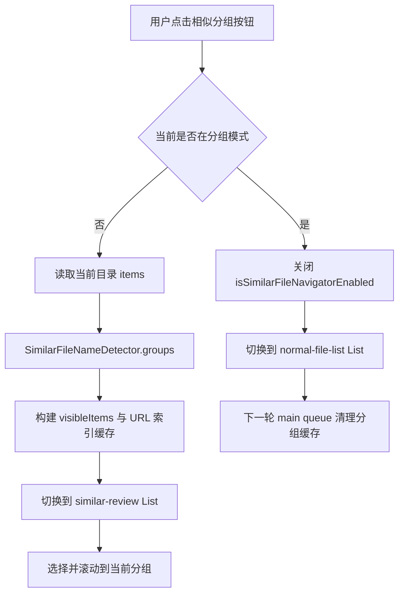
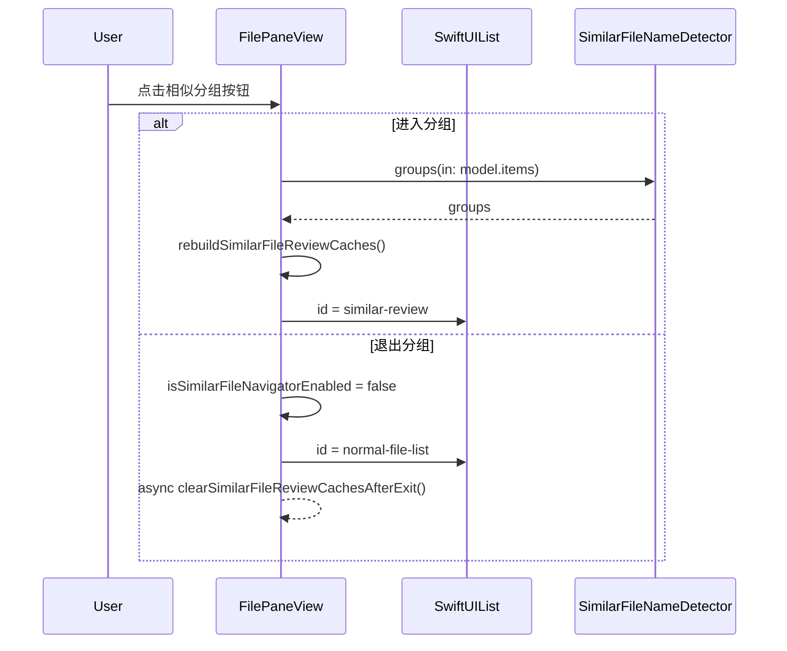
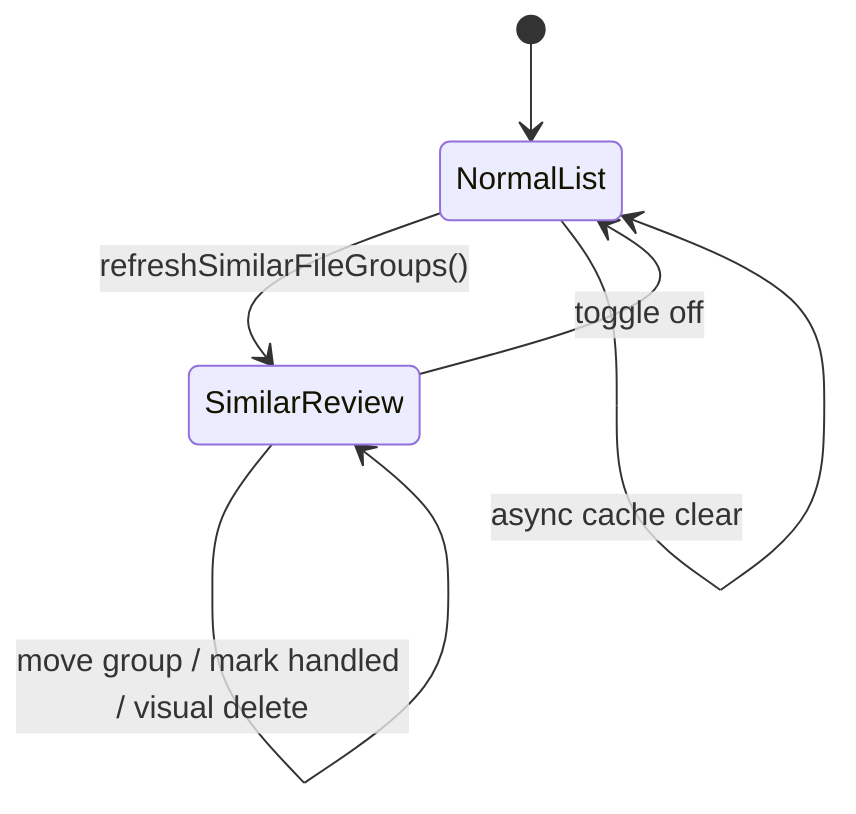

# 相似文件名分组退出性能优化

## 问题

在文件数量较多的目录中，进入“相似文件名分组”需要计算和分组，耗时可以理解；但退出分组后回到普通文件列表也会明显卡顿。

退出分组时并没有重新扫描目录，也没有再次执行 `SimilarFileNameDetector.groups`。卡顿主要来自 SwiftUI 列表从“相似项子集”切回“完整文件列表”时，对两套差异很大的行集合执行视图 diff、行背景计算、状态清理和列表重建。

## 影响

- 用户点击退出相似分组后，界面响应不够即时。
- 普通文件列表看起来像在重新刷新，容易误解为退出路径又做了昂贵计算。
- 相似分组缓存如果同步清理，会和完整列表恢复竞争同一个主线程时机。
- 视觉删除状态如果不限定在相似分组模式内，退出后普通列表存在显示删除痕迹的边界风险。

## 核心思路

1. 普通文件列表和相似分组列表使用不同的 `List` identity。
   - 让 SwiftUI 直接切换列表实例，避免在“相似项子集”和“完整目录列表”之间做大规模 diff。
2. 退出时先关闭 `isSimilarFileNavigatorEnabled`，立即恢复普通列表。
   - 相似分组的可见项、索引表和分组数组延迟到下一次 main queue tick 清理。
3. 相似分组的视觉删除状态只在分组模式内生效。
   - 退出后普通列表就是普通列表，不显示相似分组审阅过程中的视觉删除标记。

## 关键文件

- `Sources/DualFinderApp/FilePaneView.swift`
  - 相似分组进入/退出状态。
  - `List` identity 切换。
  - 相似分组缓存清理。
  - 视觉删除状态限定。
- `Sources/DualFinderApp/FilePaneInteractionModels.swift`
  - 已有的 `SimilarFileReviewState` 覆盖相似分组删除和替换选择规则。
- `Tests/DualFinderAppTests/FilePaneInteractionTests.swift`
  - 已覆盖相似分组视觉删除快照、删除后的焦点替换、键盘跳过视觉删除项等纯状态逻辑。

## 数据流

## 调用时序

## 状态关系

## 使用方法

- 点击底部工具栏的相似文件名按钮进入分组审阅。
- 再次点击同一按钮退出。
- 退出后不应触发目录刷新或重新分组；普通文件列表应恢复为当前目录的完整列表。

## 验证

- `swift test`
- 当前验证结果：222 个测试通过。

## 测试覆盖评估

已覆盖：

- 相似分组视觉删除项仍留在审阅快照中。
- 删除后焦点移动到下一个可用项。
- 删除末尾项时焦点回退到前一个可用项。
- 键盘导航跳过视觉删除项。
- 编译覆盖 `FilePaneView` 的状态切换代码。

未直接覆盖：

- SwiftUI `List` identity 切换的真实性能收益。
- 退出分组后的首帧响应时间。
- 大目录下的真实滚动位置和图标加载体感。

这些属于 UI 性能路径，单元测试难以准确证明，需要用大目录进行手动验证或后续引入 UI 性能采样。

## 后续可安全优化点

- 图标加载：`FinderFileIconCache` 已有缓存，但当前容量为 512。大目录中如果文件类型和路径很多，退出后重建行仍可能触发较多 icon lookup。可后续评估提高缓存容量或按文件类型缓存通用图标。
- 日期格式化：`FileRow.dateText` 在行渲染时格式化日期。大列表频繁重绘时可考虑在 `FileItem` 或展示层缓存格式化字符串，但这会增加状态同步复杂度，暂不改。
- 列表虚拟化：当前使用 SwiftUI `List`，由系统负责虚拟化。若后续仍卡顿，可以考虑更底层的 `NSTableView`，但这是更大范围重构，不适合本次小改。
- 性能日志：已经记录相似分组 refresh duration。可后续补充退出切换耗时采样，但需要避免日志本身干扰 UI 主线程。
