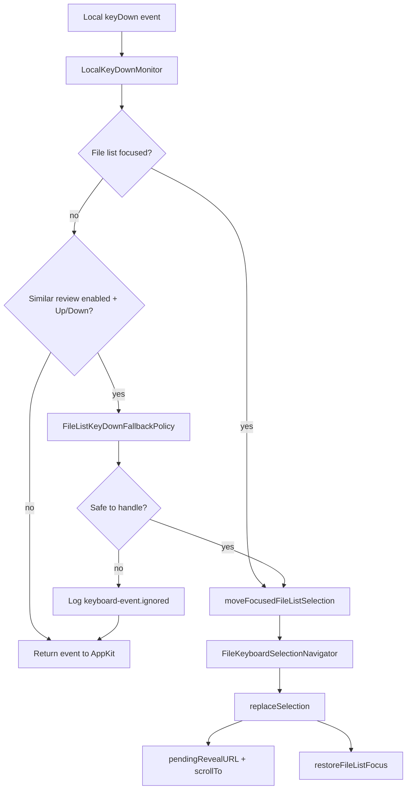
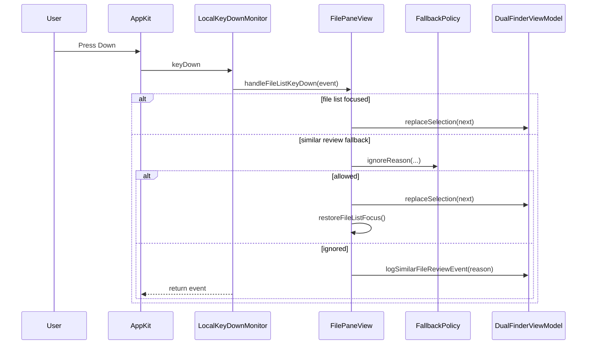
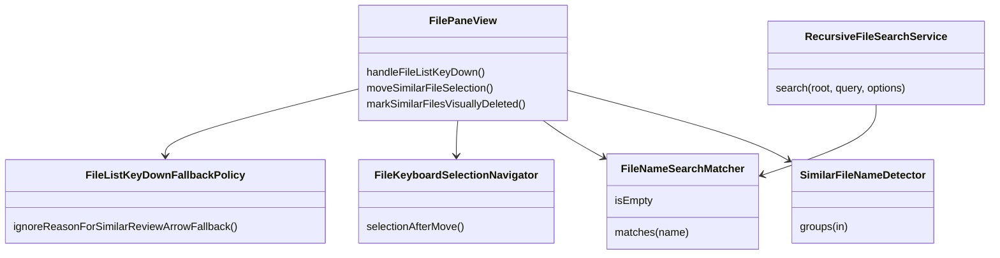

# 相似分组键盘导航与搜索性能优化

## 问题

相似文件分组模式下，用户连续使用上下方向键审阅和删除文件时，偶发出现 `Up` / `Down` 按下后没有反应。

日志排查显示，失败前后常见事件是：

- `similar-file-review visual-delete.marked`
- 随后 `pane-focus file-list.focus-state.changed focused=false`
- 之后裸方向键没有进入文件列表选择逻辑

根因是相似分组删除后，SwiftUI/AppKit 焦点可能落到工具栏、窗口内其他控件或终端输入区。旧逻辑只在文件列表明确聚焦时处理裸方向键，因此用户仍在相似分组上下文里，但按键链路已经断开。

同时，文件名搜索和递归搜索在大量文件场景下会重复构造查询归一化结果；相似分组排序原先按名称优先，不符合“大文件优先审阅”的工作流。

## 影响

- 相似分组审阅过程中，删除后需要重新点击列表才能恢复上下键，影响连续清理效率。
- 失败时旧日志只记录部分 `keyboard-move.ignored`，无法区分焦点丢失、边界、视觉删除、活动栏位错误或修饰键错误。
- 大目录搜索重复执行查询归一化，增加不必要 CPU 开销。
- 相似分组默认顺序不优先展示更可能需要保留的大文件。

## 核心思路

1. 保留正常文件列表聚焦时的原有键盘路径。
2. 只在相似分组开启且按键是裸 `Up` / `Down` 时启用失焦兜底。
3. 兜底路径必须通过策略检查：
   - 当前栏位必须是 active pane。
   - 不允许修饰键。
   - 路径输入、文件搜索输入、AppKit 文本编辑器、嵌入式终端获得焦点时不接管。
4. 视觉删除后主动恢复文件列表焦点。
5. 扩充 `similar-file-review` 日志，记录焦点、活动栏位、anchor、selection、可用行数和忽略原因。
6. 引入可复用的 `FileNameSearch.Matcher`，复用归一化查询。
7. 递归搜索跳过 `.app` 等 package 的内部 descendants，但 package 目录本身仍可按名称命中。
8. 相似分组内和组间按最大 size 降序排序，名称仅作为稳定兜底。

## 关键文件

| 文件 | 作用 |
| --- | --- |
| `Sources/DualFinderApp/FilePaneView.swift` | 键盘事件接管、相似分组移动、焦点恢复、诊断日志 |
| `Sources/DualFinderApp/FilePaneInteractionModels.swift` | 纯逻辑选择导航与方向键兜底策略 |
| `Sources/DualFinderCore/FileNameSearch.swift` | `Matcher` 缓存查询归一化结果 |
| `Sources/DualFinderCore/RecursiveFileSearchService.swift` | 递归搜索复用 matcher 并跳过 package descendants |
| `Sources/DualFinderCore/SimilarFileNameDetector.swift` | 相似组按 size 优先排序，名称稳定兜底 |
| `Tests/DualFinderAppTests/FilePaneInteractionTests.swift` | 键盘导航、视觉删除、兜底策略测试 |
| `Tests/DualFinderCoreTests/FileNameSearchTests.swift` | matcher 语义保持测试 |
| `Tests/DualFinderCoreTests/RecursiveFileSearchServiceTests.swift` | package 搜索边界测试 |
| `Tests/DualFinderCoreTests/SimilarFileNameDetectorTests.swift` | size 排序和稳定兜底测试 |

## 数据流



## 调用时序



## 组件关系



## 使用方法

### 查看诊断日志

```bash
tail -n 300 ~/Library/Logs/DualFinder/$(date +%F).log | grep 'similar-file-review\\|pane-focus'
```

重点字段：

- `keyboard-move.applied`: 已应用键盘移动。
- `keyboard-move.ignored`: 有方向键事件进入移动逻辑，但没有可替换选择。
- `keyboard-event.ignored`: 兜底路径拒绝接管，`reason` 会说明原因。
- `focused`: SwiftUI 文件列表焦点状态。
- `activePane`: 当前活动栏位。
- `anchorInReview`: 当前 anchor 是否仍在相似分组快照中。
- `unavailableCount`: 视觉删除行数量。

### 常见忽略原因

| reason | 含义 |
| --- | --- |
| `inactive-pane` | 方向键来自非活动栏位 |
| `modifiers` | 不是裸方向键 |
| `path-field` | 路径输入框正在编辑 |
| `file-search-input` | 文件搜索框正在编辑 |
| `text-responder` | AppKit 文本编辑器正在接收输入 |
| `embedded-terminal` | 嵌入式终端正在接收输入 |
| `renaming` | 正在行内重命名 |
| `file-search` | 文件搜索界面正在接管方向键 |

## 测试覆盖

已覆盖：

- 普通键盘导航从 anchor 或当前选择移动。
- 相似分组键盘导航跳过视觉删除行。
- 视觉删除后选中下一个或上一个可用项。
- 方向键兜底只允许当前 active pane 的裸方向键。
- 路径输入、文件搜索输入、文本 responder、嵌入式终端焦点时不接管。
- `FileNameSearch.Matcher` 与旧 `matches` 语义一致。
- 递归搜索跳过 package descendants。
- 递归搜索仍可命中 package 目录本身。
- 相似分组按成员 size 和组最大 size 排序。
- size 和 sort key 相同时按名称稳定排序。

验证命令：

```bash
swift test --filter FilePaneInteractionTests
swift test --filter FileNameSearchTests
swift test --filter RecursiveFileSearchServiceTests
swift test --filter SimilarFileNameDetectorTests
swift test
```

## 设计取舍

- 兜底键盘接管只服务相似分组模式，不改变普通列表失焦时的行为。
- 策略放在 `FilePaneInteractionModels.swift`，避免把可测试逻辑埋在 SwiftUI view 私有方法里。
- 仍保留 `onKeyPress` 正常路径；local monitor 是 SwiftUI 焦点丢失时的补偿路径。
- 日志包含路径样本，但大选择集会截断，避免日志暴涨。
- package 搜索只跳过内部 descendants，避免递归进入 `.app` 等 bundle 造成无意义扫描。

## 剩余风险

- SwiftUI 焦点和 AppKit firstResponder 在复杂控件组合下仍可能存在时序差异；已有日志用于定位后续边界。
- 嵌入式终端焦点判断基于当前 terminal view 是否为 window firstResponder；如果 SwiftTerm 后续改为内部子 view 接收 firstResponder，需要扩展为 descendant 判断。
- 相似分组按 size 优先会改变用户看到的顺序；这是为了“更大的版本优先审阅”的工作流，测试已固定该行为。

