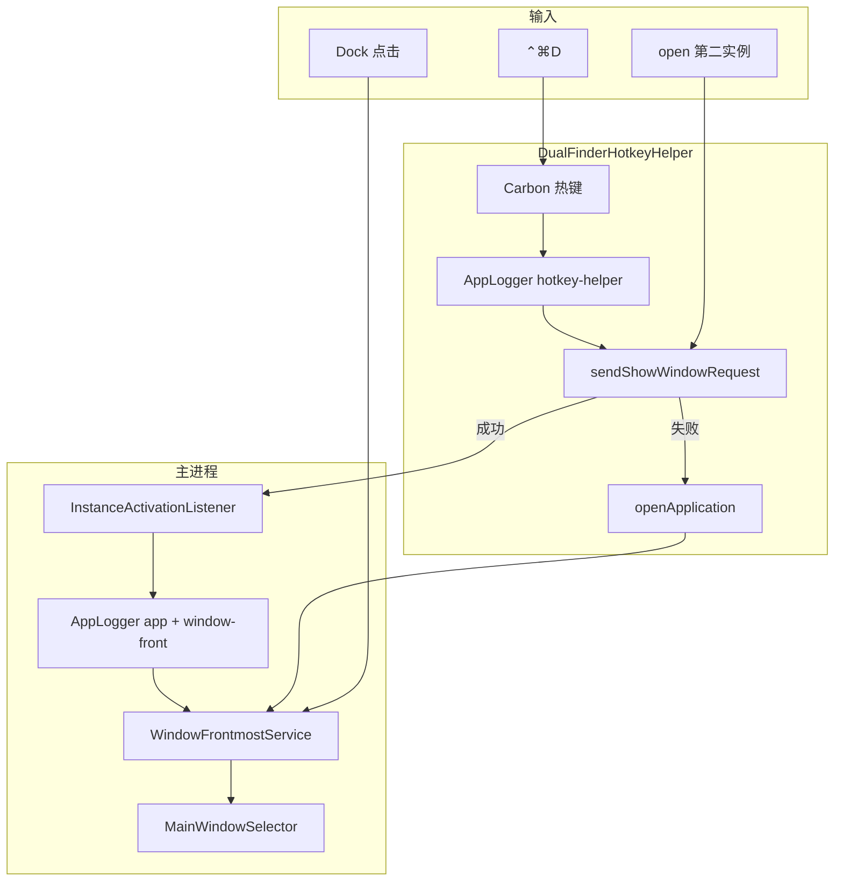
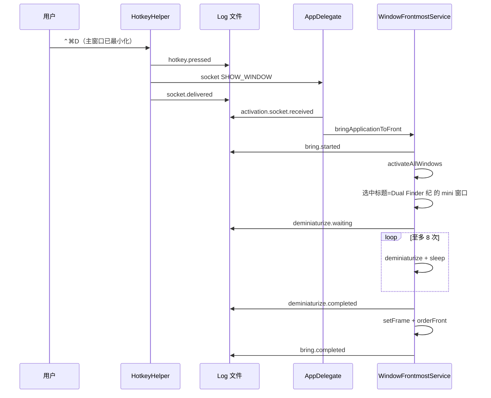
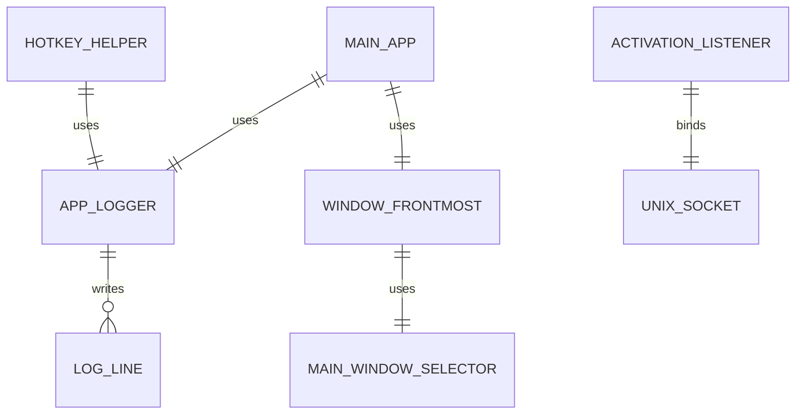

# 全局快捷键 ⌃⌘D 唤醒窗口

## 问题是什么

用户需要在任意应用、任意桌面空间下，用 **⌃⌘D** 把 Dual Finder 纪 拉到最前并铺满当前屏可见区域。要覆盖：

1. 主程序未运行 → 启动并置前  
2. 窗口已最小化（Dock 黄点）→ 先恢复，再置前  
3. 窗口在其它 App 或其它显示器 / Space → 切到该窗口并置前  

附加要求：缺权限时引导授权；尽量不因重编译反复弹「辅助功能」；**出问题时能用日志定位**。

## 影响是什么

- 全局热键 + 单实例 socket：已运行时毫秒级唤醒。  
- Login Item helper：主程序退出后 ⌃⌘D 仍可启动主 App。  
- **最小化无法唤醒**（已修复）：根因是 `NSApp.mainWindow` 在最小化时常为 `nil`，且未使用 `activateAllWindows`；修复后按标题/最小化状态选窗并轮询 `deminiaturize`。  
- 持久日志写入 `~/Library/Logs/DualFinder/yyyy-MM-dd.log`，主进程与 helper 共用同一目录，便于对照热键 → socket → 置前全链路。

## 解决的核心思路

| 场景 | 机制 |
|------|------|
| 已运行，按 ⌃⌘D | Helper/主进程 Carbon 热键 → Unix socket `SHOW_WINDOW\n` 或进程内热键 → `WindowFrontmostService` |
| 已运行，再次 `open` | `SingleInstanceGuard` 失败 → `sendShowWindowRequest()` → 现有实例置前 |
| 未运行，按 ⌃⌘D | Helper → `openApplication` |
| **最小化** | `NSRunningApplication.activate([.activateAllWindows, …])` + 按 `MainWindowSelector` 选中「Dual Finder 纪」或 `isMiniaturized` 窗口 + 异步轮询 `deminiaturize` |
| 权限 | Carbon 热键（非 Accessibility）；Login Item 一次性批准 helper |

### 最小化修复要点（第二轮）

1. **`mainWindow` / `keyWindow` 不可信**：最小化后常为 `nil`，不能作为唯一来源。  
2. **`MainWindowSelector`（Core，可单测）**：在普通层级窗口里优先匹配标题 `Dual Finder 纪`，其次任意 `isMiniaturized`，再 `canBecomeMain`。  
3. **`activateAllWindows`**：通过 `NSRunningApplication.current.activate` 让系统把已最小化窗口一并拉起。  
4. **异步 `deminiaturize`**：`deminiaturize` 有时晚于同步 `makeKeyAndOrderFront`，对仍 miniaturized 的窗口最多 8 次短间隔重试并写日志。

## 日志在哪里

路径（按天轮转，保留 7 天）：

```text
~/Library/Logs/DualFinder/yyyy-MM-dd.log
```

查看今日日志示例：

```bash
tail -f ~/Library/Logs/DualFinder/$(date +%Y-%m-%d).log
```

按唤醒链路过滤：

```bash
rg 'window-front|show-window|activation\.socket|hotkey\.|hotkey-helper' \
  ~/Library/Logs/DualFinder/$(date +%Y-%m-%d).log
```

| category | message | 含义 |
|----------|---------|------|
| `hotkey-helper` | `hotkey.pressed` | Helper 收到 ⌃⌘D |
| `hotkey-helper` | `socket.delivered` / `socket.missed-launching-app` | Socket 是否命中主进程 |
| `app.lifecycle` | `activation.socket.received` | 主进程收到 SHOW_WINDOW |
| `app.lifecycle` | `show-window.requested` | 开始置前 |
| `app.lifecycle` | `hotkey.show-window` | 主进程内热键（helper 未启用时） |
| `window-front` | `bring.started` | 置前开始（含 isHidden/isActive/窗口列表） |
| `window-front` | `bring.candidates` | 候选窗口摘要 |
| `window-front` | `deminiaturize.waiting` / `completed` / `failed` | 最小化恢复过程 |
| `window-front` | `bring.completed` / `bring.no-window` | 成功或找不到窗口 |

启动时 `app.launched` 会带 `logDirectory` 字段，与上述路径一致。

## 关键文件

| 文件 | 职责 |
|------|------|
| `Sources/DualFinderCore/MainWindowSelector.swift` | 可测试的主窗口选择（标题 / 最小化优先） |
| `Sources/DualFinderCore/MainWindowIdentity.swift` | 主窗口标题常量（在 MainWindowSelector 内） |
| `Sources/DualFinderCore/InstanceActivationSignaling.swift` | Unix socket 协议 |
| `Sources/DualFinderCore/ShowWindowHotkeyDescriptor.swift` | ⌃⌘D 键位 |
| `Sources/DualFinderApp/WindowFrontmostService.swift` | 激活 App、恢复最小化、置帧、**结构化日志** |
| `Sources/DualFinderApp/AppDelegate.swift` | 生命周期、socket、热键、`applicationShouldHandleReopen` |
| `Sources/DualFinderHotkeyHelper/main.swift` | 常驻热键 + **写入同一 Logs 目录** |
| `Tests/DualFinderCoreTests/MainWindowSelectorTests.swift` | 标题/最小化/sheet 过滤单测 |

## 架构图



## 数据流动图

```mermaid
flowchart LR
    Hotkey[⌃⌘D] --> Carbon[Carbon 回调]
    Carbon --> Socket[socket SHOW_WINDOW]
    Socket --> Listener[Listener]
    Listener --> Request[show-window.requested]
    Request --> Activate[activateAllWindows + unhide]
    Activate --> Select[MainWindowSelector]
    Select --> Demini{仍最小化?}
    Demini -->|是| Poll[异步 deminiaturize 轮询]
    Demini -->|否| Frame[setFrame visibleFrame]
    Poll --> Frame
    Frame --> Order[orderFrontRegardless + makeKeyAndOrderFront]
    Order --> LogDone[bring.completed]
```



## 调用时序图（最小化唤醒）



## 数据关系图



## 使用方法

1. `./update_app.sh` 安装到 `/Applications`。  
2. **登录项** 中允许 **DualFinderHotkeyHelper**（若提示）。  
3. 按 **⌃⌘D** 验证：前台、最小化、其它 Space、退出后启动。  
4. 若最小化仍失败：执行上文 `rg 'window-front'` 查看 `bring.no-window` 或 `deminiaturize.failed`，把相关日志行发来即可。

### 减少重装后重复授权

| 做法 | 说明 |
|------|------|
| 固定 Bundle ID | `com.local.dualfinder` / `com.local.dualfinder.hotkey-helper` |
| 稳定签名 | `DUAL_FINDER_CODESIGN_IDENTITY` 或 Developer ID |
| 不用 Accessibility 全局监听 | Carbon 热键，无需辅助功能 |

## 测试覆盖

| 区域 | 测试文件 | 说明 |
|------|----------|------|
| 热键常量 | `ShowWindowHotkeyDescriptorTests` | ⌃⌘D |
| Socket | `InstanceActivationSignalingTests` | 协议 + listener |
| **主窗口选择** | `MainWindowSelectorTests` | 标题优先、最小化优先、忽略 sheet |
| AppKit 置前 / deminiaturize | 无自动化 | 需安装版手工：最小化后 ⌃⌘D |

**未覆盖路径**：真实 `NSWindow` 与多屏组合、`deminiaturize` 失败后的用户可见降级（仅写 error 日志 + `arrangeInFront`）。

## 三轮 Code Review（最小化修复轮）

### 第一轮

- 确认用户「最小化无法唤醒」与 `resolveMainWindow` 依赖 `mainWindow` 一致。  
- 引入 `activateAllWindows` 与 `MainWindowSelector`，避免 `canBecomeMain == false` 时选不到窗。  

### 第二轮

- 去掉 NotificationCenter + 双路径 `finishBringToFront`（避免重复置前）；改为 `@MainActor` 下 `Task` 轮询 `deminiaturize`。  
- Helper 增加 `AppLogger`，与主进程同目录，便于对照 socket 是否送达。  
- `applicationShouldHandleReopen`：Dock 点击与热键共用置前逻辑（DRY）。  

### 第三轮

- `WindowFrontmostService` 注入 `AppLogging`，单一职责：只负责 AppKit 置前；选择逻辑在 Core。  
- 文档补充日志表与 `tail/rg` 示例；明确无 REST/Swagger（本地 App）。  
- 竞态：热键回调仍用 `Task { @MainActor }`；`deminiaturize` 轮询仅在主 actor，不与 UI 刷新抢锁。  

### 已知边界

- `swift run` 无 Login Item 嵌入时，退出后热键依赖主进程是否在跑。  
- Unix socket 路径过长（>104 字节）可能 bind 失败（生产路径通常安全）。  
- 仅 macOS 14+，无 Windows 实现。  

## 与市面能力对标

| 能力 | 本实现 |
|------|--------|
| 全局热键 | Carbon + Login Item |
| 最小化恢复 | activateAllWindows + 标题选窗 + deminiaturize 轮询 + 日志 |
| 可观测性 | 按天文件日志，主进程/helper 同目录 |
| 可测试选择逻辑 | Core `MainWindowSelector` 单测 |

## 跨平台说明

仅 **macOS**。Carbon、`NSRunningApplication`、`SMAppService` 均为 Apple 专有 API。
