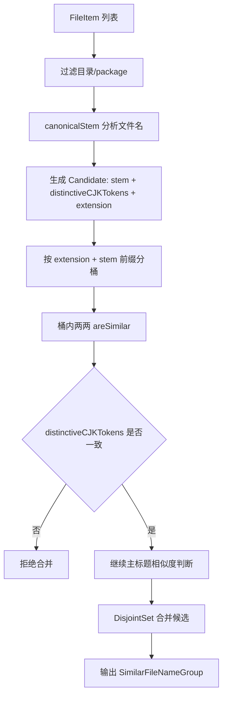
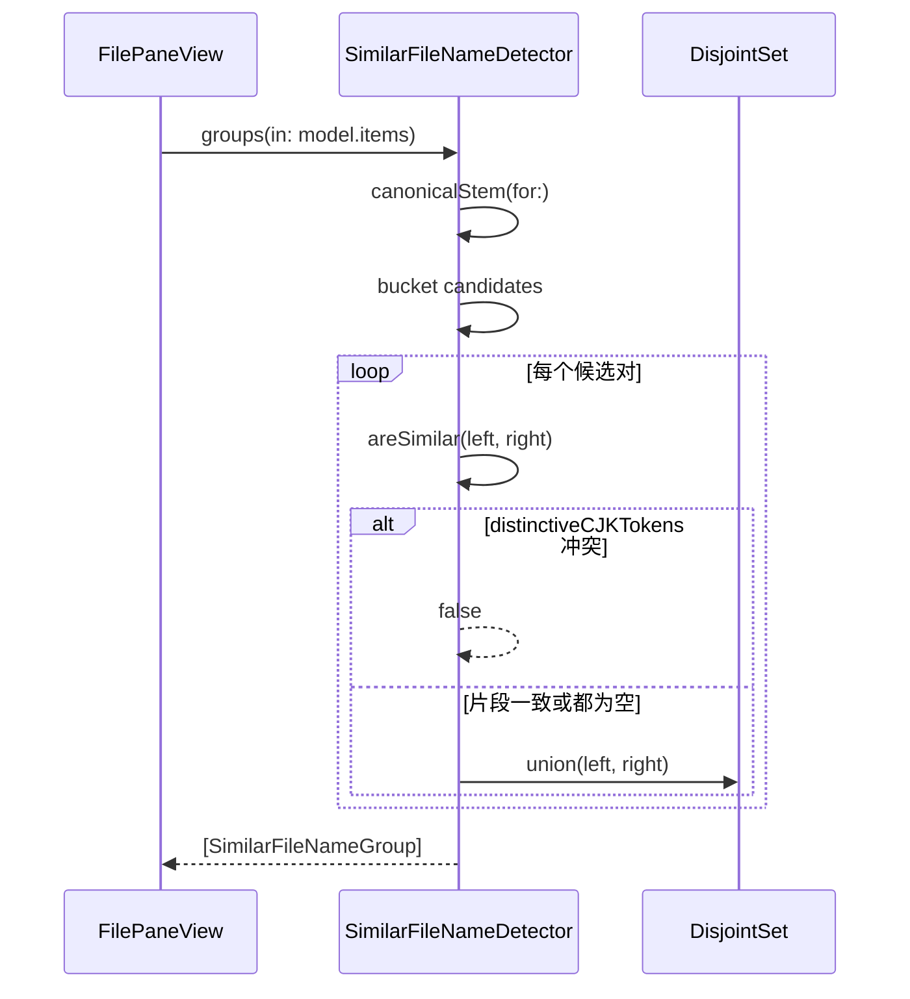
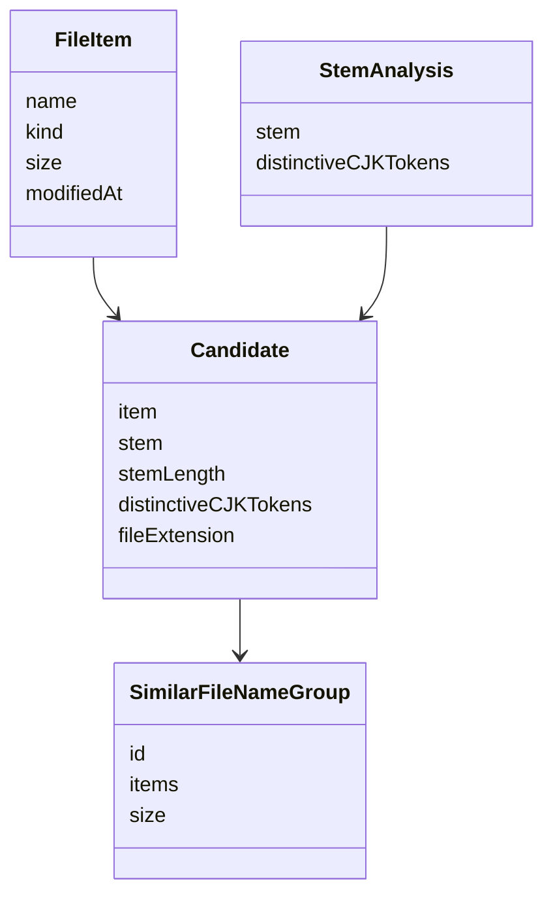
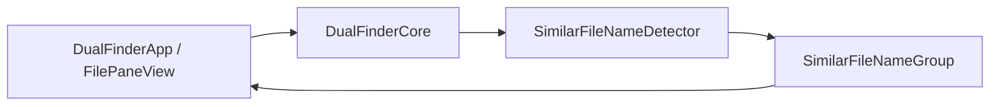

# 相似文件名分组误合并优化

## 问题

相似文件名分组会把下面两类文件误判为同一组：

- `叶辰风流（幻辰风流） 未完结 135...可卿那段.....】 作者： 英雄联盟.txt`
- `《叶辰风流（幻辰风流）》 作者： 英雄联盟 [1354章] [已完结].txt`

它们共享主书名，但第一个文件名包含 `可卿那段` 这样的额外片段描述，更像节选或特殊片段；第二个文件是完整书名文件。旧算法只保留最长 CJK 标题 token，容易把额外片段丢掉，最终只按 `叶辰风流` 判断相似。

## 影响

- 相似分组中会出现不应一起审阅的文件。
- 用户可能误以为一个文件是另一个文件的重复版本，从而误删节选或完整版本。
- 分组准确率下降，尤其影响小说、合集、章节片段类文件名。

## 核心思路

在保持原有主标题归一化逻辑的基础上，为每个候选文件额外记录“除主标题外仍有意义的 CJK 片段”。

- `未完结`、`已完结`、`全本`、`加料版` 等已有忽略词仍不参与冲突判断。
- `可卿那段` 这类未被忽略的额外片段会作为 `distinctiveCJKTokens` 记录。
- 两个候选的主标题相同或进入模糊匹配前，如果 `distinctiveCJKTokens` 不一致，则拒绝分到同一组。
- 原有按扩展名隔离、按标题相似度合并、按文件大小排序的行为保持不变。

## 关键文件

| 文件 | 作用 |
| --- | --- |
| `Sources/DualFinderCore/SimilarFileNameDetector.swift` | 相似文件名候选归一化、相似判断、分组排序 |
| `Tests/DualFinderCoreTests/SimilarFileNameDetectorTests.swift` | 相似分组正向/反向回归测试 |

## 设计

`SimilarFileNameDetector` 现在把文件名归一化结果拆成两部分：

- `stem`: 主匹配标题，继续用于 bucket、前缀、Dice 系数等既有相似判断。
- `distinctiveCJKTokens`: 主标题之外的有意义 CJK 片段，用于阻止“整本”和“片段”误合并。

这不是新的分组策略，而是相似判断前的一道语义保护条件。这样可以避免大改聚类流程，也不会影响 UI、键盘导航、删除审阅状态。

## 数据流动



## 调用时序



## 数据关系



## 架构位置



## 使用方法

用户侧无需新增操作。继续在文件列表底部点击相似文件名分组按钮即可。

开发验证命令：

```bash
swift test --filter SimilarFileNameDetectorTests
swift test
```

## 验证结果

- 新增回归测试：`does not group title with a distinct excerpt segment`。
- 专项测试：`SimilarFileNameDetectorTests` 12 个测试通过。
- 全量测试：`swift test` 273 个测试通过。

## 自审结论

连续 3 轮 review 后保留的修改都是必要修改：

- 第 1 轮：移除了非必要的前缀相似阈值调整，降低行为变化范围。
- 第 2 轮：确认已有正向测试覆盖 `未完结`、`全本`、`加料版` 等应继续合并的场景。
- 第 3 轮：把命名从 `secondaryCJKTokens` 收敛为更明确的 `distinctiveCJKTokens`，并补充维护注释。

剩余风险：

- 该算法仍基于文件名启发式判断，无法理解文件内容；极少数真实重复文件如果文件名包含不同片段描述，可能不会被分到同一组。这个取舍是刻意的：相似分组更应避免把“整本”和“片段”放在一起造成误删。
