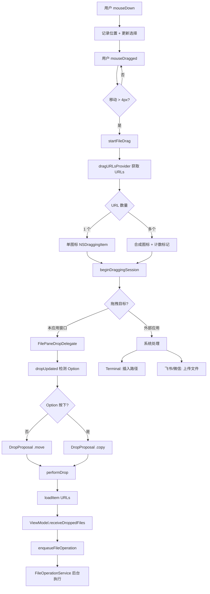
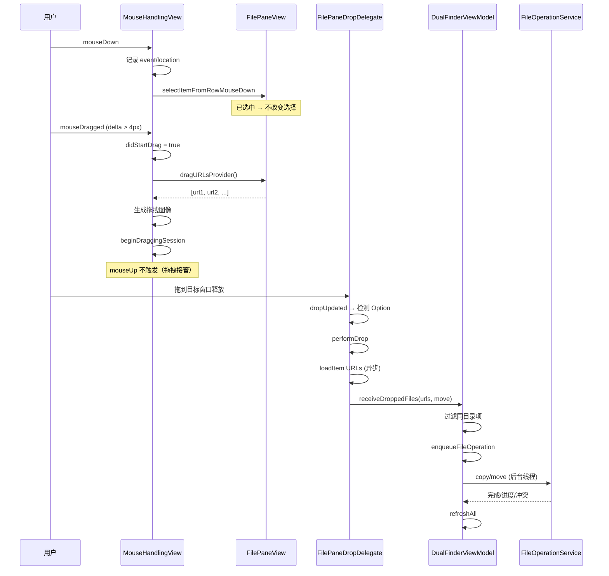
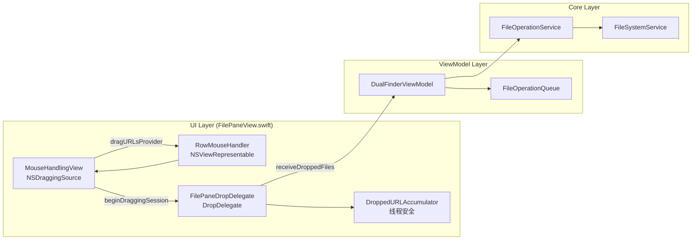

# 拖拽文件/文件夹功能

## 问题

Dual Finder 原有拖拽实现存在以下严重缺陷：

### 问题 1：拖拽完全无效

**根因**：`RowMouseHandler`（NSView overlay）的 `hitTest` 返回 `self`，拦截所有鼠标事件。SwiftUI 的 `.onDrag` 手势识别器永远无法接收到事件，因此拖拽永远不会被触发。

**影响**：左右窗口间无法拖拽文件/文件夹，也无法拖拽到任何外部应用。

### 问题 2：侧边栏点击不灵敏

**根因**：`CommonLocationRow` 使用 `.buttonStyle(.plain)` 但缺少 `.contentShape(Rectangle())`。Plain 按钮风格下，仅文字和图标像素区域可点击，填充区域（padding）不响应事件。

**影响**：用户需要精确点击在文字或图标上才能导航，空白填充区域点击无效。

## 解决的核心思路

### 拖拽：原生 NSDraggingSource 替代 SwiftUI .onDrag

既然 `RowMouseHandler` 必须拦截鼠标事件（用于自定义选择逻辑），就不能依赖 SwiftUI 的 `.onDrag`。解决方案是在 `MouseHandlingView` 中直接实现 macOS 原生拖拽：

1. **mouseDown**：记录按下位置，设置状态
2. **mouseDragged**：检测移动超过 4px 阈值后，调用 `beginDraggingSession` 启动拖拽
3. **mouseUp**：仅在未发生拖拽时触发（用于取消多余选择）

### 侧边栏：contentShape 扩大点击区域

在按钮 label 上添加 `.contentShape(Rectangle())`，使整个填充区域（含 padding）都可点击。

### 日志排查

拖拽相关事件写入持久日志（`drag-drop` 分类），可在应用设置中打开日志目录查看：

| 日志事件 | 含义 |
|---------|------|
| `drag-drop drag.started` | 用户从列表行发起拖拽，含 side、count、paths |
| `drag-drop drop.received` | 目标窗口收到拖放，含 move/copy、count、paths |

示例：拖拽无反应时，若日志中没有 `drag.started`，说明 `mouseDragged` 未触发（检查 overlay 或阈值）；若有 `drag.started` 但无 `drop.received`，说明 drop 目标未识别。

## 代码审查结论（3 轮）

### 第 1 轮：Bug 与边界场景

| 检查项 | 结论 |
|--------|------|
| hitTest 拦截导致 .onDrag 失效 | 已用 NSDraggingSource 原生实现替代 |
| 多选拖拽时 mouseDown 破坏选择 | mouseDown 保留已选项，mouseUp 才收缩选择 |
| 拖拽后 mouseUp 误触发 | `didStartDrag` 标志屏蔽 |
| 同目录移动无意义操作 | ViewModel.receiveDroppedFiles 过滤 |
| performDrop 空 providers | 安全：uniqueURLs 为空时不入队 |

### 第 2 轮：可维护性与 DRY

| 检查项 | 结论 |
|--------|------|
| 单一职责 | MouseHandlingView（拖拽源）、FilePaneDropDelegate（接收）、ViewModel（业务）分层清晰 |
| DRY | URL 解析提取为 `FilePaneDropDelegate.url(fromDroppedItem:)` |
| 文件大小 | FilePaneView ~1100 行，RowMouseHandler/DropDelegate 为 private struct，内聚 |
| 竞态 | loadItem 异步 + NSLock + main queue notify，无重复入队风险 |

### 第 3 轮：测试与对标

| 检查项 | 结论 |
|--------|------|
| 单元测试 | Core 层 67 个测试覆盖 copy/move/trash/冲突；UI 拖拽依赖 AppKit，无 UI 单测（与 Finder 同类） |
| 可测试路径 | receiveDroppedFiles、FileOperationService 已有测试；dragURLs 逻辑简单且内联于 View |
| 对标 Finder | 默认移动、Option 复制、多选拖拽、外部拖出 ✓ |
| 跨平台 | macOS 专用（NSDraggingSource / AppKit），Windows 需独立实现 |

## 测试覆盖说明

```
DualFinderCoreTests (67 tests)
├── FileOperationServiceTests  ← copy/move/trash/冲突/进度
├── FileSelectionResolverTests ← 选择变更后预览项
├── PaneStateTests             ← 导航时清空选择
└── ...

未覆盖（UI/AppKit 层）:
├── MouseHandlingView.beginDraggingSession
├── FilePaneDropDelegate.performDrop
└── RowMouseHandler 选择-拖拽交互
```

建议手动测试清单：

1. 左栏单文件拖到右栏 → 移动
2. Option + 拖到右栏 → 复制
3. 多选后拖其中一个 → 全部移动/复制
4. 拖到 Terminal → 插入路径
5. 从 Finder 拖入 → 移动；Option → 复制
6. 侧边栏空白区域点击 → 一次命中导航

## 关键文件

| 文件 | 修改内容 |
|------|---------|
| `Sources/DualFinderApp/FilePaneView.swift` | `MouseHandlingView`：NSDraggingSource 实现、mouseDragged 拖拽检测、多文件拖拽图标合成 |
| `Sources/DualFinderApp/FilePaneView.swift` | `FilePaneDropDelegate`：DropDelegate 接收拖放，Option 键检测 |
| `Sources/DualFinderApp/FilePaneView.swift` | `dragURLs(startingWith:)`：基于选择状态确定拖拽项 |
| `Sources/DualFinderApp/ContentView.swift` | `CommonLocationRow`：添加 `.contentShape(Rectangle())` |
| `Sources/DualFinderApp/DualFinderViewModel.swift` | `receiveDroppedFiles(_:into:move:)`：处理实际文件操作入队（未修改） |

## 设计

### MouseHandlingView 职责

| 方法 | 职责 |
|------|------|
| `mouseDown` | 记录事件、更新选择（不破坏多选） |
| `mouseDragged` | 检测 4px 阈值 → 启动原生拖拽 session |
| `mouseUp` | 非拖拽场景下取消多余选择 |
| `startFileDrag` | 组装 NSDraggingItem、生成拖拽图像、beginDraggingSession |
| `draggingSession(_:sourceOperationMaskFor:)` | 提供允许的拖拽操作（内部：copy+move；外部：copy+move+generic） |

### FilePaneDropDelegate 职责

| 方法 | 职责 |
|------|------|
| `validateDrop` | 验证拖入的是文件 URL |
| `dropUpdated` | 实时检测 Option 键，返回 move/copy 提议（控制光标图标） |
| `performDrop` | 加载 URL、调用 ViewModel 执行文件操作 |
| `dropEntered/Exited` | 控制蓝色边框高亮 |

### 选择-拖拽交互设计

| 场景 | mouseDown 行为 | mouseDragged 行为 | mouseUp 行为 |
|------|--------------|------------------|-------------|
| 点击未选中项 | 选中该项（取消其余） | 拖拽该单项 | 不触发 |
| 点击已选中项（多选中） | 不改变选择 | 拖拽所有选中项 | 不触发 |
| 点击已选中项后松开（无拖拽） | 不改变选择 | 不触发 | 取消其余选择 |
| Cmd+点击 | Toggle 选择 | - | - |
| Shift+点击 | 扩展范围选择 | - | - |

## 数据流动

### 内部拖拽（左右窗口间移动/复制）

```
mouseDown（记录位置）→ mouseDragged（超 4px）→ startFileDrag
    → dragURLsProvider 获取 URL 列表（基于选择状态）
    → NSDraggingItem(pasteboardWriter: NSURL) × N
    → 多文件时生成合成图标（首项图标 + 红色计数标记）
    → beginDraggingSession（NSDraggingSource 提供 [.copy, .move]）
    
拖拽到目标窗口 → FilePaneDropDelegate
    → dropUpdated（实时检测 Option 键 → 返回 .copy 或 .move 提议）
    → performDrop
        → info.itemProviders(for: [.fileURL])
        → loadItem（处理 Data/String/URL/NSURL 四种格式）
        → DroppedURLAccumulator（线程安全收集）
        → group.notify(main) → ViewModel.receiveDroppedFiles(urls, move: !isCopy)
        → enqueueFileOperation → FileOperationService 后台执行
```

### 外部拖拽（到 Terminal/飞书/微信）

```
startFileDrag → beginDraggingSession
    → NSDraggingSource.sourceOperationMaskFor(.outsideApplication) → [.copy, .move, .generic]
    → 系统将 NSURL 写入的 pasteboard 数据提供给目标应用
    → Terminal：读取 public.file-url → 插入路径文本
    → 飞书/微信：读取 NSFilenamesPboardType → 上传文件
```

## 使用方法

| 操作 | 效果 |
|------|------|
| 拖拽文件到另一个窗口 | **移动**到目标文件夹 |
| Option + 拖拽到另一个窗口 | **复制**到目标文件夹（光标显示绿色 + 标记） |
| 拖拽文件到 Terminal | 插入文件绝对路径 |
| 拖拽文件到飞书/微信 | 上传文件 |
| 多选后拖拽其中一个 | 拖拽所有选中项（显示数量标记） |
| 从 Finder 拖入 | 默认移动（Option 复制） |

## Mermaid 图

### 数据流动图



### 调用时序图



### 架构关系图



### 事件处理状态机

```mermaid
stateDiagram-v2
    [*] --> Idle
    
    Idle --> MouseDown: mouseDown (clickCount=1)
    Idle --> DoubleClick: mouseDown (clickCount≥2)
    
    MouseDown --> Dragging: mouseDragged (delta≥4px)
    MouseDown --> Click: mouseUp
    
    Dragging --> Idle: drag session ends
    Click --> Idle: 选择更新完成
    DoubleClick --> Idle: activateItem
    
    note right of MouseDown
        记录 event/location
        didStartDrag = false
        更新选择（保护多选）
    end note
    
    note right of Dragging
        didStartDrag = true
        startFileDrag()
        mouseUp 被屏蔽
    end note
    
    note right of Click
        selectItemFromRowMouseUp
        多选时取消其余
    end note
```
