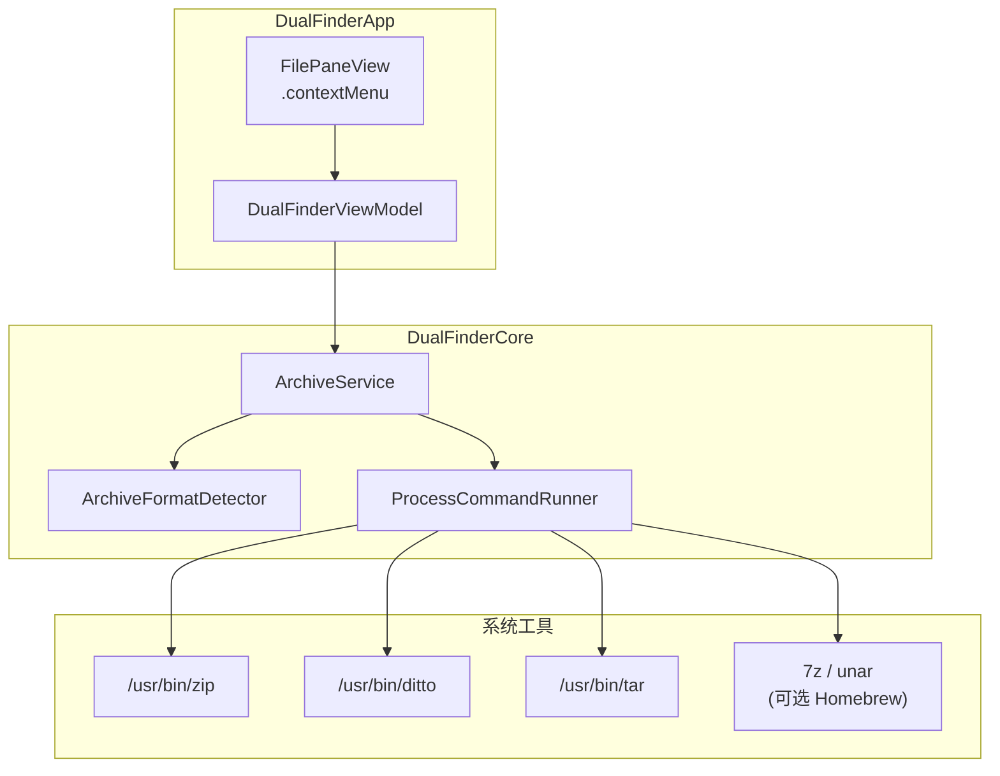
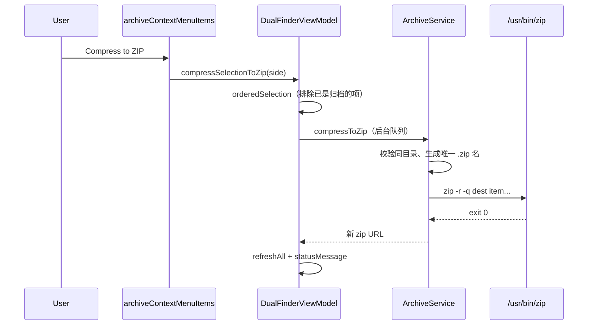
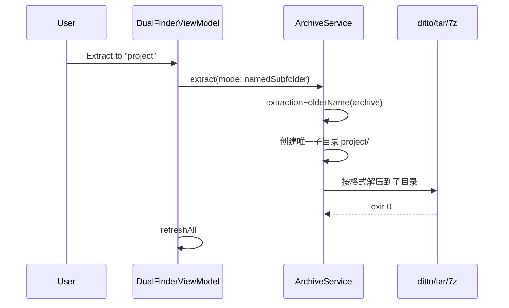
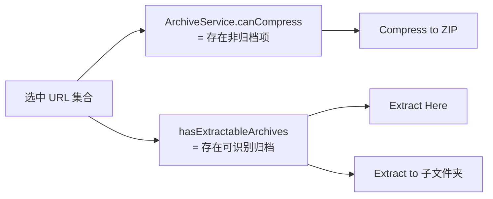
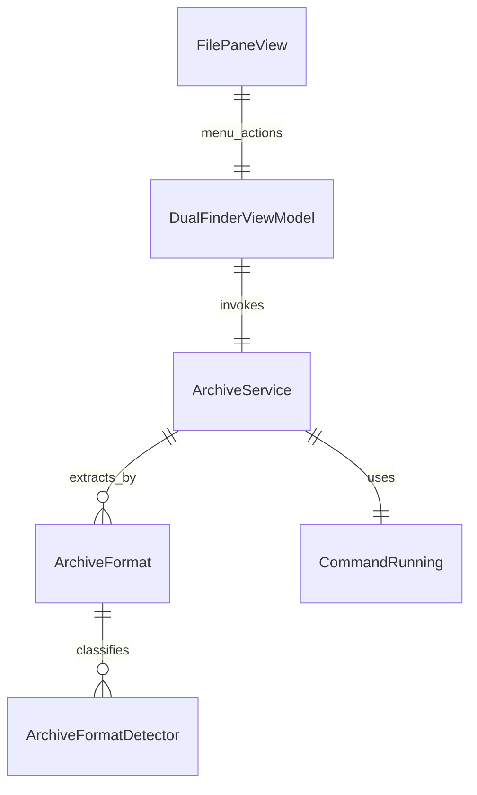

# 右键压缩 / 解压（ZIP、TAR 及更多格式）

## 问题

Dual Finder 文件列表右键菜单已有复制路径、终端、批量重命名、跨窗格复制/移动等操作，但缺少常见的**压缩为 ZIP**与**解压归档**能力。用户需要在选中文件/文件夹时一键打包，并在选中 `.zip`、`.tar`、`.tar.gz` 等归档时，能像 WinRAR 一样选择「解压到当前目录」或「解压到与归档同名的子文件夹」。

## 影响

| 场景 | 影响 |
|------|------|
| 多文件打包分发 | 需离开应用用 Finder/终端/第三方工具 |
| 解压 zip/tar 到子目录 | 无法保持「一个归档 → 一个文件夹」的整洁习惯 |
| 7z/rar/iso 等 | 无统一入口，依赖用户记忆命令行工具 |

## 解决的核心思路

1. **核心层 `ArchiveService`**：格式识别、压缩为 ZIP、按模式解压；通过可注入的 `CommandRunning` 调用系统 `zip`/`ditto`/`tar`，对 7z/rar/iso 回退到本机已安装的 `7z` 或 `unar`。
2. **表现层 DRY**：`archiveContextMenuItems` 与现有 `pathAndTerminalContextMenuItems` 并列；根据选中项动态显示「Compress to ZIP」「Extract Here」「Extract to "名称"」。
3. **后台执行**：与文件夹大小计算类似，在 `DispatchQueue.global` 中跑归档，完成后 `refreshAll` 并更新 `statusMessage`。
4. **跨平台预留**：`#if os(macOS)` / `#elseif os(Windows)` 分支；当前 Package 目标仍为 **macOS 14+**，Windows 路径使用 `tar.exe` / 7-Zip 安装目录，待未来扩展平台时启用。

## 关键文件

| 文件 | 职责 |
|------|------|
| `Sources/DualFinderCore/ArchiveFormat.swift` | 扩展名 → `ArchiveFormat`、解压子文件夹命名 |
| `Sources/DualFinderCore/ArchiveService.swift` | 压缩/解压业务、工具探测与命令组装 |
| `Sources/DualFinderCore/CommandRunner.swift` | `Process` 封装，便于单测注入 |
| `Sources/DualFinderApp/FilePaneView.swift` | 右键菜单项 |
| `Sources/DualFinderApp/DualFinderViewModel.swift` | `compressSelectionToZip` / `extractArchiveSelection` |
| `Tests/DualFinderCoreTests/ArchiveFormatDetectorTests.swift` | 格式识别与文件夹名 |
| `Tests/DualFinderCoreTests/ArchiveServiceTests.swift` | 压缩/解压/错误路径 |

## 设计

### 分层

### 支持格式

| 操作 | 格式 | macOS 实现 |
|------|------|------------|
| 压缩 | ZIP | `/usr/bin/zip -r` |
| 解压 | zip | `ditto -xk`（失败则 `unzip`） |
| 解压 | tar, tar.gz/tgz, tar.bz2/tbz2, tar.xz/txz | `/usr/bin/tar -xf` |
| 解压 | .gz / .bz2 / .xz（单文件） | `tar -xf`（bsdtar 自动识别） |
| 解压 | 7z, rar, iso | 已安装的 `7z` 或 `unar` |

压缩**仅输出 ZIP**；更多解压格式通过 `tar`/第三方工具覆盖，无需在 UI 区分命令。

### 解压模式

| 模式 | 行为 |
|------|------|
| `currentDirectory` | 解压到归档所在目录（同级展开） |
| `namedSubfolder` | 在同级创建以归档主文件名命名的文件夹（如 `foo.tar.gz` → `foo/`），若已存在则 `foo 2`… |

### 数据流（压缩）

### 数据流（解压到子文件夹）

### 选中项与菜单可见性

- 混合选中（文件 + zip）：同时显示压缩（仅非归档）与解压（仅归档项）。
- 多选归档解压：子文件夹菜单文案为「Extract to Subfolder(s)」。

## 使用方法

1. 在任一窗格选中一个或多个**文件/文件夹**（勿跨目录多选压缩）。
2. 右键 → **Compress to ZIP**：在同目录生成 `名称.zip`；多项时为 `Archive.zip`（冲突时 `Archive 2.zip`…）。
3. 选中 **zip / tar / tar.gz / 7z / rar / iso** 等 → 右键：
   - **Extract Here**：内容展开到当前目录；
   - **Extract to "foo"**：解压到 `foo/` 子文件夹（WinRAR 风格）。
4. 7z/rar/iso 需本机安装 [7-Zip](https://www.7-zip.org/)（`brew install sevenzip`）或 `unar`（`brew install unar`），否则会提示工具未找到。

## 测试

| 套件 | 覆盖 |
|------|------|
| `ArchiveFormatDetectorTests` | 扩展名、tar.gz 与 .gz 区分、子文件夹名 |
| `ArchiveServiceTests` | 单文件 zip 往返、子文件夹解压、跨目录压缩拒绝、命令失败 |

运行：`swift test`（归档集成测试依赖 macOS 自带 `zip`/`ditto`）。

## 三轮 Review 摘要

### 第 1 轮：正确性与边界

- 压缩要求选中项**同一父目录**，否则 `mixedParentDirectories`，避免 zip 把绝对路径打进包内。
- 解压循环内对每个归档单独处理；`namedSubfolder` 用 `uniqueArchiveURL` 避免覆盖已有文件夹。
- 选中项中的非归档不参与解压；归档不参与压缩（避免 zip 套 zip）。

### 第 2 轮：测试与可维护性

- 格式检测与命令执行分离；`CommandRunning` 可 Mock，不依赖 UI。
- 集成测试覆盖 zip 创建 + ditto 解压 + 子文件夹路径。
- 未接入 `QueuedFileOperation` 队列：实现更简单，但与大批量复制并行时可能同时写盘——可接受，后续可扩展 `compress`/`extract` kind。

### 第 3 轮：跨平台与对标

- macOS 路径完整；Windows 分支预留 `tar.exe`、7-Zip 默认安装路径。
- 对标 WinRAR/Finder：双解压目标 + 多格式解压；压缩仅 ZIP（与 Finder「压缩」一致）。
- 未实现：加密 zip、分卷、解压进度条、队列内取消按钮（`FileOperationCancellation` 已预留接口）。

## 已知限制

- 应用目标平台仍为 macOS；Windows/Linux 需另开 App target 并验证命令路径。
- `.rar`/`.7z`/`.iso` 依赖用户安装第三方 CLI。
- 极大归档无进度反馈，仅状态栏文案。
- 与文件操作队列独立，不支持在操作面板中重试（与 copy/move 不同）。

## 架构关系（模块）

