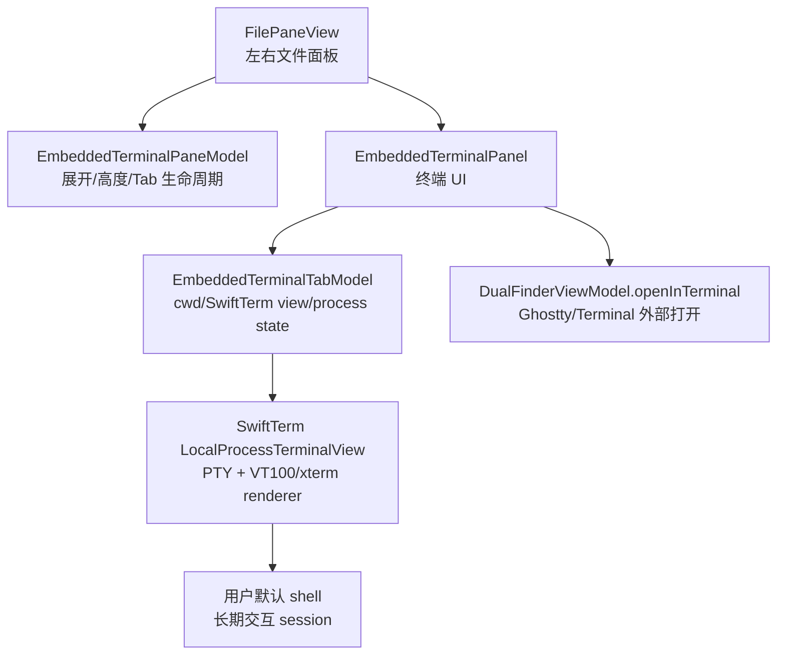
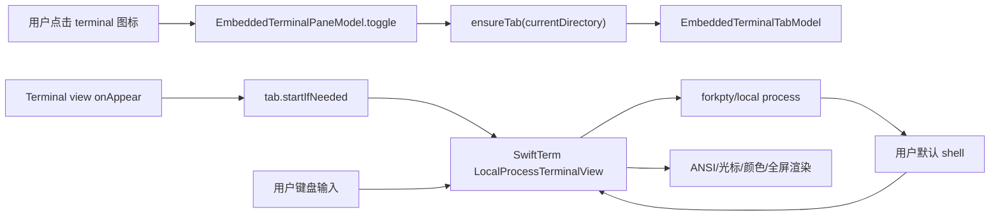
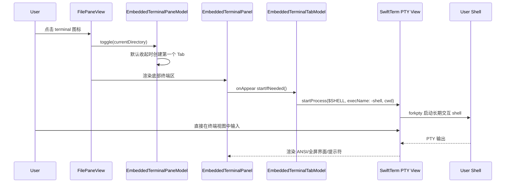

# 左右面板嵌入式 Terminal 多 Tab 支持

## 问题

Dual Finder 原来只能通过「Open in Ghostty or Terminal」打开外部终端窗口。用户在整理文件时需要频繁切换到独立终端窗口执行命令，左右面板的当前目录和命令执行上下文不能留在同一个工作界面里。

## 影响

| 场景 | 影响 |
|------|------|
| 在左/右目录中临时执行命令 | 需要打开外部窗口，工作流被打断 |
| 同时对左右两个目录操作 | 外部终端窗口难以直接对应左右面板 |
| 多个命令上下文并存 | 需要依赖终端应用自身 Tab，和 Dual Finder 面板状态分离 |
| 长输出命令 | 应用内若不限制输出，可能带来内存风险 |

## 解决的核心思路

1. **左右面板各自拥有终端状态**：`FilePaneView` 为每一侧持有一个 `EmbeddedTerminalPaneModel`，状态互不干扰。
2. **默认收起，按需创建**：终端区默认不显示；点击面板工具栏的 terminal 图标时才展开并创建第一个 terminal tab。
3. **多 Tab 内聚到终端模型**：展开状态、高度、tab 列表、选中 tab、关闭末 tab 后自动收起，都在 `EmbeddedTerminalPaneModel` 内管理。
4. **真实 PTY/ANSI 终端**：每个 terminal tab 持有一个 SwiftTerm `LocalProcessTerminalView`，启动用户默认 shell 的长期 PTY session，由 SwiftTerm 处理输入、提示符、光标、颜色和复杂 ANSI 控制序列。
5. **保留 Ghostty 外部打开能力**：终端面板仍提供按钮在当前 cwd 打开 Ghostty/Terminal。

## 关键文件

| 文件 | 职责 |
|------|------|
| `Sources/DualFinderApp/FilePaneView.swift` | 左右文件面板入口、terminal 图标、底部可折叠终端区域接线 |
| `Package.swift` / `Package.resolved` | 引入并锁定 SwiftTerm 终端模拟器依赖 |
| `Sources/DualFinderApp/EmbeddedTerminalPanel.swift` | 终端 UI、Tab 状态模型、SwiftTerm PTY session、停止/焦点/高度状态 |
| `Tests/DualFinderAppTests/EmbeddedTerminalPaneModelTests.swift` | 默认收起、展开建 tab、关闭末 tab、尺寸 clamp 测试 |

## 设计

### 分层



### 数据流



### 调用时序



## 使用方法

1. 在左侧或右侧文件面板顶部点击 **terminal** 图标。
2. 面板底部展开 Terminal 区域；默认高度 220，可拖动顶部横向 resize handle 调整，范围 140-420。
3. 点击 `+` 新建 terminal tab；点击 tab 上的 `x` 关闭。
4. 在终端视图中直接输入命令；提示符、补全、历史、`cd`、`clear`、`exit` 等行为由真实 shell 处理。
5. 点击标题栏外部打开按钮，可在当前 terminal tab 的 cwd 中打开 Ghostty 或 macOS Terminal。

## 边界与限制

| 项 | 结论 |
|----|------|
| 默认状态 | 默认收起，避免挤占文件列表空间 |
| 左右隔离 | 左右 `FilePaneView` 各自持有 `EmbeddedTerminalPaneModel` |
| 长命令输出 | 由 SwiftTerm 的终端缓冲区管理，不再维护无界字符串 transcript |
| 停止命令 | `stop` 会 terminate 当前 PTY shell session |
| 交互式全屏程序 | 支持 PTY 程序和复杂 ANSI/VT100/xterm 控制序列，例如 `vim`、`less`、`top` |
| Ghostty 嵌入 | 未嵌入；保留外部打开。Ghostty 稳定嵌入需要上游提供可嵌入控件或官方 API |
| REST API / Swagger | N/A，本功能是本地 macOS 桌面 UI |
| 跨平台 | 当前 Package 目标为 macOS 14+；Windows 需要不同 shell/process/terminal 集成策略 |

## 三轮 Review 结论

### 第 1 轮：Bug 与必要性

| 检查项 | 结论 |
|--------|------|
| 是否必要 | ✅ 满足不打开独立窗口即可执行命令的核心需求 |
| 默认收起 | ✅ `EmbeddedTerminalPaneModel.isExpanded = false` |
| 末 Tab 关闭 | ✅ 自动清空选中并收起，避免空面板 |
| SwiftUI 嵌套按钮 | ✅ 已拆开 tab 选择按钮和关闭按钮，避免嵌套 Button 行为不稳 |
| Ghostty | ✅ 不强行嵌入，提供外部打开 fallback |

### 第 2 轮：测试与边界

| 检查项 | 结论 |
|--------|------|
| 单元测试 | ✅ App pane model 有覆盖 |
| 路径解析 | ✅ 初始 cwd 来自左右面板；shell 内路径切换由 shell 处理 |
| 输出边界 | ✅ 不再维护自增长 transcript 字符串 |
| 进程尾输出 | ✅ PTY session 输出由 SwiftTerm 管线处理 |
| 测试遗漏 | ⚠️ SwiftUI 真实点击、长时间交互命令、ANSI 控制序列需后续 UI/手动验证 |

### 第 3 轮：可维护性与分层

| 检查项 | 结论 |
|--------|------|
| 单一职责 | ✅ 终端 session/UI 在 App，FilePane 只接入口 |
| DRY | ✅ 左右面板复用同一 `EmbeddedTerminalPanel` 和 pane model |
| 高内聚低耦合 | ✅ 终端状态封装在独立模型，未污染 ViewModel 文件操作职责 |
| 文件大小 | ✅ 新功能集中在新文件；`FilePaneView` 只增加入口和一小段接线 |
| 可扩展性 | ✅ 已替换为 PTY/ANSI renderer，FilePane 接口形态保持稳定 |

## 测试

```text
swift test
110 tests in 24 suites passed
```

## 后续可选增强

| 增强 | 说明 |
|------|------|
| Tab 持久化 | 保存每侧 terminal tab cwd 和高度 |
| 快捷键 | 增加 Toggle Embedded Terminal / New Terminal Tab 菜单项 |
