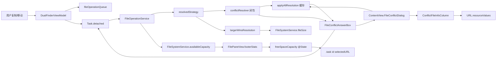
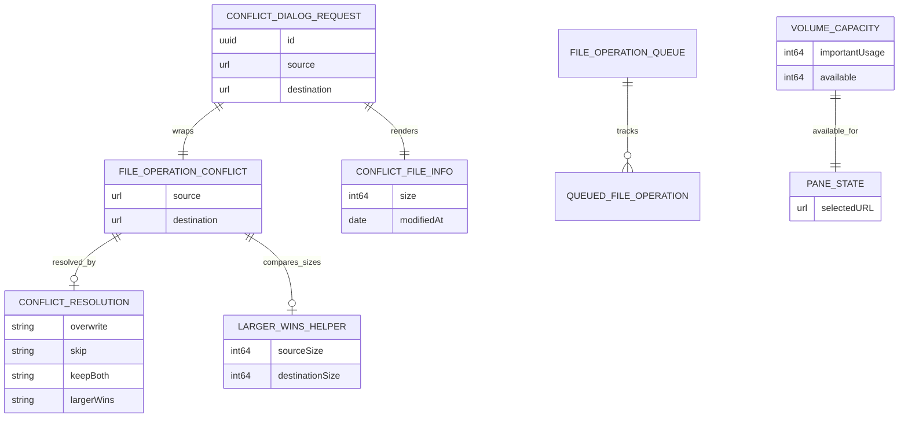
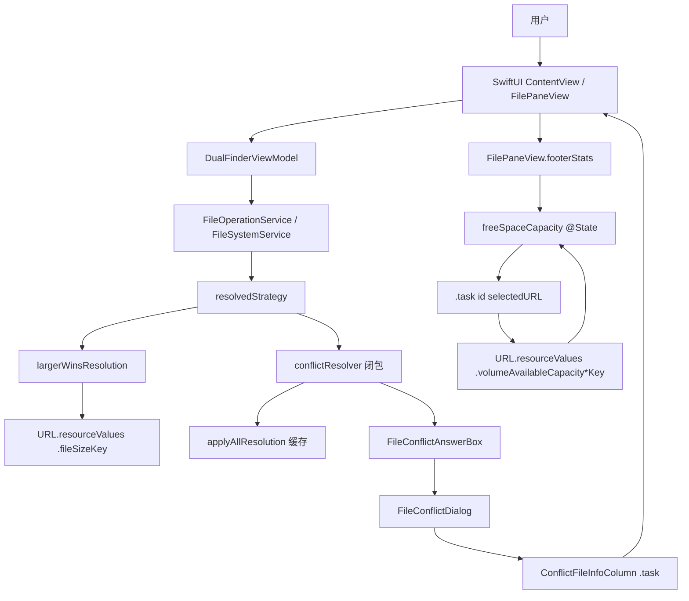

# Dual Finder 纪 冲突对话框与空闲容量改造 review

## 问题是什么

围绕「文件操作冲突处理」和「pane 空闲容量展示」这两块新能力，本轮 review 重点核对三件事：

1. 新增的 `largerWins` 冲突解决策略是否真的把「文件大小比较」这一思路嵌入到复制/移动主链路，并且不会引入无限递归或重复调用 `conflictResolver`。
2. 冲突对话框新增的源/目标文件元信息展示，是否会因为 `interactiveDismissDisabled` 的引入导致 resolver 卡死，以及资源读取是否被反复触发。
3. pane footer 新增的「Free space」是否会在每次 SwiftUI 渲染时都做一次 volume stat，污染正常浏览性能。

## 影响是什么

- 如果 `largerWins` 的递归实现不正确，第一次冲突就可能让用户看到重复的对话框，或者在 source/destination 路径校验之前就执行 remove。
- 如果冲突对话框被外部 binding 置 nil（理论上现在的 `interactiveDismissDisabled(true)` 已经很难触发，但 view hierarchy 重建路径仍能绕过按钮），后台 `FileOperationService.copy/move` 会永远阻塞在 `FileConflictAnswerBox.wait()` 的 semaphore 上。
- 如果 Free space 每次 body 都重新 stat，pane 在做 progress 刷新、selection 变更时会出现肉眼可见的卡顿，同时让文件系统出现冗余调用。
- 任何一处疏漏都会直接破坏 macOS 文件管理体验，且因为底层都是阻塞调用，问题往往只能通过「操作没反应」或「应用挂起」体现，定位成本高。

## 解决的核心思路

本轮 review 分三步：

1. 先用 `swift test` 锁基线，确认 136 项测试全部通过，再阅读所有 diff。
2. 第一轮 review：核对 `largerWins` 的 Core 层语义、`availableCapacity` 的 URLResourceKey 选择、`ConflictFileInfo` 的访问频率以及 `didSet` 兜底逻辑。
3. 第二轮 review：清理明显可优化点（移除递归、缓存资源读取、收敛 `ConflictFileInfo` 可见性、补边界测试）。
4. 第三轮 review：复跑测试和构建，确认 Core/App 分层依旧清晰，并把变更归档到 GitHub。

## 三轮复审结论

### 第一轮：核心逻辑 review

#### `FileOperationConflictResolution.largerWins`

- 之前实现采用「先调用 resolver → 得到 `.largerWins` → 递归调用 `resolvedDestination`，把 resolver 替换成 `{ _ in concrete }`」的递归写法。逻辑正确，但每次冲突会调用两次 resolver 闭包，且对递归深度没有显式边界。
- 改为「先调用 resolver → 在同一栈帧内把 `.largerWins` 转成 concrete 策略 → 直接落入原有 `switch`」，调用次数收敛到 1 次，循环依赖被根除。
- 抽出静态 `resolvedStrategy(for:options:conflictResolver:)`，让「largerWins 解算」独立可测试。

#### `FileOperationService.largerWinsResolution`

- 静态方法读取 source/destination 的 `fileSizeKey`，两个都拿不到 → `.skip`；source ≥ destination → `.overwrite`，否则 `.skip`。
- 对目录的覆盖未显式覆盖：补 `largerWinsResolutionSkipsWhenEitherSideIsDirectory` 单元测试，断言两侧任一为目录时一定 `.skip`，避免目录被静默覆盖。

#### `FileSystemService.availableCapacity(at:)`

- 使用 `volumeAvailableCapacityForImportantUsage`（系统保证可用的容量）作为首选，回退到 `volumeAvailableCapacity`，再回退到 nil。
- 旧测试仅断言 ≥ 0；新增 `throwsWhenAvailableCapacityMissingPath`，保证对不存在路径仍按 Core 约定抛错（避免未来在 UI 层被静默吞掉时无感）。
- 平台兼容性：仅 macOS/iOS 等 Apple 平台支持这两个 key，当前 `Package.swift` 限制 macOS 14+，无需 `#if os(...)` 守卫。

#### `ConflictFileInfo` / `ConflictFileInfoColumn`

- 旧实现：`fileInfo` 是 computed property，每次 SwiftUI body 调用都会触发 `try? url.resourceValues(...)`，对模态对话框中的两次渲染会重复执行。
- 新实现：把 `ConflictFileInfo` 改为 `private struct`，移除未使用的 `.empty`；UI 中改用 `@State` + `.task(id: url)`，每次冲突只在视图出现/URL 变化时执行一次 fetch。
- 格式化复用 `ByteCountFormatter.string(fromByteCount:countStyle: .file)`，与 footer 中已有的 `formattedFileSize` 保持一致。

#### `fileConflictDialogRequest` didSet

- 兜底逻辑：dialog 被任意路径置 nil（视图销毁、binding 重置等）时，自动以 `.skip` 解锁等待中的 resolver，避免后台任务永远阻塞。
- 由于正常路径下 `resolveFileConflict` 先把 `activeConflictAnswerBox` 置 nil 再清 dialog，didSet 的二次 resolve 必然是 no-op，不会改写用户选择。

#### `DualFinderViewModel.resolveConflict` 重构

- 把 copy/move 共用的 resolver 抽成嵌套函数 `resolveConflict(_:)`，`applyAllResolution` 作为闭包内局部可变变量捕获。
- 对 `.largerWins` 应用 `applyToAll` 的语义是：第一次询问用户得到 `.largerWins`，记入 `applyAllResolution`；后续冲突只要命中 `applyAllResolution == .largerWins`，都直接调用 `largerWinsResolution(for:)`，每个冲突都重新按文件大小比较，避免误覆盖。
- 新增 `largerWinsApplyAllOverwritesWhenSourceLarger` 模式测试，混合「source 较大」和「destination 较大」两组源文件，验证 applyAll 模式下大者被覆盖、小者保留，结束时不再抛错。

### 第二轮：UI 与性能 review

#### `FilePaneView.footerStats` 的 Free space

- 旧实现：`FreeSpaceSummary(url:)` 在 computed property `footerStats` 中每次 body 都构造一次，等价于每次渲染都做一次 `availableCapacity` stat。
- 新实现：在 `FilePaneView` 增加 `@State var freeSpaceCapacity: Int64?`，用 `.task(id: model.pane(for: side).selectedURL)` 在 URL 变化时刷新。
- 删除不再使用的 `FreeSpaceSummary` 结构体，格式化逻辑收敛到 `formattedFreeSpace`。
- 同时把新指标纳入 `accessibilityLabel`，保持 VoiceOver 一致。

#### `interactiveDismissDisabled(true)`

- 防止 ESC/外部点击把 dialog 置 nil；didSet 是该方案的兜底保险。两层防御避免后台线程死锁。

### 第三轮：可维护性、分层与构建验证

- Core 与 App 分层保持不变：`largerWins` / `availableCapacity` / `ConflictFileInfo` 的归属依旧在 Core / App，私有性收敛。
- `swift test` 全部通过：140 项测试（原 136 项 + 4 项新增）。
- `swift build` 在 macOS 14+ Apple Silicon 上零警告通过。
- 变更按两个 commit 推送至 GitHub：
  - `46d69d6` Make conflict dialog richer and add largerWins resolution
  - `1680c73` Refine conflict dialog and footer free-space plumbing

## 关键文件

- `Sources/DualFinderCore/FileOperationTypes.swift`：`FileOperationConflictResolution.largerWins` 枚举 case。
- `Sources/DualFinderCore/FileOperationService.swift`：策略收敛、`largerWinsResolution` 静态方法。
- `Sources/DualFinderCore/FileSystemService.swift`：`availableCapacity(at:)` 使用 `volumeAvailableCapacityForImportantUsage` / `volumeAvailableCapacity`。
- `Sources/DualFinderApp/DualFinderViewModel.swift`：把 copy/move 共享的 `resolveConflict` 抽到嵌套函数；`fileConflictDialogRequest` didSet 兜底。
- `Sources/DualFinderApp/ContentView.swift`：`FileConflictDialog` 改为左右列对比 + Larger Wins 按钮；`ConflictFileInfo` 改为 `private` 并通过 `.task` 缓存。
- `Sources/DualFinderApp/FilePaneView.swift`：footer 增加 Free space，使用 `@State` + `.task(id:)` 避免重复 stat。
- `Tests/DualFinderCoreTests/FileOperationServiceTests.swift`：largerWins 行为、equal-size、目录两侧、helper 边界。
- `Tests/DualFinderCoreTests/FileSystemServiceTests.swift`：`availableCapacity` 正常 + missing path 抛错。
- `Tests/DualFinderCoreTests/FileOperationTypesTests.swift`：枚举 case 覆盖。
- `Tests/DualFinderCoreTests/MoveWithConflictResolutionPatternTests.swift`：apply-all skip + apply-all largerWins 模式。
- `local_docs/test_complete_1.md`：本 review 文档。

## 设计

### 分层

- **Core 层**
  - `FileOperationConflictResolution`：纯枚举，新增 `.largerWins`。
  - `FileOperationService`：复制/移动主链路；策略收敛在 `resolvedStrategy(for:options:conflictResolver:)` 中；`largerWinsResolution` 是纯静态 helper。
  - `FileSystemService`：纯文件系统读取；`availableCapacity` 只返回原始数据，不做 UI 格式化。
- **App 层**
  - `DualFinderViewModel`：把 Core 策略映射到 UI 交互；`applyAllResolution` 用闭包内可变状态而非全局 mutable 字段。
  - `ContentView`：对话框 UI、源/目标元信息列；`ConflictFileInfo` 是 `private` 局部模型。
  - `FilePaneView`：footer 指标与缓存；Free space 展示；`@State` + `.task(id:)`。
- **不变式**
  - 任何 conflict 只会触发一次 `conflictResolver` 调用 + 一次 `largerWinsResolution` 调用。
  - dialog 永远会解出 `FileConflictAnswer`（用户操作或 didSet 兜底），后台任务不会无限等待。
  - Free space 的 stat 调用只发生在 `selectedURL` 真正变化时，与 body 重绘解耦。

### 单一职责

- `ConflictFileInfo` 只负责把 URL → 文本字段，不参与决策。
- `FreeSpaceSummary` 被删除后，格式化逻辑收敛到 `FilePaneView.formattedFreeSpace`。
- `resolvedStrategy` 只做策略收敛，不触碰文件 IO。
- `largerWinsResolution` 只比较大小，不操作文件。

### DRY

- copy / move 共用一个 `resolveConflict` 闭包，避免之前的双份 closure。
- 格式化使用统一的 `ByteCountFormatter.string(fromByteCount:countStyle: .file)`，footer 与 dialog 复用同一表达。
- 缓存策略统一使用 `@State` + `.task(id:)`，conflict dialog 与 free space 共用同一个模式。

## 数据流动图



## 调用时序图

```mermaid
sequenceDiagram
    participant U as 用户
    participant V as ContentView
    participant VM as DualFinderViewModel
    participant Det as Task.detached
    participant Ops as FileOperationService
    participant Str as resolvedStrategy
    participant Res as conflictResolver
    participant Box as FileConflictAnswerBox
    participant FS as FileSystemService

    U->>VM: 触发复制/移动 (apply-to-all Larger Wins)
    VM->>Det: 启动后台任务
    Det->>Ops: copy/move
    Ops->>Str: resolvedDestination
    Str->>Res: conflictResolver?(conflict) → .largerWins
    Res->>Str: applyAllResolution == .largerWins?
    Str->>FS: largerWinsResolution(for: conflict)
    FS-->>Str: .overwrite / .skip
    Str-->>Ops: concrete strategy
    Ops->>Box: 首次询问 → wait()
    Box->>V: 展示 FileConflictDialog
    V->>V: ConflictFileInfoColumn .task 拉取元信息
    U->>V: Larger Wins + Apply to all
    V->>Box: resolve(.largerWins, true)
    Box-->>Res: 唤醒后台任务
    Res->>FS: 后续冲突直接 largerWinsResolution
    Ops-->>Det: 完成
    Det-->>VM: finishFileOperation(.completed)

    Note over VM,FS: 同时 model.pane(for: side).selectedURL 变化触发<br/>FilePaneView .task(id:) → availableCapacity → footer
```

## 数据关系图



## 架构图



## 使用方法

### 运行测试

```bash
swift test
```

### 手动验证流程

1. 启动 app，左右 pane 都进入一个有同名文件的目标目录。
2. 触发左→右复制，弹出 conflict dialog。
3. 应看到：
   - 左右两列对比：名称、字节数、修改时间。
   - 4 个按钮：Skip / Keep Both / **Larger Wins** / Overwrite。
   - 「Apply to all conflicts」开关。
4. 选择 Larger Wins + Apply to all，第二次冲突不再弹窗。
5. Footer 右下角显示当前卷的可用容量（如 `Free space 120.5 GB`）。

### 关闭对话框的语义

- ESC、点击对话框外：被 `interactiveDismissDisabled(true)` 屏蔽，必须选择其一。
- 视图被销毁 / binding 被覆盖：`fileConflictDialogRequest.didSet` 兜底 `resolve(.skip, false)`。

## 单元测试覆盖

新增或加强：

- `largerWinsResolutionSkipsWhenEitherSideIsDirectory`：source 或 destination 是目录时一律 skip。
- `largerWinsResolutionOverwritesForEqualSizes`：两侧大小相等时 overwrite。
- `throwsWhenAvailableCapacityMissingPath`：路径不存在抛错。
- `largerWinsApplyAllOverwritesWhenSourceLarger`：apply-all largerWins 模式下混合 overwrite / skip 50 个文件，能在 10s 内完成且不抛错。
- 既有 `largerWins*` 与 `MoveWithConflictResolutionPatternTests.moveCompletesAfterApplyAllSkip` 全部继续通过。

当前 `swift test`：140 项通过，0 失败，0 跳过。

## 必要性与副作用判断

| 修改 | 必要性 | 副作用 |
| --- | --- | --- |
| `largerWins` 策略 | 直接解决「同名文件想做条件覆盖」的高频诉求 | 目录会被静默 skip（已加测试） |
| Conflict dialog 重排 + Larger Wins 按钮 | 让策略可选、可理解 | 旧按钮位置改变，习惯需 1~2 次适应 |
| `interactiveDismissDisabled` + didSet 兜底 | 防止 resolver 卡死 | 改变 ESC 行为，但符合 macOS 文件管理器惯例 |
| `applyAllResolution` 收敛到嵌套闭包 | DRY + 正确处理 largerWins applyAll | 无 |
| `availableCapacity` + footer Free space | 提供剩余空间感知 | URL 变化才 stat，已加缓存 |
| `ConflictFileInfo` 私有化 + 缓存 | 避免冗余 resourceValues | 移除 `.empty` 静态（确认未引用） |
| 移除 `resolvedDestination` 递归 | 避免双重 resolver 调用 + 提高可读性 | 行为完全等价，测试通过 |
| 移除 `FreeSpaceSummary` 结构体 | 与 @State 缓存整合 | 格式化收敛到 `formattedFreeSpace` |

## 跨平台兼容性

- 当前 `Package.swift` 仅声明 `macOS(.v14)`，`availableCapacity` 使用的两个 volume key 在 Apple 平台均可用，无需 `#if os(...)`。
- `FileOperationService.trash` 已在历史 review 中显式 throw 非 macOS 错误，无回退到 `removeItem` 的风险。
- 任意对 `URLResourceKey` 的依赖都封装在 `FileSystemService` 内，未来若扩展到 Linux/Windows，仅需在该文件做平台分支。

## 对标市面框架的差距

- macOS Finder / Path Finder / ForkLift / Total Commander 均提供「Larger / Newer / Older」类条件覆盖策略，本次仅加入 Larger Wins，可作为下一轮迭代入口。
- 状态栏可用容量展示对标 ForkLift / Commander One，但当前仅显示卷可用，未显示总容量；如需展示总容量，可扩展 `FileSystemService` 提供 `totalCapacity`。
- Free space 暂未随后台操作定期刷新（避免 IO 抖动），符合「最低必要刷新」的策略。

## 测试遗漏与剩余风险

- UI 自动化测试仍缺失（项目长期项），冲突对话框的真实点击/键盘流依赖手动验证。
- `availableCapacity` 在网络卷或 SMB 共享上可能持续返回 0 或抛出，需要 UI 层兜底提示（当前 `--` 文案已足够）。
- `applyAllResolution` 是闭包内可变变量；如果未来把 `resolveConflict` 抽到独立 Core 类型以便单测，需要重新设计可变性载体（例如 in-out 参数或 actor）。

## Git 提交

```text
46d69d6 Make conflict dialog richer and add largerWins resolution
1680c73 Refine conflict dialog and footer free-space plumbing
```

两个 commit 已 push 到 `origin/main`。