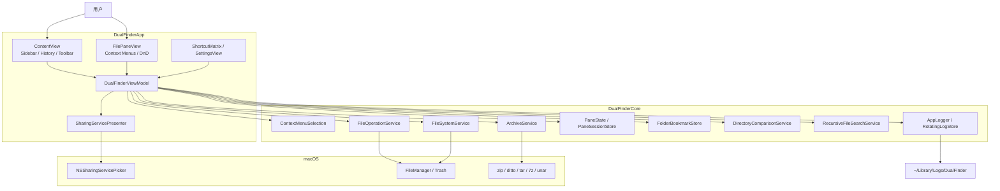
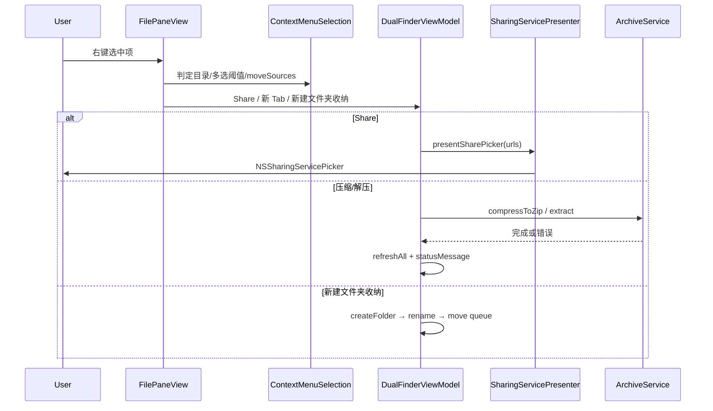
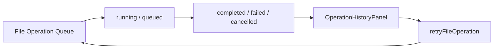

# README 更新说明（3 轮审查）

## 问题

`README.md` 落后于当前代码：已实现常用位置侧边栏、操作历史与重试、可配置快捷键、ZIP 压缩/解压、Finder 风格右键菜单（Share / 新 Tab / 新建文件夹收纳多选）等能力，但文档仍描述为缺失或未列出；项目结构、架构图、测试清单也未同步新增模块。

## 影响

- 新用户或协作者无法从 README 了解真实功能边界与使用方法。
- 「还差哪些功能」表格误判多项 P0 为未实现，误导优先级规划。
- 缺少对新模块（`ContextMenuSelection`、`ArchiveService`、`SharingServicePresenter` 等）的分层与数据流说明。

## 解决的核心思路

1. **对照代码逐项核对**：以 `ContentView`、`FilePaneView`、`DualFinderViewModel`、`DualFinderCore` 与 81 项单元测试为准，更新「已实现功能」「项目结构」「架构」「测试覆盖」。
2. **三轮审查**：每轮分别聚焦正确性/边界、必要性与风险、可维护性与测试充分性；结论写入本文档。
3. **修正路线图**：将已交付能力移出 P0 缺口，保留仍缺项（卷宗/iCloud、F 键工作流、hash 同步等）并标注部分完成状态。
4. **同步 README**：使对外文档与审查结论一致。

---

## 关键文件

| 文件 | 职责 |
|------|------|
| `README.md` | 对外功能说明、快捷键、构建方式、架构与路线图 |
| `Sources/DualFinderCore/ContextMenuSelection.swift` | 右键菜单可见性与移动源过滤（可测） |
| `Sources/DualFinderCore/ArchiveService.swift` | ZIP 压缩与多格式解压 |
| `Sources/DualFinderCore/ArchiveFormat.swift` | 归档格式识别 |
| `Sources/DualFinderCore/CommandRunner.swift` | 外部命令封装（可注入，便于单测） |
| `Sources/DualFinderApp/SharingServicePresenter.swift` | 系统 Share 面板（AirDrop 等） |
| `Sources/DualFinderApp/ShortcutMatrix.swift` | 可配置快捷键矩阵 |
| `Sources/DualFinderApp/ContentView.swift` | 侧边栏、操作历史面板、主布局 |
| `Sources/DualFinderApp/FilePaneView.swift` | 文件/Tab 右键菜单、行内重命名联动 |
| `Sources/DualFinderApp/DualFinderViewModel.swift` | UI 与 Core 协调、归档/分享/操作队列 |
| `Tests/DualFinderCoreTests/ContextMenuSelectionTests.swift` | 菜单规则单元测试 |
| `Tests/DualFinderCoreTests/ArchiveServiceTests.swift` | 压缩/解压单元测试 |

---

## 设计

### 分层架构

### 右键菜单数据流

### 操作历史与重试

---

## 使用方法（新增/变更能力）

### 常用位置侧边栏

- 主窗口左侧 **Locations** 面板：Pinned（Home、Desktop、Documents、Downloads、Applications）、Favorites、Recent（最多 8 条）。
- 点击条目在当前活动栏打开；收藏项可星标移除（含确认对话框）。
- 工具栏星标按钮可将当前活动栏目录加入收藏。

### 操作历史

- 工具栏切换 **Operation History** 侧栏，查看已完成/失败/已取消任务。
- 失败项显示恢复建议；可用 **Retry** 重试（源文件仍存在时）。
- 可清空已完成记录。

### 可配置快捷键

- **Dual Finder 纪 → Settings → Shortcuts**：调整命令、导航、Tab、跨栏移动等快捷键；支持冲突提示与恢复默认。
- 默认键位见 README 快捷键表；修改后通过 `AppShortcutMatrix` 持久化到 `UserDefaults`。

### 压缩与解压

- 文件列表右键：**Compress to ZIP**（同目录多选且非归档项）、**Extract Here** / **Extract to "名称"** / **Extract to Subfolder(s)**。
- 解压支持 zip、tar 系列及本机已安装的 7z/unar 可处理格式；7z/rar/iso 依赖 Homebrew 等安装的工具。

### Finder 风格右键

- **Share…**：系统分享面板（含 AirDrop）。
- **Open in New Tab(s)**：所选均为文件夹时，每个文件夹各占新 Tab。
- **New Folder with Selection (N Items)**：≥2 项时创建文件夹并进入重命名；Enter 移入选中项，Esc 删除空文件夹并恢复选区。

---

## 测试覆盖

| 套件 | 覆盖内容 |
|------|----------|
| `ContextMenuSelectionTests` | 全目录判定、≥2 阈值、moveSources 防嵌套、空目录检测 |
| `ArchiveServiceTests` / `ArchiveFormatDetectorTests` | 格式识别、ZIP 压缩、解压子目录、混合父目录拒绝 |
| 既有 15 个 Suite | 文件操作、对比、搜索、排序、会话、收藏、批量重命名等 |

**当前：`swift test` 共 81 项，全部通过。**

**未自动化（需手工）**：Share 面板 UI、AirDrop 真机、归档依赖缺失时的用户提示、行内重命名与右键并发、SwiftUI 焦点/快捷键集成。

---

## 三轮审查结论

### 第 1 轮：正确性、边界与风险

| 项 | 结论 |
|----|------|
| `moveSources` 排除自身与「目标位于源内部」 | 正确，有单测 |
| Esc 取消新建文件夹仅删空目录 | 正确，避免误删 |
| 重命名失败保留 `pendingNewFolderMoveSources` | 合理，用户可改或 Esc |
| Share 无 `keyWindow` 时静默返回 | 边界风险：应后续加 status 提示（未改代码，记入可选后续） |
| 归档 `isArchiveOperationRunning` 防并发 | 合理；与行内重命名互斥 |
| 操作重试要求源仍存在 | 合理；不会重试已消失文件 |

**未发现必须修复的 bug**；Share 无窗口降级为文档级已知限制。

### 第 2 轮：必要性、引入问题、平台

| 项 | 结论 |
|----|------|
| 变更是否必要 | 是：补齐 Finder 常用右键、压缩解压、文档与真实功能对齐 |
| REST/Swagger | 不适用（本地 macOS 桌面应用，无 REST 服务） |
| 竞态/重复请求 | 文件操作串行队列；归档单飞 guard；无网络缓存竞态 |
| macOS / Windows | `Package.swift` 仅 `macOS(.v14)`；Archive 层预留 `#if os` 分支，Windows 未启用 |
| 性能/扩展 | 归档在后台队列；Core 与 App 分离，可继续扩展 |

**未引入明显回归**；README 误报「缺失」才是主要问题。

### 第 3 轮：可维护性、DRY、测试充分性

| 项 | 评价 |
|----|------|
| 单一职责 | `ContextMenuSelection` / `ArchiveService` / `SharingServicePresenter` 职责清晰 |
| DRY | Tab 与列表共用 `pathAndTerminalContextMenuItems`；移动走统一 `enqueueFileOperation` |
| ViewModel 体积 | `DualFinderViewModel` 仍偏大（~1700 行），长期可拆 Share/Archive/Queue 扩展 |
| 测试 | Core 规则覆盖充分；ViewModel 集成（`commitNewFolderWithSelection`）缺 mock 测试 |
| 文件大小 | `ContentView` / `FilePaneView` 较大但按 UI 域划分，可接受 |

**测试对 Core 充分，对 AppKit UI 合理依赖手工**。

---

## 路线图修正（相对旧 README）

| 旧 README 描述 | 实际状态 |
|----------------|----------|
| P0 常用位置侧边栏「缺失」 | **部分完成**：Pinned + 收藏 + 最近；仍缺卷宗、iCloud、网络位置 |
| P0 操作历史「不完整」 | **大部分完成**：历史面板、Retry、恢复建议；仍缺失败项定位到列表 |
| P0 可配置快捷键「没有」 | **部分完成**：Settings 内 Shortcut Matrix；仍缺 F3–F8、Tab 切栏、应用内快捷键帮助页 |
| P1 压缩解压「没有」 | **已完成**（ZIP 压缩 + 多格式解压） |
| 右键 Share / 新 Tab / 新建收纳 | **已完成** |

---

## 平台说明

- **仅 macOS 14+**，Swift 6.2，SwiftUI + AppKit。
- 关闭最后窗口退出；单实例；启动最大化；日志 `~/Library/Logs/DualFinder` 按日轮转保留 7 天。
- 本地安装：`./update_app.sh`（编译、ad-hoc 签名、复制到 `/Applications` 并启动）。
