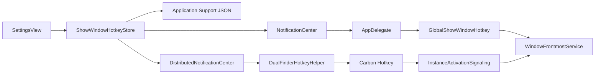
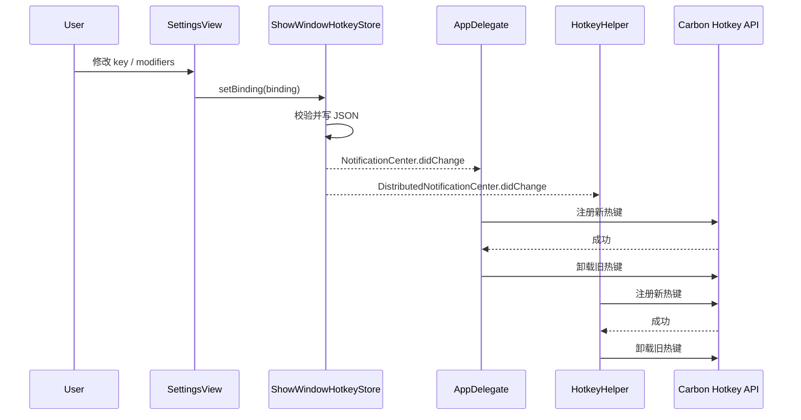
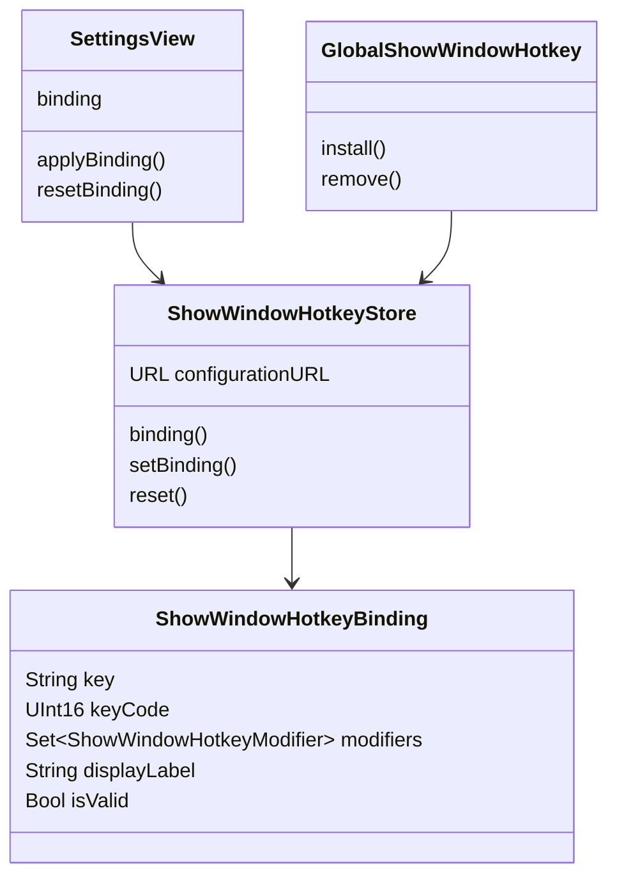
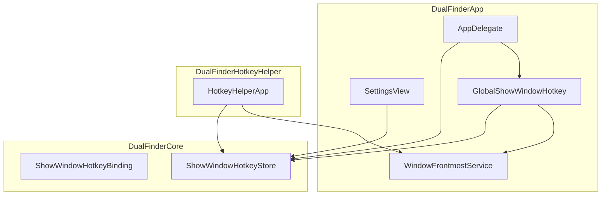

# 唤醒窗口快捷键配置

## 问题

用户需要把“从最小化、被遮挡、其他屏幕/空间恢复到最前台”的全局唤醒快捷键从固定键位调整为默认 **⌃⌘D**，并且可以在设置界面自行修改。

旧实现的问题是热键绑定属于代码常量：主 App 和 Login Item Helper 都直接注册固定 Carbon hotkey，Settings 里只能展示当前绑定，不能修改；如果后续改键，App、Helper、提示文案和测试也容易漂移。

## 影响

- 用户无法避开系统或个人工作流里已有的快捷键冲突。
- Login Item Helper 是独立进程，不能只依赖主 App 的 `UserDefaults.standard`。
- 如果改键时先卸载旧热键再注册新热键，新热键被系统占用时会导致唤醒热键丢失。

## 核心思路

把唤醒热键抽成 Core 层的可序列化配置：

- 默认绑定为 **⌃⌘D**。
- 配置文件存放在用户 Application Support 下：`com.local.dualfinder/show-window-hotkey.json`。
- 主 App 和 Login Item Helper 都通过 `ShowWindowHotkeyStore` 读取同一份配置。
- Settings 保存后发送本进程通知和 distributed notification。
- 主 App 与 Helper 收到变更后重新注册 Carbon hotkey。
- 重新注册采用“新热键成功后再替换旧热键”，避免注册失败时丢失旧热键。

## 关键文件

| 文件 | 作用 |
| --- | --- |
| `Sources/DualFinderCore/ShowWindowHotkeyDescriptor.swift` | 热键绑定模型、默认值、允许的按键、配置读写和变更通知 |
| `Sources/DualFinderApp/SettingsView.swift` | Settings → General 中的全局唤醒快捷键配置 UI |
| `Sources/DualFinderApp/GlobalShowWindowHotkey.swift` | 主 App 内 Carbon hotkey 注册 |
| `Sources/DualFinderApp/AppDelegate.swift` | 监听配置变更并安全替换主 App 内热键 |
| `Sources/DualFinderHotkeyHelper/main.swift` | Login Item Helper 读取配置、监听分布式通知并安全替换热键 |
| `Sources/DualFinderApp/DualFinderViewModel.swift` | 启动提示使用当前热键显示 |
| `Sources/DualFinderApp/ContentView.swift` | 唤醒热键提示弹窗标题使用当前热键显示 |
| `Sources/DualFinderApp/PrivacyPermissionGuide.swift` | 权限说明使用当前热键显示 |
| `Tests/DualFinderCoreTests/ShowWindowHotkeyDescriptorTests.swift` | 默认值、持久化、损坏配置、无效配置和重置测试 |

## 设计

`ShowWindowHotkeyBinding` 是唯一的热键数据结构，包含：

- `key`：UI 和 JSON 中保存的按键 id，例如 `d`。
- `keyCode`：Carbon 注册需要的 macOS 虚拟键码。
- `modifiers`：`command`、`control`、`option`、`shift` 集合。

校验规则：

- `key` 和 `keyCode` 必须匹配允许列表。
- 至少包含 `command`、`control` 或 `option` 之一。
- 单独 `shift` 或无修饰键不会保存，避免注册过于宽泛的全局热键。

当前支持 A-Z 和 0-9。Carbon 使用物理键码，键位映射按 macOS 常用 US key code 固定表实现。

## 数据流

## 调用时序图

## 数据关系图

## 架构图

## 使用方法

1. 打开 **Dual Finder 纪 → Settings → General**。
2. 在 **Global Window Shortcut** 中选择按键和修饰键。
3. 默认是 **⌃⌘D**。
4. 修改后会自动保存，主 App 内热键会立即重载。
5. 如果启用了 Login Item Helper，Helper 会通过分布式通知重载；如果系统拒绝新热键，日志会记录失败并保留旧热键。
6. 点击 **Reset Shortcut** 可恢复默认 **⌃⌘D**。

## 测试覆盖

已覆盖：

- 默认绑定是 **⌃⌘D**。
- 自定义绑定可以写入并读取。
- 损坏 JSON 回退到默认绑定。
- 单独 `shift` 这类无效修饰键组合会被拒绝。
- `key` 与 `keyCode` 不匹配会被拒绝。
- reset 会删除自定义配置并回到默认值。

未自动化覆盖：

- macOS Carbon 全局热键真实注册冲突。
- Login Item Helper 在系统登录项中的真实重载。
- 跨 Space、最小化、遮挡和多屏幕的人工唤醒验证。

这些路径依赖系统级窗口和登录项状态，当前通过编译、Core 单测和手工验证兜底。

## 三轮复审结论

### 第 1 轮

发现提示文案仍有固定默认值引用，已改为读取 `ShowWindowHotkeyStore().binding().displayLabel`，避免用户改键后弹窗和权限说明显示旧快捷键。

### 第 2 轮

发现热键重载边界风险：如果先移除旧热键再注册新热键，注册失败时会丢失旧热键。已改为新热键注册成功后再移除旧热键；主 App 和 Helper 都采用该策略。

### 第 3 轮

补充测试覆盖 `key` 与 `keyCode` 不匹配的无效配置，防止未来配置 UI 或 JSON 写入把显示键和 Carbon 物理键码写歪。

## 维护说明

- 不要把 Carbon 或 AppKit 依赖下沉到 `DualFinderCore`；Core 只保存可序列化配置和通知名。
- 如果未来支持更多按键，先扩展 `ShowWindowHotkeyBinding.allowedKeys`，再补 keyCode 测试。
- 如果未来启用 macOS sandbox，需要把配置文件迁移到 App Group 容器，否则主 App 和 Login Item Helper 可能无法共享同一份配置。
